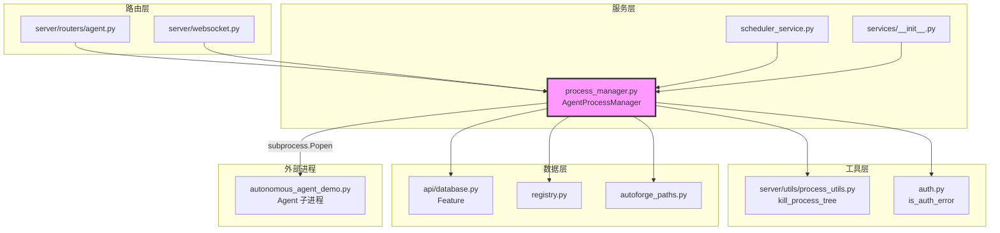

# `process_manager.py` — Agent 子进程生命周期管理器

> 源文件路径: `server/services/process_manager.py`

## 功能概述

`process_manager.py` 是 AutoForge 服务端核心服务之一，负责管理每个项目的 Agent 子进程生命周期。它提供了完整的启动（start）、停止（stop）、暂停（pause）、恢复（resume）以及优雅暂停（graceful pause/drain）功能，并支持跨平台操作。

该模块通过 `psutil` 实现进程树管理，确保在停止 Agent 时能够终止所有子进程（包括编码 Agent 和测试 Agent），防止孤立进程。它还支持多 WebSocket 客户端同时订阅输出流和状态变更，使用线程安全的回调注册机制。

此外，模块实现了基于 PID + 创建时间的锁文件机制，防止同一项目同时运行多个 Agent 实例。在 Agent 进程异常退出时，会自动清理卡在 `in_progress` 状态的 Feature，确保下次启动时这些 Feature 可被重新领取。

## 依赖关系

### 导入依赖

| 模块 | 说明 |
|------|------|
| `asyncio` | 异步任务调度和事件循环 |
| `logging` | 日志记录 |
| `os` | 操作系统接口（环境变量、文件操作） |
| `re` | 正则表达式（敏感信息过滤） |
| `subprocess` | 子进程创建和管理 |
| `sys` | 系统路径和平台检测 |
| `threading` | 线程锁（回调和管理器注册表线程安全） |
| `datetime` | 时间戳记录 |
| `pathlib.Path` | 路径操作 |
| `psutil` | 跨平台进程管理（暂停/恢复/进程树） |
| `auth` | 认证错误检测（`is_auth_error`, `AUTH_ERROR_HELP_SERVER`） |
| `server.utils.process_utils` | 进程树终止工具（`kill_process_tree`） |
| `autoforge_paths` | 路径解析（锁文件、features.db、drain 信号文件） |
| `api.database` | Feature 数据库模型 |
| `registry` | 项目注册表（`list_registered_projects`, `get_effective_sdk_env`） |
| `sqlalchemy` | 数据库引擎和会话管理 |

### 被依赖

| 模块 | 引用内容 |
|------|----------|
| `server/services/__init__.py` | 导出 `AgentProcessManager` |
| `server/routers/agent.py` | 导入 `get_manager`，创建/获取 Agent 管理器 |
| `server/services/scheduler_service.py` | 导入 `get_manager`，调度启动/停止 Agent |
| `server/websocket.py` | 导入 `get_manager`，WebSocket 连接中获取管理器 |
| `server/main.py` | 导入 `cleanup_all_managers` 和 `cleanup_orphaned_locks` |

## 关键类/函数

### `sanitize_output(line: str) -> str`

- **参数**: `line` — 原始输出行
- **返回值**: 过滤后的字符串
- **说明**: 使用正则表达式模式列表（`SENSITIVE_PATTERNS`）过滤敏感信息（API 密钥、GitHub Token、AWS 密钥等），替换为 `[REDACTED]`

### `class AgentProcessManager`

管理单个项目的 Agent 子进程生命周期。

#### `__init__(self, project_name, project_dir, root_dir)`

- **参数**:
  - `project_name: str` — 项目名称
  - `project_dir: Path` — 项目目录绝对路径
  - `root_dir: Path` — AutoForge 仓库根目录
- **说明**: 初始化进程管理器，包括状态跟踪、回调集合、锁文件路径

#### `status` (property)

- **类型**: `Literal["stopped", "running", "paused", "crashed", "pausing", "paused_graceful"]`
- **说明**: 状态属性，设置时自动触发所有已注册的状态回调

#### `async start(self, yolo_mode, model, parallel_mode, max_concurrency, testing_agent_ratio, playwright_headless, batch_size, testing_batch_size) -> tuple[bool, str]`

- **参数**:
  - `yolo_mode: bool` — 是否启用 YOLO 模式（跳过测试）
  - `model: str | None` — 使用的模型名称
  - `max_concurrency: int | None` — 最大并发编码 Agent 数（1-5）
  - `testing_agent_ratio: int` — 回归测试 Agent 数量（0-3）
  - `playwright_headless: bool` — 浏览器是否无头模式
  - `batch_size: int` — 每个编码 Agent 批次的 Feature 数量
  - `testing_batch_size: int` — 每个测试 Agent 批次的 Feature 数量
- **返回值**: `(success: bool, message: str)`
- **说明**: 构建命令行参数，创建子进程（`autonomous_agent_demo.py`），创建原子锁文件，启动输出流任务

#### `async stop(self) -> tuple[bool, str]`

- **返回值**: `(success: bool, message: str)`
- **说明**: 终止整个进程树（使用 `kill_process_tree`），清理锁文件和卡住的 Feature，重置所有状态

#### `async pause(self) / async resume(self) -> tuple[bool, str]`

- **说明**: 通过 `psutil` 的 `suspend()`/`resume()` 实现进程暂停和恢复

#### `async graceful_pause(self) / async graceful_resume(self) -> tuple[bool, str]`

- **说明**: 通过创建/删除 drain 信号文件实现优雅暂停（让正在执行的 Agent 完成当前工作后再暂停）

#### `async healthcheck(self) -> bool`

- **说明**: 检查进程是否存活，如果已终止则更新状态为 `crashed`

### `get_manager(project_name, project_dir, root_dir) -> AgentProcessManager`

- **说明**: 线程安全地获取或创建项目的进程管理器实例。使用 `(project_name, resolved_project_dir)` 作为复合键，防止同名不同路径的项目交叉污染

### `async cleanup_all_managers() -> None`

- **说明**: 停止所有运行中的 Agent，服务器关闭时调用

### `cleanup_orphaned_locks() -> int`

- **返回值**: 清理的孤立锁文件数量
- **说明**: 扫描所有已注册项目的锁文件，移除引用已不存在进程的陈旧锁文件。支持 PID 重用检测

## 架构图

## 注意事项

1. **锁文件机制**: 使用 `O_CREAT | O_EXCL` 原子创建锁文件，防止 TOCTOU 竞态条件。锁文件内容为 `PID:CREATE_TIME` 格式，通过创建时间对比检测 PID 重用
2. **进程树终止**: 停止 Agent 时必须终止整个进程树，否则编码/测试 Agent 子进程会成为孤立进程
3. **敏感信息过滤**: 所有输出在广播给 WebSocket 客户端前都会经过 `sanitize_output` 过滤
4. **Windows 兼容**: 使用 `CREATE_NO_WINDOW` 创建标志避免弹出控制台窗口
5. **Feature 清理**: 进程异常退出时自动重置 `in_progress` 状态的 Feature，确保不会永久阻塞
6. **优雅暂停**: drain 模式通过信号文件通信，编排器轮询该文件以决定是否停止派发新任务
