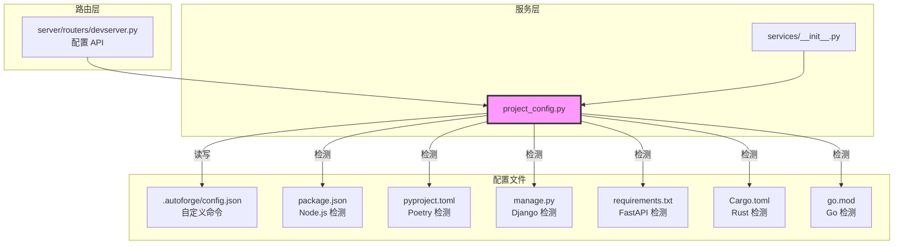

# `project_config.py` — 项目类型检测与开发命令配置

> 源文件路径: `server/services/project_config.py`

## 功能概述

`project_config.py` 负责项目类型的自动检测和开发服务器命令的配置管理。它通过扫描项目目录中的配置文件（如 `package.json`、`Cargo.toml`、`go.mod` 等）来自动识别项目类型，并为每种类型提供默认的开发服务器启动命令。

支持的项目类型包括：Node.js（Vite/CRA）、Python（Poetry/Django/FastAPI）、Rust 和 Go。用户也可以通过 UI 设置自定义的开发命令，该配置存储在 `{project_dir}/.autoforge/config.json` 中。

模块采用优先级链设计：自定义命令 > 自动检测命令。清除自定义命令后自动回退到检测到的默认命令。当配置文件清空后还会自动清理空文件和空目录。

## 依赖关系

### 导入依赖

| 模块 | 说明 |
|------|------|
| `json` | 配置文件读写（config.json, package.json） |
| `logging` | 日志记录 |
| `pathlib.Path` | 路径操作 |
| `typing.TypedDict` | 配置响应类型定义 |
| `tomllib` (Python 3.11+) | TOML 解析（pyproject.toml 中检测 Poetry） |

### 被依赖

| 模块 | 引用内容 |
|------|----------|
| `server/services/__init__.py` | 导出 `clear_dev_command`, `detect_project_type`, `get_default_dev_command`, `get_dev_command`, `get_project_config`, `set_dev_command` |
| `server/routers/devserver.py` | 导入 `clear_dev_command`, `get_dev_command`, `get_project_config`, `set_dev_command` |

## 关键类/函数

### `class ProjectConfig(TypedDict)`

完整的项目配置响应类型。

| 字段 | 类型 | 说明 |
|------|------|------|
| `detected_type` | `str \| None` | 自动检测的项目类型 |
| `detected_command` | `str \| None` | 检测类型对应的默认命令 |
| `custom_command` | `str \| None` | 用户自定义命令 |
| `effective_command` | `str \| None` | 实际生效的命令（自定义优先） |

### `PROJECT_TYPE_COMMANDS`

项目类型到默认开发命令的映射：

| 类型 | 命令 |
|------|------|
| `nodejs-vite` | `npm run dev` |
| `nodejs-cra` | `npm start` |
| `python-poetry` | `poetry run python -m uvicorn main:app --reload` |
| `python-django` | `python manage.py runserver` |
| `python-fastapi` | `python -m uvicorn main:app --reload` |
| `rust` | `cargo run` |
| `go` | `go run .` |

### `detect_project_type(project_dir: Path) -> str | None`

- **检测优先级**:
  1. `package.json` + `scripts.dev` -> `nodejs-vite`
  2. `package.json` + `scripts.start` -> `nodejs-cra`
  3. `pyproject.toml` + `[tool.poetry]` -> `python-poetry`
  4. `manage.py` -> `python-django`
  5. `requirements.txt` + (`main.py` | `app.py`) -> `python-fastapi`
  6. `Cargo.toml` -> `rust`
  7. `go.mod` -> `go`

### `get_dev_command(project_dir: Path) -> str | None`

- **说明**: 获取生效的开发命令。优先返回自定义命令，否则返回自动检测的默认命令

### `set_dev_command(project_dir: Path, command: str) -> None`

- **说明**: 保存自定义开发命令到 `.autoforge/config.json`
- **异常**: 空命令或非字符串参数抛出 `ValueError`

### `clear_dev_command(project_dir: Path) -> None`

- **说明**: 清除自定义命令。如果配置文件因此变空，自动删除文件和空的 `.autoforge` 目录

### `get_project_config(project_dir: Path) -> ProjectConfig`

- **说明**: 一次性返回所有配置信息，包括检测结果和自定义设置。适用于 UI 显示和调试

## 架构图

## 注意事项

1. **向后兼容**: 配置文件路径同时检查 `.autoforge/` 和 `.autocoder/`（旧版路径），优先使用新路径
2. **tomllib 兜底**: Python 3.11 之前没有内置 `tomllib`，此时 Poetry 检测退化为简单的 `pyproject.toml` 文件存在性检查
3. **路径验证**: `_validate_project_dir` 确保路径存在且是目录，防止路径穿越
4. **空配置清理**: `clear_dev_command` 在配置清空时自动删除空文件和空目录，保持项目目录整洁
5. **检测优先级**: 首次匹配即返回，package.json 的 dev 脚本优先于 start 脚本
