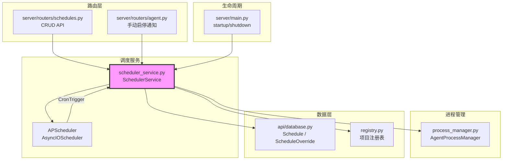

# `scheduler_service.py` — 基于 APScheduler 的 Agent 定时调度服务

> 源文件路径: `server/services/scheduler_service.py`

## 功能概述

`scheduler_service.py` 实现了基于 APScheduler 的自动化 Agent 调度服务，支持按时间窗口自动启动和停止 Agent。每个调度计划（Schedule）会创建两个 Cron 作业：一个在指定时间启动 Agent，一个在指定时长后停止 Agent。

该服务处理多种复杂场景：手动操作覆盖（manual override）追踪并持久化到数据库、崩溃恢复与指数退避重试（最多 3 次，退避为 10s/30s/90s）、跨越午夜的调度窗口、重叠调度（最晚停止时间优先）以及服务器重启后的恢复检查。所有调度时间使用 UTC 时区存储和执行。

## 依赖关系

### 导入依赖

| 模块 | 说明 |
|------|------|
| `asyncio` | 异步延迟（崩溃退避重试） |
| `logging` | 日志记录 |
| `sys` | 模块路径管理 |
| `datetime` | 时间计算（UTC、时间差） |
| `pathlib.Path` | 路径操作 |
| `apscheduler.schedulers.asyncio.AsyncIOScheduler` | 异步定时调度器 |
| `apscheduler.triggers.cron.CronTrigger` | Cron 触发器 |
| `api.database` | 数据库模型（`Schedule`, `ScheduleOverride`, `create_database`） |
| `autoforge_paths` | 路径解析（`get_features_db_path`） |
| `registry` | 项目注册表（`list_registered_projects`） |
| `server.services.process_manager` | Agent 进程管理器（`get_manager`） |

### 被依赖

| 模块 | 引用内容 |
|------|----------|
| `server/main.py` | 导入 `cleanup_scheduler` 和 `get_scheduler`，生命周期管理 |
| `server/routers/schedules.py` | 导入 `get_scheduler`，CRUD 操作时同步 APScheduler 作业 |
| `server/routers/agent.py` | 导入 `get_scheduler`，手动启停时通知调度器 |

## 关键类/函数

### `class SchedulerService`

APScheduler 异步调度服务核心类。

#### `async start(self)`

- **说明**: 启动调度器，检查遗漏的活跃窗口（服务器重启恢复），加载所有项目的调度计划

#### `async stop(self)`

- **说明**: 优雅关闭调度器

#### `async add_schedule(self, project_name, schedule, project_dir)`

- **参数**: `schedule` — SQLAlchemy `Schedule` 对象
- **说明**: 为调度计划创建 start/stop 两个 Cron 作业。跨午夜调度会将 stop 作业的日期向前偏移一天

#### `remove_schedule(self, schedule_id)`

- **说明**: 移除调度计划的所有 APScheduler 作业

#### `async _handle_scheduled_start(self, project_name, schedule_id, project_dir_str)`

- **说明**: 调度启动触发时调用。检查手动停止覆盖，重置崩溃计数，注册崩溃回调，启动 Agent

#### `async _handle_scheduled_stop(self, project_name, schedule_id, project_dir_str)`

- **说明**: 调度停止触发时调用。检查是否有其他活跃调度（最晚停止优先），检查手动启动覆盖，清理过期覆盖记录

#### `async handle_crash_during_window(self, project_name, project_dir)`

- **说明**: Agent 崩溃时的恢复处理。检查是否在活跃窗口内，使用指数退避重试（10s * 3^(n-1)），最多重试 3 次

#### `notify_manual_start(self, project_name, project_dir)` / `notify_manual_stop(...)`

- **说明**: 记录手动操作覆盖，防止自动调度干扰用户的手动操作

#### `_is_within_window(self, schedule, now) -> bool`

- **说明**: 判断当前时间是否在调度窗口内。处理跨午夜窗口需要检查当天和前一天

#### `_bitfield_to_cron_days(bitfield) -> str` (静态方法)

- **参数**: `bitfield: int` — 7 位位域（bit 0=周一 ... bit 6=周日）
- **返回值**: APScheduler cron 格式字符串（如 `"mon,wed,fri"`）

#### `_shift_days_forward(bitfield) -> int` (静态方法)

- **说明**: 将日期位域向前偏移一天，用于跨午夜调度的 stop 作业

### `get_scheduler() -> SchedulerService`

- **说明**: 获取全局单例调度器实例

### `async cleanup_scheduler()`

- **说明**: 关闭调度器并清空全局实例

## 架构图

## 注意事项

1. **UTC 时区**: 所有调度时间存储和执行均使用 UTC，CronTrigger 必须指定 `timezone=timezone.utc`
2. **跨午夜调度**: 当 `start_time + duration` 跨越午夜时，stop 作业的星期需要向前偏移一天
3. **手动覆盖**: 用户手动启动/停止 Agent 时会创建 `ScheduleOverride` 记录，防止自动调度覆盖用户意图。覆盖记录在窗口结束时过期
4. **崩溃恢复**: 在调度窗口内崩溃会自动重试（指数退避），但达到最大重试次数后不再尝试
5. **重叠调度**: 多个调度窗口重叠时，只要有任何一个仍然活跃就不执行停止操作
6. **Misfire Grace Time**: 作业设置了 5 分钟的 misfire 容忍时间，允许服务器短暂停机后仍能触发
