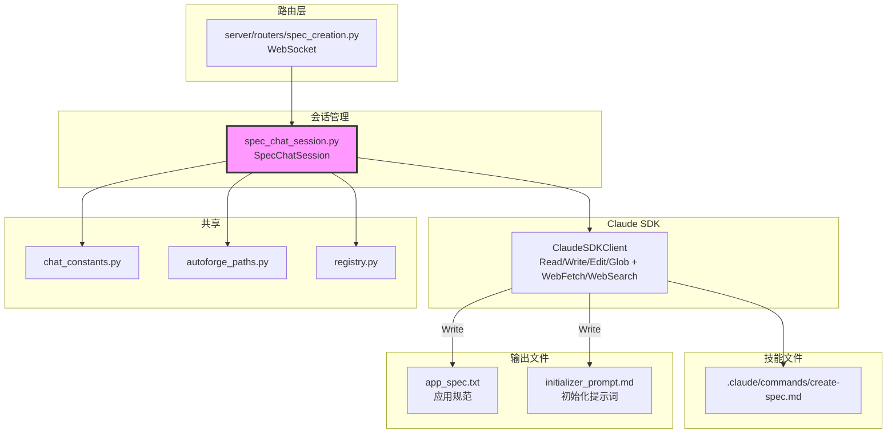

# `spec_chat_session.py` — 交互式应用规范创建会话

> 源文件路径: `server/services/spec_chat_session.py`

## 功能概述

`spec_chat_session.py` 管理交互式的应用规范（app spec）创建对话。它使用 `create-spec.md` 技能（Slash Command）引导用户逐步完成规范创建流程：项目概述 -> 参与程度选择 -> 技术偏好 -> 功能定义 -> 技术细节 -> 成功标准 -> 审批。

该会话具有文件写入能力（Read、Write、Edit、Glob），Claude 会在对话过程中生成两个关键文件：`app_spec.txt`（应用规范）和 `initializer_prompt.md`（初始化提示词）。模块会追踪这两个文件的写入状态，只有两者都成功写入磁盘后才发出 `spec_complete` 信号通知 UI。

支持多模态输入，用户可以通过图片附件传达 UI 设计想法。

## 依赖关系

### 导入依赖

| 模块 | 说明 |
|------|------|
| `json` | JSON 序列化（安全设置文件） |
| `logging` | 日志记录 |
| `os` | 环境变量读取 |
| `shutil` | Claude CLI 查找 |
| `threading` | 会话注册表线程安全 |
| `datetime` | 会话和消息时间戳 |
| `pathlib.Path` | 路径操作 |
| `claude_agent_sdk` | Claude Agent SDK |
| `dotenv` | 环境变量加载 |
| `..schemas` | `ImageAttachment` 数据模型 |
| `.chat_constants` | 共享常量和工具函数（`ROOT_DIR`, `check_rate_limit_error`, `make_multimodal_message`, `safe_receive_response`） |
| `autoforge_paths` | 路径解析（提示词目录、设置文件路径） |
| `registry` | API 配置（`DEFAULT_MODEL`, `get_effective_sdk_env`） |

### 被依赖

| 模块 | 引用内容 |
|------|----------|
| `server/routers/spec_creation.py` | 导入 `SpecChatSession`, `get_session`, `create_session`, `remove_session`, `list_sessions`, `cleanup_all_sessions` |

## 关键类/函数

### `class SpecChatSession`

#### `__init__(self, project_name, project_dir)`

- **参数**:
  - `project_name: str` — 正在创建的项目名称
  - `project_dir: Path` — 项目目录路径

#### `async start(self) -> AsyncGenerator[dict, None]`

- **Yields**: 消息块（`text`、`error`、`response_done`）
- **说明**:
  1. 加载 `create-spec.md` 技能文件
  2. 确保项目目录存在
  3. 删除已有的 `app_spec.txt`（允许 Claude 重新创建）
  4. 创建安全设置文件（允许文件读写）
  5. 将提示词写入 `CLAUDE.md`
  6. 创建 Claude SDK 客户端（`acceptEdits` 权限模式）
  7. 发起对话："Begin the spec creation process."

#### `async send_message(self, user_message, attachments=None) -> AsyncGenerator[dict, None]`

- **Yields**: 消息块（`text`、`question`、`spec_complete`、`file_written`、`error`、`response_done`）
- **说明**: 存储用户消息，支持图片附件的多模态输入

#### `async _query_claude(self, message, attachments=None) -> AsyncGenerator[dict, None]`

- **说明**: 核心查询逻辑。追踪 Write/Edit 工具调用和结果：
  - 追踪 `app_spec.txt` 的写入（通过 tool_id 关联）
  - 追踪 `initializer_prompt.md` 的写入
  - 检查文件是否实际写入磁盘
  - 两个文件都成功写入后发出 `spec_complete` 信号

### 模块级会话管理

#### `get_session(project_name) -> Optional[SpecChatSession]`

#### `async create_session(project_name, project_dir) -> SpecChatSession`

#### `async remove_session(project_name) -> None`

#### `async cleanup_all_sessions() -> None`

## 架构图

## 注意事项

1. **双文件完成检测**: `spec_complete` 信号只在 `app_spec.txt` 和 `initializer_prompt.md` 两个文件都被验证存在于磁盘后才发出
2. **Tool ID 关联**: 使用 `tool_use_id` 将 Write 工具调用与其 ToolResult 关联，精确追踪每个文件的写入状态
3. **app_spec.txt 预删除**: 启动时删除已有的 `app_spec.txt`，因为 SDK 要求写入前先读取（但这是新建文件场景）
4. **acceptEdits 权限**: 使用 `acceptEdits` 权限模式，自动批准文件写入操作
5. **setting_sources**: 包含 `["project", "user"]`，允许访问全局技能和子 Agent
6. **消息历史**: 维护内存中的消息列表，用于对话追踪（不像 assistant_chat_session 那样持久化到数据库）
7. **多模态支持**: 通过 `make_multimodal_message` 构建包含文本和图片的消息
