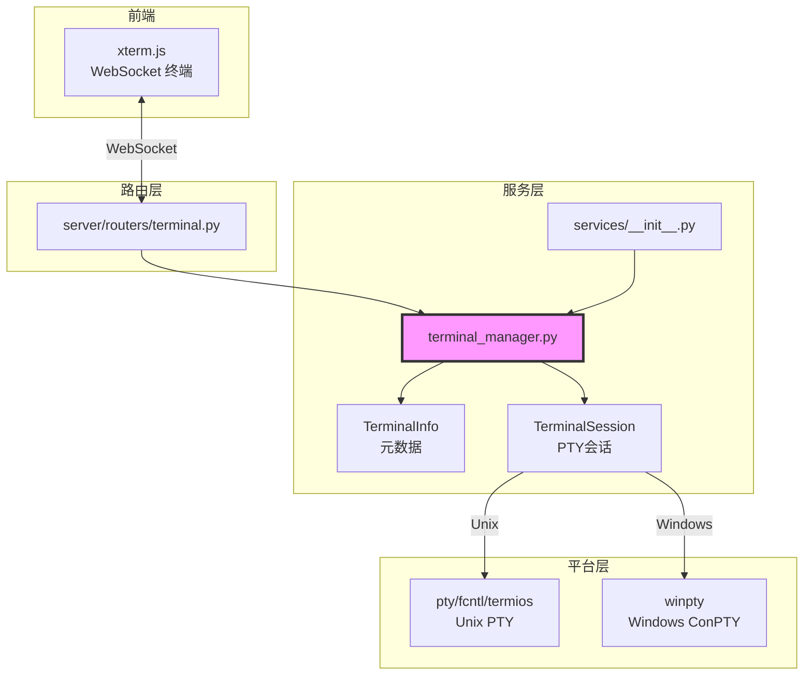

# `terminal_manager.py` — PTY 终端会话管理器

> 源文件路径: `server/services/terminal_manager.py`

## 功能概述

`terminal_manager.py` 提供跨平台的 PTY（伪终端）会话管理功能，支持在 Web UI 中通过 xterm.js 为每个项目创建交互式终端。在 Unix 系统上使用内置的 `pty` 模块，在 Windows 上使用 `pywinpty`（ConPTY）。

该模块管理两层注册表：终端元数据（`TerminalInfo`，包括 ID 和名称）和终端会话（`TerminalSession`，包含实际的 PTY 进程）。支持多标签终端，每个项目可以拥有多个独立的终端实例，并支持创建、重命名、删除操作。

终端会话通过异步输出流将 PTY 数据广播给多个 WebSocket 客户端，支持终端窗口大小动态调整（resize），并在关闭时正确清理子进程（Unix 上通过 SIGTERM/SIGKILL，Windows 上通过 terminate/kill）。

## 依赖关系

### 导入依赖

| 模块 | 说明 |
|------|------|
| `asyncio` | 异步任务调度 |
| `logging` | 日志记录 |
| `os` | 文件描述符读写、进程管理 |
| `platform` | 平台检测（Windows/Unix） |
| `shutil` | Shell 路径查找 |
| `threading` | 线程安全锁 |
| `uuid` | 终端 ID 生成 |
| `dataclasses` | 终端元数据数据类 |
| `datetime` | 创建时间戳 |
| `pathlib.Path` | 路径操作 |
| `pty` (Unix) | 伪终端创建 |
| `fcntl` (Unix) | 终端窗口大小设置 |
| `select` (Unix) | 非阻塞 I/O 检测 |
| `signal` (Unix) | 进程信号发送 |
| `struct` (Unix) | 窗口大小结构体打包 |
| `termios` (Unix) | 终端控制 |
| `winpty` (Windows) | Windows PTY 支持 |

### 被依赖

| 模块 | 引用内容 |
|------|----------|
| `server/services/__init__.py` | 导出 `TerminalSession`, `cleanup_all_terminals`, `get_terminal_session`, `remove_terminal_session` |
| `server/routers/terminal.py` | 导入终端管理相关函数 |
| `server/main.py` | 导入 `cleanup_all_terminals`，服务器关闭时清理 |

## 关键类/函数

### `@dataclass TerminalInfo`

- **字段**:
  - `id: str` — 终端唯一标识（UUID 前 8 位）
  - `name: str` — 终端显示名称（如 "Terminal 1"）
  - `created_at: str` — 创建时间 ISO 格式

### `_get_shell() -> str`

- **返回值**: Shell 可执行文件路径
- **说明**: Windows 优先返回 PowerShell，Unix 使用 `$SHELL` 环境变量或 `/bin/bash` 兜底

### `class TerminalSession`

管理单个 PTY 终端会话。

#### `__init__(self, project_name, project_dir)`

- **参数**:
  - `project_name: str` — 项目名称
  - `project_dir: Path` — 项目目录（作为终端工作目录）

#### `async start(self, cols=80, rows=24) -> bool`

- **参数**: `cols`/`rows` — 终端列数和行数
- **返回值**: 是否成功启动
- **说明**: 根据平台调用 `_start_windows()` 或 `_start_unix()`，Unix 通过 `pty.fork()` 创建子进程

#### `write(self, data: bytes) -> None`

- **说明**: 向 PTY 写入数据。Windows 上 winpty 接受字符串，Unix 直接写入 master 文件描述符

#### `resize(self, cols, rows) -> None`

- **说明**: 调整终端窗口大小。Unix 使用 `TIOCSWINSZ` ioctl，Windows 使用 `setwinsize()`

#### `async stop(self) -> None`

- **说明**: 停止终端会话。Unix 上先 SIGTERM 再 SIGKILL，并通过 `waitpid` 回收僵尸进程

### 模块级函数

#### `create_terminal(project_name, name=None) -> TerminalInfo`

- **说明**: 创建新终端元数据条目，自动编号名称（"Terminal 1", "Terminal 2" 等）

#### `list_terminals(project_name) -> list[TerminalInfo]`

- **说明**: 列出项目的所有终端

#### `rename_terminal(project_name, terminal_id, new_name) -> bool`

- **说明**: 重命名终端

#### `delete_terminal(project_name, terminal_id) -> bool`

- **说明**: 删除终端及其会话

#### `get_terminal_session(project_name, project_dir, terminal_id=None) -> TerminalSession`

- **说明**: 线程安全地获取或创建终端会话。若未指定 ID，使用或创建默认终端

#### `async cleanup_all_terminals() -> None`

- **说明**: 停止所有活跃终端会话，服务器关闭时调用

## 架构图

## 注意事项

1. **跨平台 PTY**: Unix 使用内置 `pty` 模块，Windows 需要安装 `pywinpty` 包。未安装时终端功能不可用
2. **僵尸进程回收**: Unix 上必须通过 `os.waitpid()` 回收子进程，避免僵尸进程积累
3. **线程安全**: 使用独立的 `_sessions_lock` 和 `_metadata_lock` 保护两个全局注册表
4. **输出读取**: 使用 `asyncio.run_in_executor` 将阻塞的 PTY 读取操作放入线程池，避免阻塞事件循环
5. **信号 0 检测**: Unix 上使用 `os.kill(pid, 0)` 检测子进程是否存活，避免意外回收进程
6. **winpty 类型差异**: winpty 的 `read()` 可能返回字符串而非字节，需要统一转换为 bytes
