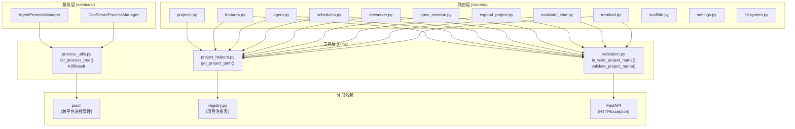

# server/utils/ -- 工具函数

## 目录概述

`utils/` 目录包含跨路由和服务层共享的基础工具函数。设计原则是消除重复代码,为上层提供单一的真相来源(single source of truth)。

## 文件列表

| 文件 | 大小 | 职责说明 |
|------|------|---------|
| `__init__.py` | 0.02 KB | 空包初始化(仅含注释) |
| `process_utils.py` | 4.3 KB | 跨平台进程树终止工具 |
| `project_helpers.py` | 0.9 KB | 项目路径查找(注册表封装) |
| `validation.py` | 1.5 KB | 项目名称验证(两种变体) |

---

## 各文件详细说明

### process_utils.py -- 进程管理工具

**数据类:** `KillResult`

```python
@dataclass
class KillResult:
    status: Literal["success", "partial", "failure"]
    parent_pid: int
    children_found: int = 0
    children_terminated: int = 0
    children_killed: int = 0
    parent_forcekilled: bool = False
```

| 字段 | 说明 |
|------|------|
| `status` | `success`: 所有进程正常终止; `partial`: 部分需要强杀; `failure`: 父进程无法终止 |
| `parent_pid` | 父进程 PID |
| `children_found` | 发现的子进程数量 |
| `children_terminated` | 正常终止(SIGTERM)的子进程数 |
| `children_killed` | 强制终止(SIGKILL)的子进程数 |
| `parent_forcekilled` | 父进程是否需要强杀 |

**核心函数:** `kill_process_tree(proc, timeout=5.0) -> KillResult`

终止一个进程及其所有子进程(递归)。在 Windows 上尤为重要,因为 `subprocess.terminate()` 仅终止直接进程,会留下孤立的浏览器实例、编码/测试代理等子进程。

**执行流程:**

1. 通过 `psutil.Process(pid).children(recursive=True)` 获取所有子进程
2. 对所有子进程发送 SIGTERM(优雅终止请求)
3. 等待 `timeout` 秒,使用 `psutil.wait_procs()` 收集已终止的进程
4. 对仍存活的子进程发送 SIGKILL(强制终止)
5. 对父进程发送 SIGTERM,等待 `timeout` 秒
6. 如果父进程仍存活,发送 SIGKILL
7. 异常处理: `NoSuchProcess` (已死亡)和 `AccessDenied` (Windows 系统进程)均正常处理

**被调用者:** `AgentProcessManager.stop()` 和 `DevServerProcessManager.stop()`

### project_helpers.py -- 项目路径查找

**核心函数:** `get_project_path(project_name: str) -> Path | None`

通过项目注册表(registry)查找项目的文件系统路径。这是所有路由获取项目路径的**单一入口**,封装了对根目录 `registry.py` 中 `get_project_path()` 函数的调用。

**设计决策:**

此文件存在的原因是解耦。`registry.py` 位于项目根目录,不属于 `server` 包。通过 `project_helpers.py` 封装导入逻辑(包括 `sys.path` 调整),避免每个路由文件重复同样的模块路径操作。

**使用者:** 几乎所有路由模块(`projects.py`、`features.py`、`agent.py`、`schedules.py`、`devserver.py`、`spec_creation.py`、`expand_project.py`、`assistant_chat.py`、`terminal.py`)。

### validation.py -- 项目名称验证

**验证规则:** 仅允许 ASCII 字母、数字、连字符(`-`)和下划线(`_`),长度 1-50 字符。

正则表达式: `^[a-zA-Z0-9_-]{1,50}$`(编译一次,全局复用)

**两种变体:**

| 函数 | 返回类型 | 适用场景 |
|------|---------|---------|
| `is_valid_project_name(name)` | `bool` | WebSocket 处理器(需要手动关闭连接,不能抛 HTTP 异常) |
| `validate_project_name(name)` | `str` 或抛异常 | REST 端点处理器(FastAPI 自动将 HTTPException 转为 400 响应) |

**使用者:** 所有涉及 `project_name` 路径参数的路由模块。WebSocket 端点使用 `is_valid_project_name()`,REST 端点使用 `validate_project_name()`。

---

## 架构图



---

## 依赖关系

### 被依赖汇总

| 工具函数 | 被路由调用 | 被服务调用 |
|---------|-----------|-----------|
| `kill_process_tree()` | -- | `process_manager.py`, `dev_server_manager.py` |
| `get_project_path()` | 9 个路由模块 | -- |
| `is_valid_project_name()` | WebSocket 路由(spec, expand, assistant, terminal) | -- |
| `validate_project_name()` | REST 路由(features, agent, schedules, devserver, 等) | -- |

### 外部依赖

| 工具文件 | 依赖包 | 用途 |
|---------|--------|------|
| `process_utils.py` | `psutil` | 获取子进程列表、等待进程终止 |
| `process_utils.py` | `subprocess` | Popen 类型(仅类型引用) |
| `project_helpers.py` | `registry` (项目根) | `get_project_path()` 函数 |
| `validation.py` | `fastapi` | `HTTPException` 异常类 |
| `validation.py` | `re` (标准库) | 正则表达式编译和匹配 |

---

## 关键模式

### 单一职责原则

每个工具文件只承担一个明确的职责:
- `process_utils.py` -- 进程终止(一个函数 + 一个数据类)
- `project_helpers.py` -- 路径查找(一个函数)
- `validation.py` -- 名称验证(两个函数 + 一个编译正则)

### 抽象层隔离

`project_helpers.py` 将 `registry.py` 的 `sys.path` 操作封装在内部,避免每个路由文件重复以下模式:

```python
import sys
from pathlib import Path
sys.path.insert(0, str(Path(__file__).parent.parent.parent))
from registry import get_project_path
```

上层只需:

```python
from ..utils.project_helpers import get_project_path
```

### 两种验证变体

`validation.py` 提供两种验证函数以适应不同的错误处理场景:
- **REST 端点**: 使用 `validate_project_name()`,依赖 FastAPI 的异常处理机制自动返回 HTTP 400
- **WebSocket 端点**: 使用 `is_valid_project_name()`,返回布尔值让调用者决定如何关闭连接和发送错误消息

### 优雅降级

`kill_process_tree()` 在每一步都处理 `NoSuchProcess` 和 `AccessDenied` 异常:
- 子进程可能在遍历过程中自行退出(NoSuchProcess)
- Windows 系统进程可能拒绝访问(AccessDenied)
- 即使 psutil 完全不可用,也通过 fallback 直接调用 `proc.terminate()` / `proc.kill()`
