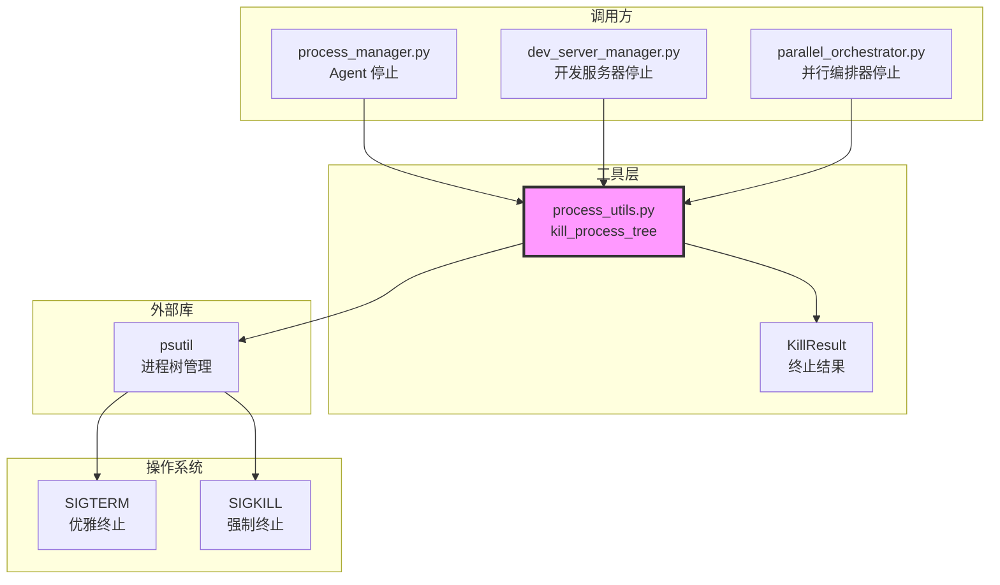

# `process_utils.py` — 进程管理工具函数

> 源文件路径: `server/utils/process_utils.py`

## 功能概述

`process_utils.py` 提供跨代码库共享的进程管理工具函数，目前核心功能是 `kill_process_tree`——安全终止一个进程及其所有子进程的完整进程树。

在 Windows 上，`subprocess.terminate()` 只终止直接进程而不影响其子进程，这会导致孤立的子进程（如浏览器实例、编码/测试 Agent）。该函数使用 `psutil` 递归收集所有子进程，先优雅终止（SIGTERM），等待指定超时时间后对仍存活的进程强制终止（SIGKILL）。通过 `KillResult` 数据类返回详细的终止统计信息。

## 依赖关系

### 导入依赖

| 模块 | 说明 |
|------|------|
| `logging` | 日志记录 |
| `subprocess` | 进程类型引用（`Popen`） |
| `dataclasses` | 结果数据类 |
| `psutil` | 进程树管理（子进程枚举、等待、终止） |

### 被依赖

| 模块 | 引用内容 |
|------|----------|
| `server/services/process_manager.py` | 导入 `kill_process_tree`，Agent 进程停止 |
| `server/services/dev_server_manager.py` | 导入 `kill_process_tree`，开发服务器停止 |
| `parallel_orchestrator.py` | 导入 `kill_process_tree`，并行编排器停止 |

## 关键类/函数

### `@dataclass KillResult`

进程树终止操作的结果。

| 字段 | 类型 | 说明 |
|------|------|------|
| `status` | `Literal["success", "partial", "failure"]` | 整体状态 |
| `parent_pid` | `int` | 父进程 PID |
| `children_found` | `int` | 发现的子进程数（默认 0） |
| `children_terminated` | `int` | 优雅终止的子进程数（默认 0） |
| `children_killed` | `int` | 强制终止的子进程数（默认 0） |
| `parent_forcekilled` | `bool` | 父进程是否被强制终止（默认 False） |

状态含义：
- `"success"` — 所有进程优雅终止
- `"partial"` — 部分进程需要强制终止
- `"failure"` — 父进程无法终止

### `kill_process_tree(proc: subprocess.Popen, timeout: float = 5.0) -> KillResult`

- **参数**:
  - `proc` — 要终止的 `subprocess.Popen` 对象
  - `timeout` — 优雅终止等待时间（秒），默认 5.0
- **返回值**: `KillResult` 终止结果统计
- **执行流程**:
  1. 通过 `psutil.Process(pid).children(recursive=True)` 递归获取所有子进程
  2. 对每个子进程调用 `terminate()`（SIGTERM）
  3. 使用 `psutil.wait_procs()` 等待子进程终止
  4. 对超时仍存活的子进程调用 `kill()`（SIGKILL）
  5. 终止父进程（先 terminate，超时后 kill）
  6. 处理 `NoSuchProcess`（已退出）和 `AccessDenied`（Windows 系统进程）异常
- **容错**: 如果 psutil 无法访问父进程，回退到直接 `proc.terminate()` / `proc.kill()`

## 架构图

## 注意事项

1. **子进程优先**: 必须先终止子进程再终止父进程，否则子进程会成为孤立进程
2. **递归收集**: 使用 `recursive=True` 递归获取所有层级的子进程，不仅仅是直接子进程
3. **Windows AccessDenied**: Windows 上 `psutil` 可能对系统进程或已退出进程抛出 `AccessDenied`，需要优雅处理
4. **PID 重用**: 由于先收集子进程列表再终止，理论上存在极短时间窗口的 PID 重用风险，但 `NoSuchProcess` 异常会安全处理这种情况
5. **阻塞调用**: `kill_process_tree` 是阻塞函数，调用方需要通过 `asyncio.run_in_executor` 在异步上下文中使用
6. **日志级别**: 使用 `DEBUG` 级别记录详细的终止过程，避免正常操作中产生过多日志
