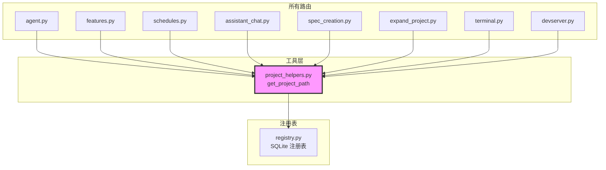

# `project_helpers.py` — 项目路径查询工具

> 源文件路径: `server/utils/project_helpers.py`

## 功能概述

`project_helpers.py` 是一个轻量级工具模块，封装了项目名称到文件系统路径的查询功能。它将之前分散在各个路由和 WebSocket 处理器中的重复代码（`_get_project_path()` 函数）统一到一处，通过全局项目注册表（`registry.py`）进行查找。

该模块的核心价值在于消除代码重复——之前每个需要解析项目路径的路由模块都有各自的 `_get_project_path()` 内联函数，现在统一使用此模块提供的 `get_project_path()` 函数。

## 依赖关系

### 导入依赖

| 模块 | 说明 |
|------|------|
| `sys` | 模块路径管理 |
| `pathlib.Path` | 路径操作 |
| `registry` | 项目注册表（`get_project_path`） |

### 被依赖

| 模块 | 引用内容 |
|------|----------|
| `server/routers/agent.py` | 导入 `get_project_path`（别名 `_get_project_path`） |
| `server/routers/features.py` | 导入 `get_project_path`（别名 `_get_project_path`） |
| `server/routers/schedules.py` | 导入 `get_project_path`（别名 `_get_project_path`） |
| `server/routers/assistant_chat.py` | 导入 `get_project_path`（别名 `_get_project_path`） |
| `server/routers/spec_creation.py` | 导入 `get_project_path`（别名 `_get_project_path`） |
| `server/routers/expand_project.py` | 导入 `get_project_path`（别名 `_get_project_path`） |
| `server/routers/terminal.py` | 导入 `get_project_path`（别名 `_get_project_path`） |
| `server/routers/devserver.py` | 导入 `get_project_path`（别名 `_get_project_path`） |

## 关键类/函数

### `get_project_path(project_name: str) -> Path | None`

- **参数**: `project_name: str` — 已注册的项目名称
- **返回值**: 项目目录的 `Path` 对象，若项目未在注册表中找到则返回 `None`
- **说明**: 直接委托给 `registry.get_project_path()`。模块启动时确保仓库根目录在 `sys.path` 中，以便导入根级 `registry` 模块

## 架构图

## 注意事项

1. **代码消重**: 该模块的存在纯粹是为了消除路由层的代码重复，所有路由都以 `_get_project_path` 别名导入使用
2. **sys.path 管理**: 模块级代码将仓库根目录插入 `sys.path`，因为 `registry.py` 位于仓库根目录而非 `server` 包内
3. **返回值语义**: 返回 `None` 表示项目未注册，调用方通常会返回 HTTP 404 或关闭 WebSocket 连接
4. **无缓存**: 每次调用都直接查询注册表数据库，不做缓存。对于高频路由来说性能影响可忽略不计（SQLite 本地查询很快）
