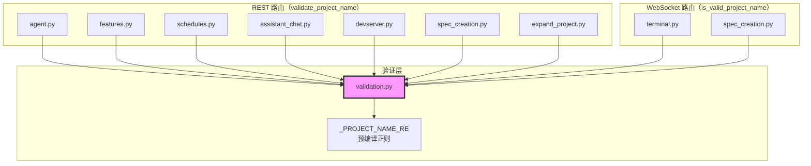

# `validation.py` — 项目名称验证工具

> 源文件路径: `server/utils/validation.py`

## 功能概述

`validation.py` 提供项目名称验证功能，是所有 REST 端点和 WebSocket 处理器共享的输入验证模块。它定义了项目名称的格式规则：仅允许 ASCII 字母、数字、连字符和下划线，长度 1-50 个字符。

模块提供两个变体函数以适配不同的使用场景：`is_valid_project_name` 返回布尔值，适用于 WebSocket 处理器（需要手动关闭连接而非抛出 HTTP 异常）；`validate_project_name` 在验证失败时抛出 `HTTPException(400)`，适用于 REST 端点（由 FastAPI 自动转换为 HTTP 400 响应）。

正则表达式在模块加载时编译一次，所有验证调用复用同一个编译后的模式对象。

## 依赖关系

### 导入依赖

| 模块 | 说明 |
|------|------|
| `re` | 正则表达式编译和匹配 |
| `fastapi` | `HTTPException` HTTP 异常类 |

### 被依赖

| 模块 | 引用内容 |
|------|----------|
| `server/routers/agent.py` | 导入 `validate_project_name` |
| `server/routers/features.py` | 导入 `validate_project_name` |
| `server/routers/schedules.py` | 导入 `validate_project_name` |
| `server/routers/assistant_chat.py` | 导入 `validate_project_name` |
| `server/routers/devserver.py` | 导入 `validate_project_name` |
| `server/routers/spec_creation.py` | 导入 `is_valid_project_name` 和 `validate_project_name` |
| `server/routers/terminal.py` | 导入 `is_valid_project_name` |
| `server/routers/expand_project.py` | 导入 `validate_project_name` |

## 关键类/函数

### 常量

#### `_PROJECT_NAME_RE`

- **值**: `re.compile(r'^[a-zA-Z0-9_-]{1,50}$')`
- **说明**: 预编译的项目名称验证正则表达式。允许 ASCII 字母（大小写）、数字、下划线、连字符，长度 1-50

### `is_valid_project_name(name: str) -> bool`

- **参数**: `name` — 待验证的项目名称
- **返回值**: `True` 表示有效，`False` 表示无效
- **适用场景**: WebSocket 处理器，需要自行处理无效名称（如关闭连接并发送错误消息）

### `validate_project_name(name: str) -> str`

- **参数**: `name` — 待验证的项目名称
- **返回值**: 验证通过则返回原名称（不变）
- **异常**: `HTTPException(400)` — 名称不合法时抛出，包含描述性错误信息
- **适用场景**: REST 端点处理器，FastAPI 自动将异常转换为 HTTP 400 响应

## 架构图

## 注意事项

1. **安全边界**: 项目名称验证是系统的安全边界之一，防止路径穿越（`../`）和注入攻击。通过只允许 `[a-zA-Z0-9_-]` 字符集确保名称不包含任何特殊字符
2. **长度限制**: 50 字符上限防止过长名称导致的文件系统路径问题（特别是 Windows 的 260 字符路径限制）
3. **预编译正则**: 正则表达式在模块加载时编译一次（`re.compile`），避免每次验证重复编译
4. **两种变体**: 区分 REST 和 WebSocket 场景是因为 WebSocket 连接中无法使用 `HTTPException`（FastAPI 的 WebSocket 异常处理机制不同）
5. **spec_creation 双用**: `spec_creation.py` 同时使用两个变体——REST 端点用 `validate_project_name`，WebSocket 处理器用 `is_valid_project_name`
