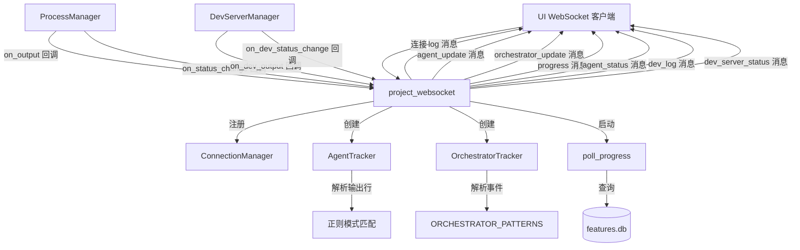

# `websocket.py` -- WebSocket 实时通信与多代理状态追踪

> 源文件路径: `server/websocket.py`

## 功能概述

`websocket.py` 是 AutoForge 服务器的核心实时通信模块。它实现了 WebSocket 连接管理、项目进度轮询、代理输出流转发,以及多代理模式下的状态追踪系统。当 UI 客户端连接到 `/ws/projects/{project_name}` 端点时,该模块负责将代理进程的输出、状态变更和编排器事件实时推送给前端。

该文件包含三个关键的追踪器类:`AgentTracker` 负责解析并行代理的输出行,识别每个代理的当前状态(思考/工作/测试/成功/错误),为每个代理分配吉祥物名称并发射 `agent_update` WebSocket 消息;`OrchestratorTracker` 解析编排器级别的事件(初始化、容量检查、生成/完成代理等),发射 `orchestrator_update` 消息;`ConnectionManager` 管理每个项目的 WebSocket 连接集合,支持向特定项目的所有客户端广播消息。

进度轮询通过 `poll_progress` 函数每 2 秒查询一次数据库中的通过/进行中/总计测试数量,仅在数据变化时向客户端推送更新,以减少不必要的网络流量。

## 依赖关系

### 导入依赖

| 模块 | 说明 |
|------|------|
| `fastapi` | `WebSocket`, `WebSocketDisconnect` WebSocket 支持 |
| `server.schemas` | `AGENT_MASCOTS` 代理吉祥物名称列表 |
| `server.services.chat_constants` | `ROOT_DIR` 项目根路径 |
| `server.services.dev_server_manager` | `get_devserver_manager` 开发服务器管理 |
| `server.services.process_manager` | `get_manager` 代理进程管理 |
| `server.utils.project_helpers` | `get_project_path` 项目路径查找 |
| `server.utils.validation` | `is_valid_project_name` 项目名称校验 |
| `progress` | `count_passing_tests` 进度统计 (延迟导入) |

### 被依赖

| 模块 | 引用内容 |
|------|----------|
| `server/main.py` | `project_websocket` 函数,注册为 WebSocket 路由处理器 |

## 关键类/函数

### `AgentTracker`
- **说明**: 追踪活跃代理及其状态的核心类,支持编码代理和测试代理的独立追踪。
- **关键属性**:
  - `active_agents`: 字典, key 为 `(feature_id, agent_type)` 复合键, value 为代理状态信息
  - `_next_agent_index`: 自增代理索引
  - `_lock`: asyncio 锁, 保证线程安全

#### `process_line(line: str) -> dict | None`
- **参数**: `line` - 代理进程的输出行
- **返回值**: `agent_update` 消息字典或 `None`
- **说明**: 解析输出行中的特征 ID、代理状态和思考内容。支持识别单个代理启动/完成、批量代理启动/完成、`[Feature #X]` 前缀输出和 `[Tool: name]` 工具使用模式。仅在状态或思考内容变化时发射更新。

#### `get_agent_info(feature_id, agent_type) -> tuple[int | None, str | None]`
- **参数**: `feature_id` - 特征 ID, `agent_type` - 代理类型 ("coding" | "testing")
- **返回值**: `(agentIndex, agentName)` 元组
- **说明**: 线程安全地获取指定特征和代理类型的索引和名称信息。

#### `reset()`
- **说明**: 重置追踪器状态。在编排器停止或崩溃时调用,清除所有活跃代理和重置索引计数器,防止幽灵代理在重启周期间累积。

### `OrchestratorTracker`
- **说明**: 追踪编排器状态,为任务控制面板提供可观测性。
- **关键属性**: `state`, `coding_agents`, `testing_agents`, `max_concurrency`, `ready_count`, `blocked_count`, `recent_events`

#### `process_line(line: str) -> dict | None`
- **参数**: `line` - 编排器输出行
- **返回值**: `orchestrator_update` 消息字典或 `None`
- **说明**: 使用预编译正则模式匹配编排器事件,包括初始化、容量检查、代理生成/完成、全部完成、优雅暂停等。

### `ConnectionManager`
- **说明**: 管理每个项目的 WebSocket 连接集合。

#### `connect(websocket, project_name)`
- **说明**: 注册 WebSocket 连接到指定项目。

#### `disconnect(websocket, project_name)`
- **说明**: 移除 WebSocket 连接,空集合时自动清理。

#### `broadcast_to_project(project_name, message)`
- **说明**: 向项目的所有连接广播消息,自动清理失效连接。

### `poll_progress(websocket, project_name, project_dir)`
- **参数**: `websocket` - WebSocket 连接, `project_name` - 项目名, `project_dir` - 项目路径
- **说明**: 异步轮询任务,每 2 秒查询数据库进度,仅在数据变化时发送 `progress` 消息。

### `project_websocket(websocket, project_name)`
- **参数**: `websocket` - WebSocket 连接, `project_name` - 项目名称
- **说明**: WebSocket 端点的主处理函数。接受连接后,注册代理和开发服务器的输出/状态回调,启动进度轮询任务,发送初始状态,然后进入消息循环处理客户端请求(如 ping/pong)。断开时清理所有回调和轮询任务。

## 架构图

## 注意事项

1. **复合键追踪**: `AgentTracker` 使用 `(feature_id, agent_type)` 作为复合键,允许同一特征同时拥有编码代理和测试代理。
2. **批量代理支持**: 批量代理为所有特征 ID 创建引用同一代理对象的条目,确保任何特征 ID 的输出都能正确路由。
3. **幽灵代理防护**: 当代理状态变为 `stopped` 或 `crashed` 时,两个追踪器都会重置,防止跨重启周期的幽灵代理。
4. **合成完成消息**: 对于未被追踪的代理(可能因为启动消息丢失),仍会发射带 `synthetic: True` 标记的完成消息,确保 UI 始终收到完成通知。
5. **延迟导入**: `count_passing_tests` 通过 `_get_count_passing_tests()` 延迟导入,避免循环依赖和启动时的模块加载开销。
6. **连接清理**: `broadcast_to_project` 在发送失败时自动标记并清理死连接,保持连接集合的健康状态。
