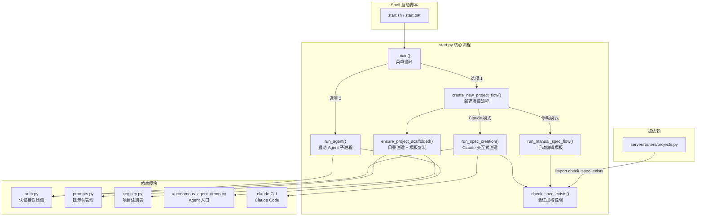

# `start.py` — CLI 交互式启动器，提供项目创建与选择菜单

> 源文件路径: `start.py`

## 功能概述

`start.py` 是 AutoForge 的命令行交互式入口程序，为用户提供一个基于终端的菜单界面来管理项目。它是从源码目录直接运行 AutoForge 时的主要启动方式（通过 `start.sh` 或 `start.bat` 调用）。

该文件支持两条核心工作流：**创建新项目**和**继续已有项目**。创建新项目时，用户可以选择通过 Claude Code 的 `/create-spec` 命令交互式生成项目规格说明，也可以手动编辑模板文件。继续已有项目时，程序从注册表中加载已注册的项目列表供用户选择。

程序采用循环菜单模式运行——用户在完成一次 Agent 运行后会自动返回主菜单，直到显式退出。所有项目信息通过 `registry` 模块持久化存储在 SQLite 注册表中。

## 依赖关系

### 导入依赖

| 模块 | 说明 |
|------|------|
| `os` | 切换工作目录 (`os.chdir`) |
| `subprocess` | 启动 Claude CLI 和 Agent 子进程 |
| `sys` | 获取平台信息和 Python 解释器路径 |
| `pathlib.Path` | 文件路径操作 |
| `dotenv.load_dotenv` | 加载 `.env` 环境变量文件 |
| `auth.is_auth_error` | 检测 Claude CLI 认证错误 |
| `auth.print_auth_error_help` | 输出认证错误帮助信息 |
| `prompts.get_project_prompts_dir` | 获取项目提示词目录路径 |
| `prompts.has_project_prompts` | 检查项目是否有有效的提示词文件 |
| `prompts.scaffold_project_prompts` | 为新项目复制模板提示词文件 |
| `registry.get_project_path` | 按名称查询已注册项目的路径 |
| `registry.list_registered_projects` | 列出所有已注册的项目 |
| `registry.register_project` | 将新项目注册到注册表 |
| `registry.DEFAULT_MODEL` | 默认模型名称（运行时延迟导入） |
| `registry.get_all_settings` | 获取全局设置（运行时延迟导入） |

### 被依赖

| 模块 | 引用内容 |
|------|----------|
| `server/routers/projects.py` | `from start import check_spec_exists` — 在 API 端检查项目规格说明是否存在 |
| `start.sh` | Shell 脚本通过 `python start.py` 启动 CLI 菜单 |
| `start.bat` | Windows 批处理通过 `python start.py` 启动 CLI 菜单 |
| `package.json` | 作为 npm 包的分发文件列入 `files` 字段 |

## 关键类/函数

### `check_spec_exists(project_dir: Path) -> bool`
- **参数**: `project_dir` — 项目目录的绝对路径
- **返回值**: 布尔值，表示是否存在有效的项目规格说明文件
- **说明**: 按优先级依次检查 `{project_dir}/.autoforge/prompts/app_spec.txt`（新布局）和 `{project_dir}/app_spec.txt`（旧布局）。有效性通过检测文件内容中是否包含 `<project_specification>` 标签来判断。此函数也被 `server/routers/projects.py` 引用。

### `get_existing_projects() -> list[tuple[str, Path]]`
- **返回值**: `(项目名称, 项目路径)` 元组的列表，按名称排序
- **说明**: 从注册表中读取所有已注册项目，过滤掉目录已不存在的项目，返回仍然有效的项目列表。

### `display_menu(projects: list[tuple[str, Path]]) -> None`
- **说明**: 打印主菜单界面，包含"创建新项目"、"继续已有项目"（仅在有项目时显示）和"退出"选项。

### `get_new_project_info() -> tuple[str, Path] | None`
- **返回值**: 新项目的 `(名称, 路径)` 元组，或取消时返回 `None`
- **说明**: 交互式获取项目名称和目录路径。包含平台感知的名称字符验证（Windows 限制更多字符）和名称重复检查。

### `ensure_project_scaffolded(project_name: str, project_dir: Path) -> Path`
- **参数**: `project_name` — 项目名称, `project_dir` — 项目目录路径
- **返回值**: 项目目录路径
- **说明**: 确保项目目录已创建、模板文件已复制、项目已注册到注册表。是新项目创建流程的核心步骤。

### `run_spec_creation(project_dir: Path) -> bool`
- **返回值**: 布尔值，表示规格说明是否创建成功
- **说明**: 通过 `subprocess.run` 启动 `claude /create-spec {project_dir}` 命令，进入交互式规格创建流程。捕获 `stderr` 以检测认证错误并提供帮助信息。

### `run_manual_spec_flow(project_dir: Path) -> bool`
- **返回值**: 布尔值，表示用户是否确认继续
- **说明**: 引导用户手动编辑模板文件。显示需要编辑的文件路径，等待用户按 Enter 确认，然后验证规格说明是否已被正确编辑。

### `run_agent(project_name: str, project_dir: Path) -> None`
- **说明**: 通过 `subprocess.run` 启动 `autonomous_agent_demo.py` 子进程。从全局设置中读取模型配置，构建带有 `--project-dir` 和 `--model` 参数的命令行。捕获 `stderr` 以检测认证错误。

### `create_new_project_flow() -> tuple[str, Path] | None`
- **返回值**: 成功时返回 `(项目名称, 项目目录)` 元组，失败或取消时返回 `None`
- **说明**: 完整的新项目创建流程：获取信息 -> 创建目录与模板 -> 选择规格创建方式（Claude / 手动） -> 执行创建 -> 返回结果。

### `main() -> None`
- **说明**: 主入口函数。切换到脚本所在目录，进入无限循环显示菜单并处理用户输入，直到用户选择退出。

## 架构图

## 注意事项

1. **工作目录依赖**: `main()` 函数在启动时会通过 `os.chdir()` 切换到脚本所在目录，后续的子进程启动依赖此工作目录。这意味着 `start.py` 必须从 AutoForge 项目根目录运行或由 shell 脚本正确定位。

2. **延迟导入**: `run_agent()` 函数内部使用延迟导入 (`from registry import DEFAULT_MODEL, get_all_settings`)，避免在程序启动时加载不必要的模块。

3. **平台差异**: 项目名称验证规则因操作系统而异 —— Windows 不允许 `<>:"/\|?*` 字符，而 Unix 仅限制 `/` 和空字符。

4. **双路径兼容**: `check_spec_exists()` 同时检查新布局 (`.autoforge/prompts/`) 和旧布局（项目根目录），以支持遗留项目的透明迁移。

5. **认证错误处理**: 所有涉及 Claude CLI 调用的函数都会捕获 `stderr` 并通过 `auth` 模块检测认证问题，提供明确的解决指引。

6. **此文件仅用于源码开发模式**: 通过 `npm install -g autoforge-ai` 安装的全局包使用 `bin/autoforge.js` + `lib/cli.js` 作为入口，不经过 `start.py`。
