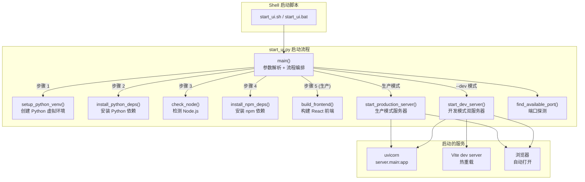

# `start_ui.py` — Web UI 自动化启动器，管理全栈环境设置与服务启动

> 源文件路径: `start_ui.py`

## 功能概述

`start_ui.py` 是 AutoForge Web UI 的自动化启动脚本，负责从零开始搭建并启动完整的全栈开发环境。它以"一键启动"为设计目标，自动处理 Python 虚拟环境创建、依赖安装、Node.js 检测、npm 依赖安装、React 前端构建以及 FastAPI 服务器启动等全部流程。

该脚本支持两种运行模式：**生产模式**（默认）和**开发模式**（`--dev`）。生产模式会先构建前端静态资源再由 FastAPI 统一提供服务；开发模式则同时启动 Vite 热重载开发服务器和 FastAPI 后端，适合 UI 开发。脚本还支持自定义端口和主机绑定，并在启用远程访问时显示安全警告。

此文件仅用于从源码目录直接运行 AutoForge 的场景（开发模式）。通过 npm 全局安装的用户使用 `lib/cli.js` 作为启动入口。

## 依赖关系

### 导入依赖

| 模块 | 说明 |
|------|------|
| `argparse` | 命令行参数解析（`--dev`, `--host`, `--port`） |
| `asyncio` | Windows 平台的 `ProactorEventLoop` 策略设置 |
| `os` | 环境变量操作 |
| `shutil` | 检测 `node` 和 `npm` 可执行文件路径 |
| `socket` | 端口可用性探测 |
| `subprocess` | 运行子进程（pip、npm、uvicorn 等） |
| `sys` | 平台检测和退出控制 |
| `time` | 服务器启动延迟等待 |
| `webbrowser` | 自动打开浏览器 |
| `pathlib.Path` | 文件路径操作 |
| `dotenv.load_dotenv` | 加载 `.env` 环境变量（在 venv 安装后延迟导入） |
| `server.main:app` | FastAPI 应用实例（通过 uvicorn 间接启动） |

### 被依赖

| 模块 | 引用内容 |
|------|----------|
| `start_ui.sh` | Shell 脚本通过 `python start_ui.py "$@"` 启动，传递命令行参数 |
| `start_ui.bat` | Windows 批处理通过 `python start_ui.py %*` 启动 |
| `ui/src/components/SetupWizard.tsx` | 错误提示中引导用户运行 `start_ui.py` |
| `server/main.py` | 文档注释中引用 `start_ui.py` 的环境变量设置 |

## 关键类/函数

### `print_step(step: int, total: int, message: str) -> None`
- **说明**: 打印格式化的步骤进度消息，形如 `[1/6] Setting up Python environment`。

### `find_available_port(start: int = 8888, max_attempts: int = 10) -> int`
- **参数**: `start` — 起始端口号, `max_attempts` — 最大尝试次数
- **返回值**: 可用端口号
- **说明**: 从指定端口开始逐一尝试绑定 TCP socket，找到第一个可用端口。若无可用端口则抛出 `RuntimeError`。

### `get_venv_python() -> Path`
- **返回值**: 虚拟环境中 Python 可执行文件的路径
- **说明**: 根据平台返回 `venv/Scripts/python.exe`（Windows）或 `venv/bin/python`（macOS/Linux）。

### `run_command(cmd: list, cwd: Path | None = None, check: bool = True) -> bool`
- **返回值**: 命令是否成功执行
- **说明**: 通用命令执行封装。捕获 `CalledProcessError` 和 `FileNotFoundError`，返回布尔结果。

### `setup_python_venv() -> bool`
- **返回值**: 虚拟环境是否就绪
- **说明**: 检查 `venv/` 目录和 Python 可执行文件是否存在，不存在则创建。使用项目本地 venv（与 `lib/cli.js` 使用 `~/.autoforge/venv/` 不同）。

### `install_python_deps() -> bool`
- **返回值**: 依赖安装是否成功
- **说明**: 先升级 pip，再安装 `requirements.txt` 中的所有依赖。

### `check_node() -> bool`
- **返回值**: Node.js 和 npm 是否可用
- **说明**: 使用 `shutil.which()` 检测 `node` 和 `npm` 命令，并打印版本信息。

### `install_npm_deps() -> bool`
- **返回值**: npm 依赖是否已安装
- **说明**: 智能检测是否需要重新安装：如果 `node_modules/` 不存在或 `package.json` / `package-lock.json` 的修改时间比 `node_modules/` 新，则执行 `npm install`。

### `build_frontend() -> bool`
- **返回值**: 前端是否已构建
- **说明**: 智能增量构建检测。比较 `ui/dist/` 中最新文件与 `ui/src/` 源文件和配置文件的修改时间，仅在源码有变更时重新构建。包含 2 秒的 FAT32 文件系统时间戳容差。

### `start_dev_server(port: int, host: str = "127.0.0.1") -> tuple`
- **返回值**: `(backend_process, frontend_process)` 子进程元组
- **说明**: 同时启动 FastAPI 后端（带 `--reload`）和 Vite 前端开发服务器。通过 `VITE_API_PORT` 环境变量将后端端口传递给 Vite 代理配置。

### `start_production_server(port: int, host: str = "127.0.0.1")`
- **返回值**: 服务器子进程 (`subprocess.Popen`)
- **说明**: 以生产模式启动 uvicorn 服务器。注意：**不使用** `--reload` 标志，因为在 Windows 上 uvicorn 的重载 worker 不继承 `ProactorEventLoop` 策略，会导致 asyncio 子进程支持失效。

### `main() -> None`
- **说明**: 主入口函数。解析命令行参数，按步骤执行环境检查与设置，最终启动服务器。处理 `Ctrl+C` 信号优雅关闭服务进程。

## 架构图

## 注意事项

1. **Windows asyncio 兼容性**: 文件顶部在 Windows 平台上设置 `WindowsProactorEventLoopPolicy`，这必须在任何 asyncio 操作之前执行。生产模式不使用 `--reload` 也是出于此原因。

2. **本地 venv vs 全局 venv**: `start_ui.py` 在项目根目录创建 `venv/` 虚拟环境（源码开发模式），而 npm 全局包的 `lib/cli.js` 在 `~/.autoforge/venv/` 创建虚拟环境。两者相互独立。

3. **FAT32 时间戳容差**: `build_frontend()` 在比较文件修改时间时加入 2 秒容差，以兼容 FAT32 文件系统的 2 秒时间戳精度（USB 驱动器、SD 卡等场景）。

4. **远程访问安全**: 当 `--host` 不是 `127.0.0.1` 时，脚本会显示醒目的安全警告，并设置 `AUTOFORGE_ALLOW_REMOTE=1` 环境变量通知 FastAPI 服务器启用跨域支持。

5. **智能重建检测**: npm 依赖安装和前端构建都使用文件修改时间进行增量检测，避免不必要的重复操作，显著加快后续启动速度。

6. **dotenv 延迟导入**: `.env` 文件的加载在 Python 依赖安装完成后才执行，因为 `python-dotenv` 包可能尚未安装。使用 `try/except ImportError` 做优雅降级。
