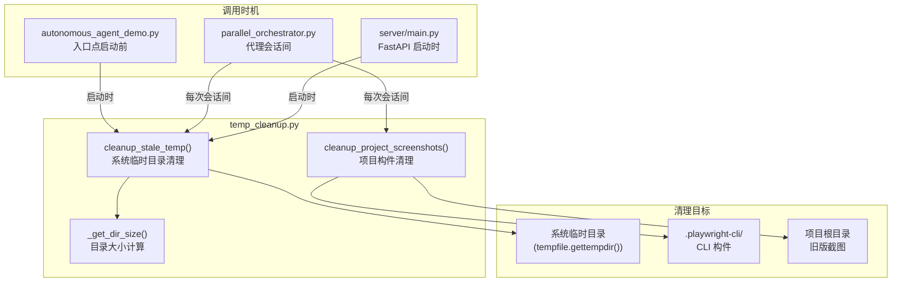

# `temp_cleanup.py` -- 临时文件与构件清理模块

> 源文件路径: `temp_cleanup.py`

## 功能概述

`temp_cleanup.py` 负责清理 AutoForge 代理、Playwright 浏览器、Node.js 和其他开发工具在运行过程中产生的陈旧临时文件和目录。这是一个防止磁盘空间膨胀的维护模块，对系统的长时间无人值守运行至关重要。

该模块提供两个独立的清理函数：`cleanup_stale_temp()` 清理系统临时目录中的全局陈旧文件（如 Playwright 浏览器配置、Node.js V8 编译缓存、MongoDB 内存服务器二进制文件等），`cleanup_project_screenshots()` 清理项目目录内的 Playwright CLI 构件和旧版截图文件。

清理策略基于 **文件年龄** 而非文件锁，仅删除超过指定阈值的文件（默认 1 小时用于临时文件，5 分钟用于截图），确保不会干扰正在运行的进程。

## 依赖关系

### 导入依赖

| 模块 | 说明 |
|------|------|
| `logging` | 日志记录（DEBUG 级别记录每个删除操作，INFO 级别记录汇总） |
| `shutil` | `rmtree` 递归删除目录 |
| `tempfile` | `gettempdir()` 获取系统临时目录路径 |
| `time` | 时间戳比较（`time.time()` 与文件 `st_mtime`） |
| `pathlib.Path` | 路径操作和 glob 匹配 |

### 被依赖

| 模块 | 引用内容 |
|------|----------|
| `autonomous_agent_demo.py` | `from temp_cleanup import cleanup_stale_temp` -- 入口点模式启动前清理 |
| `parallel_orchestrator.py` | `from temp_cleanup import cleanup_project_screenshots, cleanup_stale_temp` -- 代理会话间清理 |
| `server/main.py` | `from temp_cleanup import cleanup_stale_temp` -- FastAPI 服务器启动时清理 |

## 关键类/函数

### `cleanup_stale_temp(max_age_seconds=3600) -> dict`

- **参数**: `max_age_seconds: int` -- 文件最大年龄阈值（默认 3600 秒 = 1 小时）
- **返回值**: 清理统计字典：
  - `dirs_deleted: int` -- 删除的目录数
  - `files_deleted: int` -- 删除的文件数
  - `bytes_freed: int` -- 释放的近似字节数
  - `errors: list[str]` -- 非致命错误消息列表
- **说明**: 扫描系统临时目录，按模式匹配并删除超龄的目录和文件

### `cleanup_project_screenshots(project_dir, max_age_seconds=300) -> dict`

- **参数**:
  - `project_dir: Path` -- 项目目录路径
  - `max_age_seconds: int` -- 构件最大年龄阈值（默认 300 秒 = 5 分钟）
- **返回值**: 清理统计字典（`files_deleted`、`bytes_freed`、`errors`）
- **说明**: 清理两类文件：
  1. `.playwright-cli/` 目录下的新版 CLI 构件（截图、快照等）
  2. 项目根目录下的旧版截图（`feature*-*.png`、`screenshot-*.png`、`step-*.png`）

### `_get_dir_size(path: Path) -> int`

- **参数**: `path: Path` -- 目录路径
- **返回值**: 目录总大小（字节）
- **说明**: 递归计算目录大小，安全处理权限和 OS 错误

## 清理目标模式

### 目录模式（`DIR_PATTERNS`）

| 模式 | 来源 |
|------|------|
| `playwright_firefoxdev_profile-*` | Playwright Firefox 浏览器配置文件 |
| `playwright-artifacts-*` | Playwright 测试构件 |
| `playwright-transform-cache` | Playwright 转换缓存 |
| `mongodb-memory-server*` | MongoDB 内存服务器二进制文件 |
| `ng-*` | Angular CLI 临时目录 |
| `scoped_dir*` | Chrome/Chromium 临时目录 |
| `node-compile-cache` | Node.js V8 编译缓存目录 |

### 文件模式（`FILE_PATTERNS`）

| 模式 | 来源 |
|------|------|
| `.[0-9a-f]*.node` | Node.js/V8 编译缓存文件（约 7MB 每个） |
| `claude-*-cwd` | Claude CLI 工作目录临时文件 |
| `mat-debug-*.log` | Material/Angular 调试日志 |

## 架构图

## 注意事项

1. **安全性设计**: 仅删除超过年龄阈值的文件，不会影响当前正在运行的代理进程。这是基于时间戳而非文件锁的策略，在大多数场景下足够安全。
2. **非致命错误**: 所有删除操作中的异常（权限拒绝、文件锁定等）都被捕获并记录到 `errors` 列表中，不会中断清理过程或抛出异常。
3. **调用频率**:
   - 系统级清理（`cleanup_stale_temp`）在入口点启动和服务器启动时调用一次
   - 项目级清理（`cleanup_project_screenshots`）在每次代理会话完成后调用
   - 编排器中的 `_run_inter_session_cleanup()` 同时调用两个函数
4. **Node.js 缓存膨胀**: V8 编译缓存文件每个约 7MB，在长时间运行的编排会话中可累积至 GB 级别，是此模块存在的主要原因之一。
5. **旧版兼容**: `cleanup_project_screenshots()` 同时处理新版 `.playwright-cli/` 目录和旧版项目根目录下的截图模式，确保向后兼容。
6. **可独立运行**: 该模块包含 `__main__` 入口，可直接运行 `python temp_cleanup.py` 进行手动清理和测试。
