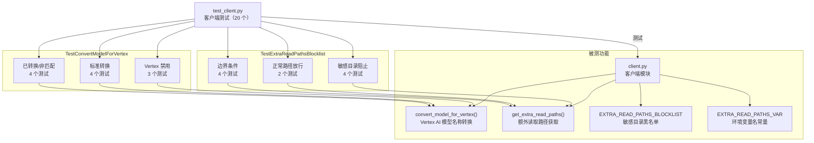

# `test_client.py` -- 客户端模块工具函数测试

> 源文件路径: `test_client.py`

## 功能概述

本文件是 AutoForge 客户端模块 (`client.py`) 的单元测试套件，使用 Python 标准库 `unittest` 框架编写，通过 `python -m pytest test_client.py` 运行。共包含约 20 个测试用例，分为两大测试类。

第一组测试 (`TestConvertModelForVertex`) 验证 Vertex AI 模型名称转换逻辑。AutoForge 支持通过 Google Cloud Vertex AI 运行 Claude 模型，但 Vertex AI 使用不同的模型命名格式（`@` 替代 `-` 分隔日期后缀）。测试确保在 Vertex AI 启用/禁用时，模型名称转换的正确性和边界条件处理。

第二组测试 (`TestExtraReadPathsBlocklist`) 验证跨项目文件读取路径的安全控制。`EXTRA_READ_PATHS` 环境变量允许 Agent 读取项目目录外的文件，但敏感目录（如 `.ssh`、`.aws`、`.gnupg` 等）必须被严格阻止。测试覆盖了路径本身是敏感目录、路径在敏感目录内部、路径包含敏感子目录、以及多种边界条件。

## 依赖关系

### 导入依赖

| 模块 | 说明 |
|------|------|
| `os` | 操作环境变量（CLAUDE_CODE_USE_VERTEX、HOME 等） |
| `sys` | 平台检测（Windows 兼容） |
| `tempfile` | 创建临时目录用于隔离测试 |
| `unittest` | 标准测试框架 |
| `pathlib.Path` | 文件路径操作 |
| `client.EXTRA_READ_PATHS_BLOCKLIST` | 被测敏感目录黑名单常量 |
| `client.EXTRA_READ_PATHS_VAR` | 被测环境变量名常量 |
| `client.convert_model_for_vertex` | 被测 Vertex AI 模型名称转换函数 |
| `client.get_extra_read_paths` | 被测额外读取路径获取函数 |

### 被依赖

| 模块 | 引用内容 |
|------|----------|
| `CLAUDE.md` | 项目文档中列为测试命令 (`python -m pytest test_client.py`) |

## 测试场景

### `TestConvertModelForVertex`

#### Vertex AI 禁用场景
- **`test_returns_model_unchanged_when_vertex_disabled`**: `CLAUDE_CODE_USE_VERTEX` 未设置时，模型名称原样返回
- **`test_returns_model_unchanged_when_vertex_set_to_zero`**: 环境变量设为 `"0"` 时，不执行转换
- **`test_returns_model_unchanged_when_vertex_set_to_empty`**: 环境变量设为空字符串时，不执行转换

#### Vertex AI 启用标准转换场景
- **`test_converts_legacy_opus_model`**: `claude-opus-4-5-20251101` 转换为 `claude-opus-4-5@20251101`
- **`test_opus_4_6_passthrough_on_vertex`**: `claude-opus-4-6` 无日期后缀，直接透传不转换
- **`test_converts_sonnet_model`**: `claude-sonnet-4-5-20250929` 转换为 `claude-sonnet-4-5@20250929`
- **`test_converts_haiku_model`**: `claude-3-5-haiku-20241022` 转换为 `claude-3-5-haiku@20241022`

#### 已转换/非匹配场景
- **`test_already_vertex_format_unchanged`**: 已包含 `@` 的 Vertex 格式不再重复转换
- **`test_non_claude_model_unchanged`**: 非 Claude 模型（如 `gpt-4o`）原样返回
- **`test_model_without_date_suffix_unchanged`**: 无日期后缀的模型名不转换
- **`test_empty_string_unchanged`**: 空字符串原样返回

### `TestExtraReadPathsBlocklist`

#### 敏感目录阻止场景
- **`test_sensitive_directory_is_blocked`**: 路径本身就是敏感目录（如 `~/.ssh`）时被阻止
- **`test_path_inside_sensitive_directory_is_blocked`**: 敏感目录内部的子路径（如 `~/.ssh/keys`）被阻止
- **`test_path_containing_sensitive_directory_is_blocked`**: 包含敏感子目录的父路径（如 HOME 目录含 `.ssh`）被阻止
- **`test_all_blocklist_entries_are_checked`**: 遍历 `EXTRA_READ_PATHS_BLOCKLIST` 中的每个条目，确保全部被阻止

#### 正常路径放行场景
- **`test_valid_non_sensitive_path_is_allowed`**: 非敏感目录（如 `~/Documents/myproject`）被正确放行
- **`test_multiple_paths_mixed_sensitive_and_valid`**: 多路径输入中，敏感路径被过滤，合法路径被保留

#### 边界条件场景
- **`test_empty_extra_read_paths_returns_empty`**: 空环境变量返回空列表
- **`test_unset_extra_read_paths_returns_empty`**: 未设置环境变量返回空列表
- **`test_nonexistent_path_is_skipped`**: 不存在的路径被跳过
- **`test_relative_path_is_skipped`**: 相对路径被跳过（仅接受绝对路径）

## 测试覆盖范围

- Vertex AI 模型名称转换（启用/禁用/边界条件）
- Vertex AI 格式检测（`@` vs `-` 日期分隔符）
- 额外读取路径敏感目录阻止（直接/内部/包含）
- 完整敏感目录黑名单覆盖（`.ssh`、`.aws`、`.azure`、`.kube`、`.gnupg`、`.gpg`、`.password-store`、`.docker`、`.config/gcloud`、`.npmrc`、`.pypirc`、`.netrc`）
- 多路径混合过滤
- 空值/未设置/不存在/相对路径等边界条件

## Fixtures 和辅助函数

| 名称 | 类型 | 说明 |
|------|------|------|
| `TestConvertModelForVertex.setUp()` | unittest setUp | 保存 `CLAUDE_CODE_USE_VERTEX` 环境变量原始值 |
| `TestConvertModelForVertex.tearDown()` | unittest tearDown | 恢复 `CLAUDE_CODE_USE_VERTEX` 环境变量 |
| `TestExtraReadPathsBlocklist.setUp()` | unittest setUp | 保存 `EXTRA_READ_PATHS`、`HOME`、`USERPROFILE`、`HOMEDRIVE`、`HOMEPATH` 环境变量 |
| `TestExtraReadPathsBlocklist.tearDown()` | unittest tearDown | 恢复所有保存的环境变量 |
| `TestExtraReadPathsBlocklist._set_home()` | 辅助方法 | 设置 HOME 目录（兼容 Unix 和 Windows） |

## 架构图

## 注意事项

- 测试通过操作环境变量控制 Vertex AI 的启用/禁用，`setUp`/`tearDown` 确保环境变量被正确恢复，避免测试间污染
- `TestExtraReadPathsBlocklist` 使用 `tempfile.TemporaryDirectory()` 创建临时 HOME 目录，模拟真实的用户目录结构
- 敏感目录检查包含三个维度：路径本身是敏感目录、路径在敏感目录内、路径包含敏感目录——确保无论路径关系如何都能正确阻止
- `_set_home()` 辅助方法同时设置 Unix (`HOME`) 和 Windows (`USERPROFILE`/`HOMEDRIVE`/`HOMEPATH`) 环境变量，确保跨平台兼容
- 模型转换测试特别验证了 `claude-opus-4-6`（无日期后缀）在 Vertex 模式下的透传行为，这是最新模型的特殊处理逻辑
