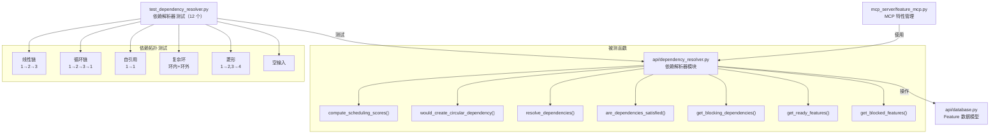

# `test_dependency_resolver.py` -- 依赖解析器测试

> 源文件路径: `test_dependency_resolver.py`

## 功能概述

本文件是 AutoForge 依赖解析器 (`api/dependency_resolver.py`) 的完整测试套件，采用自定义测试框架编写，通过 `python -m pytest test_dependency_resolver.py` 运行。共包含 12 个测试用例，覆盖调度评分、循环依赖检测、依赖满足判断、阻塞分析和就绪特性查询等核心功能。

依赖解析器是 AutoForge 特性管理系统的核心组件，负责确定特性的执行顺序、检测循环依赖（使用 Kahn 算法 + DFS）、以及为并行模式提供调度评分。本测试特别关注了循环依赖场景下的安全性——使用 `ThreadPoolExecutor` 配合 5 秒超时检测潜在的无限循环，确保即使存在循环依赖也不会导致系统挂起。

测试覆盖了多种依赖拓扑：线性链、循环链、自引用、复杂环（环内+环外节点）、菱形依赖、以及空输入。这些拓扑模式全面验证了图算法在各种边界条件下的正确性。

## 依赖关系

### 导入依赖

| 模块 | 说明 |
|------|------|
| `sys` | 退出码控制 |
| `time` | 测量执行时间（超时检测） |
| `concurrent.futures.ThreadPoolExecutor` | 在独立线程中执行计算，支持超时检测 |
| `concurrent.futures.TimeoutError` | 超时异常（别名 `FuturesTimeoutError`） |
| `api.dependency_resolver.are_dependencies_satisfied` | 被测依赖满足判断函数 |
| `api.dependency_resolver.compute_scheduling_scores` | 被测调度评分计算函数 |
| `api.dependency_resolver.get_blocked_features` | 被测阻塞特性查询函数 |
| `api.dependency_resolver.get_blocking_dependencies` | 被测阻塞依赖获取函数 |
| `api.dependency_resolver.get_ready_features` | 被测就绪特性查询函数 |
| `api.dependency_resolver.resolve_dependencies` | 被测依赖解析函数（含环检测） |
| `api.dependency_resolver.would_create_circular_dependency` | 被测循环依赖预检函数 |

### 被依赖

| 模块 | 引用内容 |
|------|----------|
| `CLAUDE.md` | 项目文档中列为测试命令 (`python -m pytest test_dependency_resolver.py`) |

## 测试场景

### 调度评分测试

#### `test_compute_scheduling_scores_simple_chain()`
- **目的**: 验证线性依赖链（1 -> 2 -> 3）的调度评分排序
- **场景**: 三个特性组成线性链，根节点解锁最多后续特性
- **关键断言**: `scores[1] > scores[2] > scores[3]`（根节点评分最高，叶节点最低）

#### `test_compute_scheduling_scores_with_cycle()`
- **目的**: 验证循环依赖（1 -> 2 -> 3 -> 1）不会导致无限循环
- **场景**: 三个特性组成环形依赖，使用 5 秒超时保护
- **关键断言**: 在 1 秒内完成且返回 3 个评分结果

#### `test_compute_scheduling_scores_self_reference()`
- **目的**: 验证自引用依赖（特性 1 依赖自身）的安全处理
- **场景**: 特性 1 的依赖列表包含自身 ID，使用 5 秒超时保护
- **关键断言**: 在 1 秒内完成且返回 2 个评分结果

#### `test_compute_scheduling_scores_complex_cycle()`
- **目的**: 验证复杂循环依赖（环内 + 环外节点）的处理
- **场景**: 特性 1-3 组成环，特性 4 依赖环内节点 1
- **关键断言**: 在 1 秒内完成且返回 4 个评分结果

#### `test_compute_scheduling_scores_diamond()`
- **目的**: 验证菱形依赖模式的评分正确性
- **场景**: 特性 1 是根，2 和 3 分别依赖 1，4 同时依赖 2 和 3
- **关键断言**: 根节点 1 评分最高，叶节点 4 评分最低

#### `test_compute_scheduling_scores_empty()`
- **目的**: 验证空特性列表的处理
- **场景**: 传入空列表
- **关键断言**: 返回空字典

### 循环依赖检测测试

#### `test_would_create_circular_dependency()`
- **目的**: 验证新增依赖关系是否会创建循环的预检逻辑
- **场景**: 现有链 3 -> 2 -> 1，检测添加 "1 依赖 3" 是否形成环、"3 依赖 1" 是否为误报、自引用检测
- **关键断言**: 添加 1->3 检测到环，3->1 不是误报，1->1 自引用被检测

#### `test_resolve_dependencies_with_cycle()`
- **目的**: 验证完整依赖解析能检测并报告循环依赖
- **场景**: 三个特性组成环形依赖
- **关键断言**: `result["circular_dependencies"]` 非空

### 依赖满足与查询测试

#### `test_are_dependencies_satisfied()`
- **目的**: 验证依赖满足条件判断
- **场景**: 特性 1 无依赖（已通过）、特性 2 依赖已通过的 1、特性 3 依赖未通过的 2
- **关键断言**: 特性 1 满足、特性 2 满足、特性 3 不满足

#### `test_get_blocking_dependencies()`
- **目的**: 验证获取具体阻塞依赖 ID 的功能
- **场景**: 特性 3 依赖已通过的 1 和未通过的 2
- **关键断言**: 返回 `[2]`（仅未通过的依赖）

#### `test_get_ready_features()`
- **目的**: 验证获取就绪特性列表的功能
- **场景**: 4 个特性，1 已通过，2 无依赖未通过，3 依赖已通过的 1，4 依赖未通过的 2
- **关键断言**: 就绪列表包含 2 和 3，不包含 1（已通过）和 4（被阻塞）

#### `test_get_blocked_features()`
- **目的**: 验证获取被阻塞特性列表及阻塞原因
- **场景**: 特性 2 依赖未通过的特性 1
- **关键断言**: 返回特性 2 且 `blocked_by` 为 `[1]`

## 测试覆盖范围

- 调度评分计算（线性链、菱形、空输入）
- 循环依赖安全处理（简单环、自引用、复杂环）
- 循环依赖预检（`would_create_circular_dependency`）
- 依赖解析与环报告（`resolve_dependencies`）
- 依赖满足判断（无依赖、已满足、未满足）
- 阻塞依赖识别
- 就绪特性查询（排除已通过和被阻塞）
- 被阻塞特性查询（含阻塞原因）

## Fixtures 和辅助函数

| 名称 | 类型 | 说明 |
|------|------|------|
| `ThreadPoolExecutor` + `future.result(timeout=5.0)` | 超时保护机制 | 在独立线程中执行可能无限循环的计算，5 秒超时自动终止 |
| `time.time()` | 性能计时 | 验证循环依赖处理在 1 秒内完成 |
| `run_all_tests()` | 测试运行器 | 顺序执行所有测试并汇总 passed/failed 计数 |

## 架构图

## 注意事项

- 循环依赖测试使用 `ThreadPoolExecutor` 配合 5 秒超时作为安全保护，防止图算法中的无限循环导致测试永远挂起
- 性能约束：所有循环依赖场景必须在 1 秒内完成，这是一个隐式的性能回归检测
- 测试数据使用简单的字典列表（而非 SQLAlchemy 模型实例），表明依赖解析器被设计为与数据库模型解耦
- 菱形依赖测试验证了共享依赖节点不会被重复计算——这是拓扑排序算法正确性的关键
- `would_create_circular_dependency` 测试覆盖了 UI 中"添加依赖"操作的前置校验逻辑，防止用户创建循环依赖
