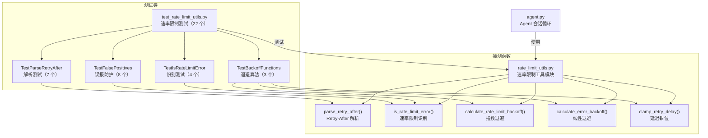

# `test_rate_limit_utils.py` -- 速率限制工具函数测试

> 源文件路径: `test_rate_limit_utils.py`

## 功能概述

本文件是 AutoForge 速率限制工具模块 (`rate_limit_utils.py`) 的单元测试套件，使用 `unittest` 框架编写，通过 `python -m pytest test_rate_limit_utils.py` 运行。共包含约 22 个测试用例，分为 5 大测试类。

测试覆盖了三个核心功能领域：重试延迟解析（从错误消息中提取 `Retry-After` 秒数）、速率限制错误识别（判断错误消息是否为速率限制类型）、以及退避延迟计算（指数退避和线性退避算法）。

特别值得注意的是 `TestFalsePositives` 测试类，它专门验证了速率限制检测的准确性——确保版本号（`v14.29.0`）、Issue/PR 编号（`#429`）、行号、端口号、编程术语（"overloaded constructor"）等包含 "429" 或相关关键词的非速率限制消息不会被误判。这是一个精心设计的测试集，防止过于宽泛的正则表达式导致 Agent 在正常输出中错误触发重试逻辑。

## 依赖关系

### 导入依赖

| 模块 | 说明 |
|------|------|
| `unittest` | 标准测试框架 |
| `rate_limit_utils.calculate_error_backoff` | 被测错误退避计算函数 |
| `rate_limit_utils.calculate_rate_limit_backoff` | 被测速率限制退避计算函数 |
| `rate_limit_utils.clamp_retry_delay` | 被测延迟值钳位函数 |
| `rate_limit_utils.is_rate_limit_error` | 被测速率限制识别函数 |
| `rate_limit_utils.parse_retry_after` | 被测 Retry-After 解析函数 |

### 被依赖

| 模块 | 引用内容 |
|------|----------|
| `CLAUDE.md` | 项目文档中列为测试命令 (`python -m pytest test_rate_limit_utils.py`) |
| `rate_limit_utils.py` | 模块文档字符串中引用本文件作为测试说明 |

## 测试场景

### `TestParseRetryAfter`

#### 标准格式解析
- **`test_retry_after_colon_format`**: 解析 `Retry-After: 60` 格式（HTTP 标准头）
  - 断言: `"Retry-After: 60"` -> 60, `"retry-after: 120"` -> 120（大小写不敏感）
- **`test_retry_after_space_format`**: 解析 `retry after 60 seconds` 自然语言格式
  - 断言: `"retry after 60 seconds"` -> 60, `"Please retry after 120 seconds"` -> 120
- **`test_try_again_in_format`**: 解析 `try again in X seconds` 格式
  - 断言: `"try again in 120 seconds"` -> 120, `"Please try again in 60s"` -> 60
- **`test_seconds_remaining_format`**: 解析 `X seconds remaining` 格式
  - 断言: `"30 seconds remaining"` -> 30, `"60 seconds left"` -> 60

#### 边界条件
- **`test_retry_after_zero`**: `Retry-After: 0` 返回 0（非 None）
- **`test_no_match`**: 不包含重试信息的消息返回 None
- **`test_minutes_not_supported`**: 分钟/小时单位不被支持（设计决策），返回 None

### `TestIsRateLimitError`

#### 正向识别
- **`test_rate_limit_patterns`**: 各种速率限制错误模式（`Rate limit exceeded`、`rate_limit_exceeded`、`Too many requests`、`HTTP 429`、`API quota exceeded`、`Server is overloaded`）
- **`test_specific_429_patterns`**: HTTP 429 状态码的各种表现形式（`http 429`、`HTTP429`、`status 429`、`error 429`、`429 too many requests`）
- **`test_case_insensitive`**: 大小写不敏感检测

#### 反向排除
- **`test_non_rate_limit_errors`**: 非速率限制错误（连接拒绝、认证失败、无效 API 密钥等）正确返回 False

### `TestFalsePositives`

#### 误报防护
- **`test_version_numbers_with_429`**: 版本号中的 429 不触发检测（`Node v14.29.0`、`Python 3.12.429`）
- **`test_issue_and_pr_numbers`**: Issue/PR 编号不触发（`PR #429`、`issue 429`、`Closes #429`）
- **`test_line_numbers`**: 错误行号不触发（`line 429`、`file.py:429`）
- **`test_port_numbers`**: 端口号不触发（`port 4293`、`localhost:4290`）
- **`test_legitimate_wait_messages`**: 正常等待提示不触发（`Please wait for the build to complete`）
- **`test_retry_discussion_messages`**: 讨论重试逻辑的消息不触发（`Try again later after maintenance`）
- **`test_limit_discussion_messages`**: 讨论限制的消息不触发（`File size limit reached`）
- **`test_overloaded_in_programming_context`**: 编程术语 "overloaded" 不触发（`overloaded constructor`、`operator is overloaded`），但 API 过载消息仍然触发（`Server is overloaded`、`API overloaded`）

### `TestBackoffFunctions`

#### 退避算法验证
- **`test_rate_limit_backoff_sequence`**: 指数退避序列验证
  - 基础值: 15, 30, 60, 120, 240, 480, 960, 1920, 3600, 3600（上限 3600 秒 = 1 小时）
  - 抖动: 0-30%（`delay` 在 `[base, base * 1.3]` 范围内）
- **`test_error_backoff_sequence`**: 线性退避序列验证
  - 预期值: 30, 60, 90, 120, ..., 270, 300, 300（上限 300 秒 = 5 分钟）
- **`test_clamp_retry_delay`**: 延迟值钳位验证
  - 正常范围内的值不变
  - 小于等于 0 的值钳位到 1
  - 大于 3600 的值钳位到 3600

## 测试覆盖范围

- Retry-After 解析（4 种格式 + 零值 + 无匹配 + 不支持的时间单位）
- 速率限制错误识别（6 种模式 + 5 种 429 变体 + 大小写不敏感）
- 误报防护（版本号、Issue 编号、行号、端口号、等待消息、重试讨论、限制讨论、编程术语 vs API 过载）
- 指数退避计算（10 级退避 + 抖动范围验证）
- 线性退避计算（11 级退避 + 上限验证）
- 延迟值钳位（正常范围、下界、上界）

## Fixtures 和辅助函数

本测试文件使用纯 `unittest` 框架，无自定义 fixtures 或 mock 对象。所有测试都是无状态的纯函数测试，不需要设置/清理环境。

## 架构图

## 注意事项

- `TestFalsePositives` 是最关键的测试类——它防止了速率限制检测的过度匹配。如果 Agent 在正常编码输出（如版本号 `3.12.429`）中错误触发速率限制重试，会导致不必要的长时间等待
- "overloaded" 关键词需要区分编程语境（方法重载）和 API 语境（服务过载）——测试验证了上下文感知的检测逻辑
- 速率限制退避使用指数策略（基础 15 秒，最大 1 小时），而一般错误退避使用线性策略（基础 30 秒，最大 5 分钟）——两种策略的适用场景不同
- 抖动（jitter）范围为 0-30%，是随机的，因此测试验证的是范围而非精确值
- `parse_retry_after` 设计上仅支持秒级单位，不支持分钟/小时——这是有意的简化决策，避免时间单位转换的复杂性
