# `test_security.py` -- Bash 命令安全验证单元测试

> 源文件路径: `test_security.py`

## 功能概述

本文件是 AutoForge 安全模块 (`security.py`) 的核心单元测试套件，覆盖了 Bash 命令安全验证系统的所有关键功能。测试采用自定义测试框架（非 pytest），通过 `python test_security.py` 直接运行，并在 GitHub Actions CI 流水线中作为必选检查项执行。

测试围绕以下核心安全机制展开：命令提取与解析、chmod 权限验证、init.sh 脚本执行验证、通配符模式匹配、YAML 配置加载与校验、项目级命令白名单、组织级配置层级解析、黑名单强制执行、pkill 进程可扩展性、以及 playwright-cli 子命令验证。此外，还包含了大量的集成式断言，验证安全钩子 (`bash_security_hook`) 对危险命令和安全命令的正确分类。

该测试文件是项目安全基线的守护者，确保任何对安全策略的修改都不会引入安全回归。

## 依赖关系

### 导入依赖

| 模块 | 说明 |
|------|------|
| `asyncio` | 用于运行异步安全钩子函数 |
| `os` | 操作环境变量（临时 HOME 目录） |
| `sys` | 平台检测（win32）和退出码 |
| `tempfile` | 创建临时目录用于隔离测试 |
| `contextlib.contextmanager` | 实现 `temporary_home` 上下文管理器 |
| `pathlib.Path` | 文件路径操作 |
| `security.bash_security_hook` | 被测核心安全钩子函数 |
| `security.extract_commands` | 被测命令提取函数 |
| `security.get_effective_commands` | 被测有效命令集计算函数 |
| `security.get_effective_pkill_processes` | 被测 pkill 进程集合函数 |
| `security.load_org_config` | 被测组织级配置加载函数 |
| `security.load_project_commands` | 被测项目级命令加载函数 |
| `security.matches_pattern` | 被测模式匹配函数 |
| `security.validate_chmod_command` | 被测 chmod 验证函数 |
| `security.validate_init_script` | 被测 init.sh 验证函数 |
| `security.validate_pkill_command` | 被测 pkill 验证函数 |
| `security.validate_playwright_command` | 被测 playwright-cli 验证函数 |
| `security.validate_project_command` | 被测项目命令验证函数 |

### 被依赖

| 模块 | 引用内容 |
|------|----------|
| `.github/workflows/ci.yml` | CI 流水线中作为必选安全测试步骤执行 (`python test_security.py`) |
| `.claude/commands/check-code.md` | `/check-code` 斜杠命令中作为代码质量检查的一部分 |
| `CLAUDE.md` | 项目文档中列为测试命令 |
| `examples/README.md` | 示例文档中引用为安全测试参考 |

## 测试场景

### `test_extract_commands()`
- **目的**: 验证从复杂 Shell 命令字符串中正确提取命令名称
- **场景**: 简单命令（`ls -la`）、链式命令（`npm install && npm run build`）、管道命令（`cat | grep`）、绝对路径命令（`/usr/bin/node`）、环境变量前缀（`VAR=value ls`）、逻辑或链接（`git status || git init`）、复杂嵌套引号回退解析（`docker exec container php -r "echo \"test\";"`)
- **关键断言**: 每个命令字符串提取出的命令列表与预期完全匹配

### `test_validate_chmod()`
- **目的**: 验证 chmod 命令的安全限制——仅允许 `+x` 执行权限
- **场景**: 允许 `chmod +x`、`chmod u+x`、`chmod a+x`、`chmod ug+x`、多文件；拒绝数字权限模式（777、755）、写权限（`+w`）、读权限（`+r`）、删除权限（`-x`）、递归标志（`-R`）、缺少文件参数
- **关键断言**: `validate_chmod_command` 返回的 `(allowed, reason)` 元组与预期一致

### `test_validate_init_script()`
- **目的**: 验证 init.sh 脚本执行的白名单机制
- **场景**: 允许 `./init.sh`、带参数、绝对路径、相对路径；拒绝非 init.sh 脚本、Python 脚本、通过 bash/sh 调用、恶意脚本、命令注入尝试
- **关键断言**: 只有名为 `init.sh` 且通过直接路径调用的脚本才被允许

### `test_pattern_matching()`
- **目的**: 验证命令模式匹配逻辑——精确匹配、前缀通配符、脚本路径匹配
- **场景**: 精确匹配（`swift` vs `swift`）、前缀通配符（`swift*` 匹配 `swiftc`/`swiftlint`/`swiftformat`）、裸通配符安全拒绝（`*` 不匹配任何命令）、本地脚本路径匹配（`./scripts/build.sh`）、无前缀路径模式
- **关键断言**: `matches_pattern` 函数返回值与预期布尔值一致，特别是裸通配符 `*` 必须被拒绝

### `test_yaml_loading()`
- **目的**: 验证项目级 YAML 配置文件的加载与校验
- **场景**: 有效 YAML 正确加载（版本号、命令列表）、缺失文件返回 None、无效 YAML 格式返回 None、超过 100 条命令限制被拒绝
- **关键断言**: `load_project_commands` 在各种边界条件下的返回值正确

### `test_command_validation()`
- **目的**: 验证单个项目命令配置的合法性校验
- **场景**: 有效命令（含描述、无描述、通配符模式、本地脚本）；无效命令（缺少 name 字段、空名称、非字符串名称）；安全拒绝（裸通配符 `*`、黑名单命令 sudo/shutdown/dd）
- **关键断言**: `validate_project_command` 返回 `(valid, error)` 元组正确

### `test_blocklist_enforcement()`
- **目的**: 验证硬编码黑名单命令始终被拦截
- **场景**: `sudo apt install`、`shutdown now`、`dd if=/dev/zero`、`aws s3 ls`
- **关键断言**: 安全钩子对所有黑名单命令返回 `block` 决策

### `test_project_commands()`
- **目的**: 验证项目特定命令通过安全钩子的端到端流程
- **场景**: 项目命令 `swift` 被允许、通配符模式 `swift*` 匹配 `swiftlint`、非白名单命令 `rustc` 被拦截、空命令名在项目配置中被拒绝
- **关键断言**: 安全钩子结合项目上下文正确放行/拦截命令

### `test_org_config_loading()`
- **目的**: 验证组织级配置文件的加载与校验
- **场景**: 有效组织配置加载（允许命令 + 阻止命令）、缺失文件返回 None、非字符串命令名被拒绝、空命令名被拒绝、纯空白命令名被拒绝
- **关键断言**: `load_org_config` 在各种边界条件下的返回值正确

### `test_hierarchy_resolution()`
- **目的**: 验证多层级命令配置的合并与优先级解析
- **场景**: 组织允许命令被包含、组织阻止命令进入黑名单、项目命令被包含、全局默认命令被包含、硬编码黑名单不可覆盖
- **关键断言**: `get_effective_commands` 返回的 `(allowed, blocked)` 集合正确反映层级优先级

### `test_org_blocklist_enforcement()`
- **目的**: 验证组织级黑名单命令无法通过项目配置覆盖
- **场景**: 组织配置阻止 `terraform`，通过安全钩子执行 `terraform apply`
- **关键断言**: 即使没有项目级配置，组织级黑名单命令也被拦截

### `test_pkill_extensibility()`
- **目的**: 验证 pkill 命令的进程白名单可通过配置扩展
- **场景**: 默认进程（node）允许、非默认进程（python）阻止、额外进程配置后允许、默认进程与额外进程共存、组织级 pkill_processes 合并、项目级 pkill_processes 合并、集成测试验证钩子行为、正则表达式元字符被拒绝、合法特殊字符（连字符/下划线/点号）被接受、空格名称被拒绝、多进程模式验证（BSD 行为）
- **关键断言**: 14 个子测试覆盖 pkill 进程白名单的各种扩展场景

### `test_playwright_cli_validation()`
- **目的**: 验证 playwright-cli 子命令的安全过滤
- **场景**: 允许 screenshot/snapshot/click/open/close/goto/fill/console；拒绝 run-code/eval；含会话标志的命令；通过安全钩子的集成测试
- **关键断言**: `validate_playwright_command` 和安全钩子对 playwright-cli 子命令的正确分类

### 主函数集成断言
- **危险命令**: reboot、wget、python、killall、pkill bash/chrome、Shell 注入（`$(echo pkill)`、`eval`）、playwright-cli run-code/eval
- **安全命令**: 文件检查（ls/cat/head/tail/wc/grep）、文件操作（cp/mkdir/touch/rm/mv）、Node.js 开发（npm/node）、版本控制（git）、进程管理（ps/lsof/sleep/kill/pkill node/npm/vite）、网络测试（curl）、Shell 脚本（bash/sh）、链式命令、完整路径、chmod+init.sh 组合、playwright-cli 安全命令

## 测试覆盖范围

- 命令字符串解析（shlex + 回退解析器）
- chmod 权限验证（仅允许 +x）
- init.sh 执行验证（仅允许直接路径调用 init.sh）
- 命令模式匹配（精确、前缀通配符、路径、裸通配符拒绝）
- YAML 配置加载与校验（格式、限制、边界条件）
- 项目命令配置验证（字段校验、类型校验、黑名单校验）
- 硬编码黑名单强制执行
- 项目级命令白名单端到端流程
- 组织级配置加载与校验
- 多层级命令配置合并与优先级
- 组织级黑名单不可覆盖性
- pkill 进程白名单可扩展性（默认 + 组织 + 项目）
- pkill 多进程模式验证（BSD 兼容）
- playwright-cli 子命令安全过滤
- 安全钩子对 ~60 个危险/安全命令的集成验证

## Fixtures 和辅助函数

| 名称 | 类型 | 说明 |
|------|------|------|
| `temporary_home(home_path)` | 上下文管理器 | 临时设置 HOME 环境变量（兼容 Unix 和 Windows），测试结束后自动恢复原始值 |
| `check_hook(command, should_block)` | 辅助函数 | 调用 `bash_security_hook` 并验证命令是否按预期被放行或拦截，返回 bool 并打印 PASS/FAIL |

## 架构图

```mermaid
graph TD
    TS["test_security.py<br/>安全单元测试"]
    SEC["security.py<br/>安全模块"]
    CI[".github/workflows/ci.yml<br/>CI 流水线"]
    CMD[".claude/commands/check-code.md<br/>代码检查命令"]

    TS -->|测试| SEC
    CI -->|执行| TS
    CMD -->|调用| TS

    subgraph 被测函数
        SEC --> BH["bash_security_hook()"]
        SEC --> EC["extract_commands()"]
        SEC --> GEC["get_effective_commands()"]
        SEC --> GEP["get_effective_pkill_processes()"]
        SEC --> LOC["load_org_config()"]
        SEC --> LPC["load_project_commands()"]
        SEC --> MP["matches_pattern()"]
        SEC --> VC["validate_chmod_command()"]
        SEC --> VI["validate_init_script()"]
        SEC --> VP["validate_pkill_command()"]
        SEC --> VPW["validate_playwright_command()"]
        SEC --> VPC["validate_project_command()"]
    end

    subgraph 测试类别
        TS --> T1["命令提取"]
        TS --> T2["chmod 验证"]
        TS --> T3["init.sh 验证"]
        TS --> T4["模式匹配"]
        TS --> T5["YAML 加载"]
        TS --> T6["命令校验"]
        TS --> T7["黑名单执行"]
        TS --> T8["项目命令"]
        TS --> T9["组织配置"]
        TS --> T10["层级解析"]
        TS --> T11["pkill 扩展"]
        TS --> T12["playwright-cli"]
    end
```

## 注意事项

- 本测试采用自定义测试框架而非 pytest，通过 `python test_security.py` 直接运行，退出码 0 表示全部通过
- 测试中使用 `asyncio.run()` 调用异步安全钩子，每次调用都会创建新的事件循环
- `temporary_home` 上下文管理器修改了全局环境变量，测试必须串行执行以避免竞态条件
- 测试使用 `tempfile.TemporaryDirectory()` 创建隔离的临时目录，确保测试环境互不干扰
- pkill 测试覆盖了 BSD 系统的多模式行为（`pkill node sshd` 会终止两个进程），这是安全关键的边界条件
- 裸通配符 `*` 被显式拒绝是重要的安全决策，防止配置错误导致所有命令被允许
- 该文件在 CI 中是必选检查项，任何失败都会阻止 PR 合并
