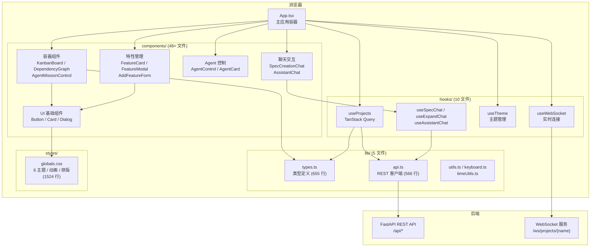

# React UI 总览

> AutoForge 的前端用户界面，提供项目管理、特性看板、Agent 控制、实时日志、AI 助手等完整功能。

## 目录结构

```
ui/
├── src/                    # 源代码目录
│   ├── App.tsx             # 主应用容器
│   ├── main.tsx            # React 入口
│   ├── vite-env.d.ts       # Vite 类型声明
│   ├── components/         # React 组件 (48+ 文件)
│   ├── hooks/              # 自定义 Hooks (10 文件)
│   ├── lib/                # 工具库与类型定义 (5 文件)
│   └── styles/             # 全局样式 (1 文件)
├── e2e/                    # Playwright 端到端测试
├── public/                 # 静态资源
├── vite.config.ts          # Vite 构建配置
├── tsconfig.json           # TypeScript 项目引用
├── tsconfig.app.json       # 应用 TypeScript 配置
├── tsconfig.node.json      # Node 端 TypeScript 配置
├── eslint.config.js        # ESLint 配置
├── playwright.config.ts    # Playwright 测试配置
├── components.json         # ShadCN 组件配置
├── package.json            # 项目依赖与脚本
└── index.html              # HTML 入口
```

## 技术栈

| 类别 | 技术 | 版本 | 用途 |
|------|------|------|------|
| 框架 | React | 19.x | UI 框架 |
| 语言 | TypeScript | ~5.7.3 | 类型安全 |
| 构建 | Vite | 7.x | 开发服务器与生产构建 |
| 数据获取 | TanStack Query | 5.x | 服务端状态管理、缓存与轮询 |
| 样式 | Tailwind CSS | 4.x (v4) | 原子化 CSS 框架 |
| UI 基础 | Radix UI | 多包 | 无障碍原语组件 |
| 图可视化 | @xyflow/react + dagre | 12.x / 0.8 | 依赖关系图布局与渲染 |
| 终端模拟 | @xterm/xterm | 6.x | 浏览器端终端 |
| 图标 | lucide-react | 0.475+ | SVG 图标库 |
| 庆祝特效 | canvas-confetti | 1.9+ | 彩纸动画 |
| Markdown | react-markdown + remark-gfm | 10.x / 4.x | Markdown 渲染 |
| 样式工具 | class-variance-authority, clsx, tailwind-merge | - | 条件样式合并 |

## 构建配置

### Vite 配置 (`vite.config.ts`)

**代码分割** -- 8 个 vendor chunk 优化首屏加载：

| Chunk 名称 | 包含库 | 说明 |
|------------|--------|------|
| `vendor-react` | react, react-dom | React 核心 |
| `vendor-query` | @tanstack/react-query | 数据获取层 |
| `vendor-flow` | @xyflow/react, dagre | 图可视化（最大依赖） |
| `vendor-xterm` | @xterm/xterm, addon-fit, addon-web-links | 终端模拟器 |
| `vendor-radix` | @radix-ui/* (7 个包) | UI 原语组件 |
| `vendor-markdown` | react-markdown, remark-gfm | Markdown 渲染 |
| `vendor-utils` | lucide-react, canvas-confetti, cva, clsx, tailwind-merge | 工具与图标 |

**开发代理配置**：

| 路径 | 目标 | 说明 |
|------|------|------|
| `/api` | `http://127.0.0.1:8888` | REST API 代理 |
| `/ws` | `ws://127.0.0.1:8888` | WebSocket 代理 |

后端端口可通过 `VITE_API_PORT` 环境变量覆盖。

### TypeScript 配置 (`tsconfig.app.json`)

- **编译目标**: ES2020
- **严格模式**: 开启 (`strict: true`)
- **路径别名**: `@` 映射到 `./src`
- **未使用检查**: 开启 `noUnusedLocals` 和 `noUnusedParameters`
- **模块解析**: bundler 模式
- **JSX**: react-jsx (自动导入)

## 脚本命令

| 命令 | 说明 |
|------|------|
| `npm run dev` | 启动 Vite 开发服务器（热更新） |
| `npm run build` | TypeScript 编译 + Vite 生产构建 |
| `npm run lint` | ESLint 代码检查 |
| `npm run preview` | 预览生产构建 |
| `npm run test:e2e` | Playwright 端到端测试 |
| `npm run test:e2e:ui` | Playwright 测试（带 UI） |

## 架构图



## 实时通信

UI 通过 WebSocket 接收后端推送的实时更新：

| 消息类型 | 说明 |
|----------|------|
| `progress` | 特性完成进度（passing/in_progress/total） |
| `agent_status` | Agent 状态变更（running/paused/stopped/crashed） |
| `log` | Agent 输出日志行（支持 featureId/agentIndex 归属） |
| `agent_update` | 多 Agent 状态更新（thinking/working/testing/success/error） |
| `orchestrator_update` | 编排器事件（调度、生成、监控） |
| `feature_update` | 特性状态变更 |
| `dev_log` | 开发服务器日志 |
| `dev_server_status` | 开发服务器状态 |

## 数据获取策略

基于 TanStack Query 的服务端状态管理：

- **staleTime**: 5 秒（默认），防止频繁请求
- **refetchOnWindowFocus**: 关闭，避免焦点切换时的不必要刷新
- **特性列表**: 每 5 秒轮询刷新
- **Agent 状态**: 每 3 秒轮询
- **设置/模型**: 缓存 1-5 分钟
- **设置更新**: 乐观更新 + 错误回滚

## 依赖关系

```
ui/
├── 运行时依赖 (dependencies)
│   ├── react, react-dom          → UI 框架
│   ├── @tanstack/react-query     → 数据获取与缓存
│   ├── @xyflow/react, dagre      → 图可视化
│   ├── @xterm/xterm + 插件       → 终端模拟
│   ├── @radix-ui/* (7 个包)      → 无障碍 UI 原语
│   ├── lucide-react              → 图标
│   ├── canvas-confetti           → 庆祝特效
│   ├── react-markdown, remark-gfm → Markdown 渲染
│   ├── class-variance-authority  → 变体样式
│   ├── clsx, tailwind-merge      → 样式合并
│   └── autoforge-ai (file:..)    → 本地包引用
│
└── 开发依赖 (devDependencies)
    ├── vite + @vitejs/plugin-react → 构建工具
    ├── tailwindcss + @tailwindcss/vite → CSS 框架
    ├── tw-animate-css             → 动画库
    ├── typescript ~5.7.3          → 类型系统
    ├── eslint + 插件              → 代码检查
    └── @playwright/test           → E2E 测试
```

## 关键设计模式

1. **WebSocket + TanStack Query 双通道**: WebSocket 处理实时推送，TanStack Query 管理 REST API 缓存与轮询，两者互补
2. **主题系统**: 6 套主题 + 亮/暗模式，通过 CSS 变量 + Tailwind v4 `@theme` 指令实现零运行时开销切换
3. **代码分割**: 8 个 vendor chunk 按功能域拆分，确保首屏仅加载必要代码
4. **路径别名**: `@` 别名简化深层导入路径
5. **组件设计**: Radix UI 原语 → ShadCN 风格封装 → 业务组件的三层架构
