# `App.tsx` -- 应用主入口组件与全局状态协调器

> 源文件路径: `ui/src/App.tsx`

## 功能概述

`App.tsx` 是 AutoForge React UI 的顶层应用组件，承担整个前端应用的布局、路由、全局状态管理和模块协调工作。它是所有 UI 功能的聚合点。

该组件管理以下核心关注点：项目选择与持久化（localStorage）、WebSocket 实时连接、功能看板/依赖图视图切换、Agent 控制面板、调试日志查看器、AI 助手面板、Spec 创建聊天、项目扩展模态框，以及键盘快捷键系统。

组件通过 `useProjectWebSocket` 接收实时数据更新（进度、Agent 状态、日志、庆祝动画），并将这些状态分发给各个子组件。它还整合了主题系统（`useTheme`）、音效系统（`useFeatureSound`）和完成庆祝（`useCelebration`）等体验增强功能。

## 依赖关系

### 导入依赖

| 模块 | 说明 |
|------|------|
| `react` | useState, useEffect, useCallback 等核心 Hooks |
| `@tanstack/react-query` | useQueryClient, useQuery 用于数据缓存与请求 |
| `./hooks/useProjects` | useProjects, useFeatures, useAgentStatus, useSettings 数据 Hooks |
| `./hooks/useWebSocket` | useProjectWebSocket 实时 WebSocket 通信 |
| `./hooks/useFeatureSound` | useFeatureSound 功能状态变化音效 |
| `./hooks/useCelebration` | useCelebration 全部完成庆祝动画 |
| `./hooks/useTheme` | useTheme 主题与暗色模式管理 |
| `./lib/api` | getDependencyGraph, startAgent API 调用 |
| `./lib/types` | Feature 类型定义 |
| `./components/*` | 20+ 个子组件（详见架构图） |
| `lucide-react` | Loader2, Settings, Moon, Sun 等图标 |
| `@/components/ui/*` | Button, Card, Badge, Tooltip 等基础 UI 组件 |

### 被依赖

| 模块 | 引用内容 |
|------|----------|
| `ui/src/main.tsx` | `import App from './App'` -- 作为应用根组件渲染 |

## 关键类/函数

### `App()`

- 参数: 无
- 返回值: JSX.Element -- 完整的应用 UI 结构
- 说明: 应用根组件，管理以下状态：
  - `selectedProject`: 当前选中的项目名（持久化到 localStorage）
  - `viewMode`: 视图模式（'kanban' | 'graph'），持久化到 localStorage
  - `debugOpen` / `debugPanelHeight`: 调试面板开关与高度
  - `assistantOpen`: AI 助手面板开关
  - `showSettings` / `showAddFeature` / `showExpandProject` 等: 各模态框显示状态
  - `wsState`: WebSocket 实时状态（进度、Agent 状态、日志、庆祝等）

### 键盘快捷键

| 按键 | 功能 |
|------|------|
| `D` | 切换调试面板 |
| `T` | 切换终端标签 |
| `N` | 添加新功能 |
| `E` | AI 扩展项目 |
| `A` | 切换 AI 助手 |
| `G` | 切换看板/图视图 |
| `,` | 打开设置 |
| `R` | 重置项目 |
| `?` | 显示快捷键帮助 |
| `Escape` | 关闭当前模态框 |

### `handleSelectProject(project: string | null)`

- 参数: `project` -- 项目名或 null（取消选择）
- 说明: 使用 `useCallback` 记忆化，更新选中项目并同步到 localStorage

### `handleGraphNodeClick(nodeId: number)`

- 参数: `nodeId` -- 依赖图中被点击的节点 ID
- 说明: 查找对应的 Feature 并打开详情模态框

## 架构图

```mermaid
graph TD
    main["main.tsx"] --> App["App.tsx"]
    App --> useProjects["useProjects Hook"]
    App --> useWebSocket["useProjectWebSocket Hook"]
    App --> useFeatureSound["useFeatureSound Hook"]
    App --> useCelebration["useCelebration Hook"]
    App --> useTheme["useTheme Hook"]
    App --> api["lib/api.ts"]
    App --> ProjectSelector["ProjectSelector"]
    App --> KanbanBoard["KanbanBoard"]
    App --> DependencyGraph["DependencyGraph"]
    App --> AgentControl["AgentControl"]
    App --> ProgressDashboard["ProgressDashboard"]
    App --> DebugLogViewer["DebugLogViewer"]
    App --> AgentMissionControl["AgentMissionControl"]
    App --> AssistantPanel["AssistantPanel"]
    App --> SettingsModal["SettingsModal"]
    App --> SpecCreationChat["SpecCreationChat"]
    App --> ExpandProjectModal["ExpandProjectModal"]
    App --> CelebrationOverlay["CelebrationOverlay"]
    App --> FeatureModal["FeatureModal"]
    App --> AddFeatureForm["AddFeatureForm"]
    App --> DevServerControl["DevServerControl"]
    App --> ResetProjectModal["ResetProjectModal"]
```

## 注意事项

- 项目选择状态通过 `STORAGE_KEY = 'autoforge-selected-project'` 持久化到 localStorage，切换项目时会自动验证项目是否仍然存在。
- WebSocket 进度数据与 React Query 轮询数据存在合并逻辑：当 WebSocket 进度为空时回退到 features 数据计算进度。
- 调试面板折叠时主内容区域底部留有 `COLLAPSED_DEBUG_PANEL_CLEARANCE = 48px` 的安全间距。
- 键盘快捷键会在用户正在输入（input/textarea 聚焦）时自动忽略。
- Spec 创建完成后会自动启动 Agent（YOLO 模式、并发数 3），此流程包含完善的错误处理和重试机制。
