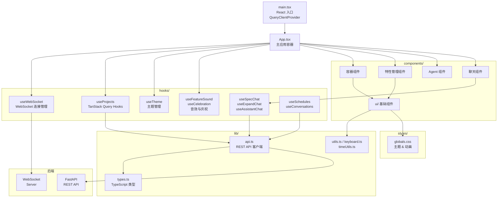

# 源码结构

> `ui/src/` 目录包含 AutoForge 前端应用的全部源代码，采用按职责分层的目录组织方式。

## 目录结构

```
src/
├── App.tsx              # 主应用容器 (627 行)
├── main.tsx             # React 入口 (22 行)
├── vite-env.d.ts        # Vite 客户端类型声明 (1 行)
├── components/          # React 组件目录 (48+ 文件)
│   ├── *.tsx            # 业务组件 (47 文件)
│   └── ui/              # UI 基础组件库 (14 文件)
├── hooks/               # 自定义 React Hooks (10 文件)
├── lib/                 # 工具库与类型定义 (5 文件)
└── styles/              # 全局样式 (1 文件)
```

## 文件清单

| 文件 | 行数 | 说明 |
|------|------|------|
| `App.tsx` | 627 | 主应用容器，项目选择、看板/图切换、键盘快捷键、WebSocket 连接、模态窗管理、进度仪表板 |
| `main.tsx` | 22 | React 19 根节点挂载，TanStack Query 配置（5s staleTime，关闭焦点刷新） |
| `vite-env.d.ts` | 1 | Vite 客户端类型声明引用 |

## App.tsx 详解

`App.tsx` 是整个应用的核心入口组件，承担以下职责：

### 状态管理

- `selectedProject` -- 当前选中项目（持久化到 localStorage）
- `viewMode` -- 看板/图视图切换（持久化到 localStorage）
- `debugOpen` / `debugPanelHeight` / `debugActiveTab` -- 调试面板状态
- `assistantOpen` -- AI 助手面板开关
- `showAddFeature` / `showExpandProject` / `showSettings` / `showResetModal` -- 各模态窗状态
- `isSpecCreating` / `showSpecChat` -- Spec 创建流程状态
- `specInitializerStatus` / `specInitializerError` -- 初始化器状态

### 键盘快捷键

| 快捷键 | 功能 | 条件 |
|--------|------|------|
| `D` | 切换调试面板 | - |
| `T` | 切换终端标签页 | 调试面板联动 |
| `N` | 添加新特性 | 需选中项目 |
| `E` | 扩展项目（AI 批量创建） | 需有 Spec 和特性 |
| `A` | 切换 AI 助手面板 | 需选中项目，非 Spec 创建中 |
| `,` | 打开设置 | - |
| `G` | 切换看板/图视图 | 需选中项目 |
| `?` | 显示快捷键帮助 | - |
| `R` | 打开重置模态窗 | 需选中项目，Agent 未运行 |
| `Escape` | 逐层关闭模态窗/面板 | 按优先级依次关闭 |

快捷键在输入框 (`input` / `textarea`) 内自动失效，避免干扰文本输入。

### 数据流

1. **项目列表** -- `useProjects()` 通过 TanStack Query 获取
2. **特性数据** -- `useFeatures(selectedProject)` 每 5 秒刷新
3. **Agent 状态** -- `useAgentStatus(selectedProject)` 每 3 秒轮询
4. **WebSocket** -- `useProjectWebSocket(selectedProject)` 实时推送
5. **图数据** -- `useQuery` 按需获取（仅图视图启用），每 5 秒刷新
6. **设置** -- `useSettings()` 获取全局配置

### 渲染结构

```
App
├── header (sticky)
│   ├── 品牌 Logo + 标题
│   ├── ProjectSelector (下拉选择器)
│   ├── Ollama/GLM 模式标识
│   ├── 文档链接 / ThemeSelector / 暗色模式切换
│   └── [项目选中时]
│       ├── AgentControl (启动/停止/暂停/恢复)
│       ├── DevServerControl (开发服务器)
│       ├── 设置按钮 / 重置按钮
│       └── ScheduleModal 入口
├── main
│   ├── [无项目] 欢迎页面
│   ├── [无 Spec] ProjectSetupRequired
│   └── [正常]
│       ├── ProgressDashboard (进度条)
│       ├── AgentMissionControl (多 Agent 仪表板)
│       ├── ViewToggle (视图切换)
│       └── KanbanBoard | DependencyGraph
├── AddFeatureForm (模态窗)
├── FeatureModal (模态窗)
├── ExpandProjectModal (模态窗)
├── SpecCreationChat (全屏)
├── DebugLogViewer (底部固定)
├── AssistantFAB + AssistantPanel (侧边)
├── SettingsModal
├── KeyboardShortcutsHelp
├── ResetProjectModal
└── CelebrationOverlay (庆祝动画)
```

## main.tsx 详解

```typescript
const queryClient = new QueryClient({
  defaultOptions: {
    queries: {
      staleTime: 5000,            // 5 秒内数据视为新鲜
      refetchOnWindowFocus: false, // 窗口聚焦不自动刷新
    },
  },
})
```

入口使用 `StrictMode` 包裹并提供 `QueryClientProvider`，确保：
- 开发环境下双重渲染检测
- 全局 TanStack Query 客户端注入

## 子目录概览

| 目录 | 文件数 | 总行数 | 说明 |
|------|--------|--------|------|
| `components/` | 47 | ~9,500 | 业务组件（看板、Agent、聊天、终端等） |
| `components/ui/` | 14 | ~946 | Radix UI 封装的基础组件库 |
| `hooks/` | 10 | ~2,759 | 自定义 React Hooks（WebSocket、查询、主题等） |
| `lib/` | 5 | ~1,517 | 类型定义、API 客户端、工具函数 |
| `styles/` | 1 | 1,524 | 全局 CSS（6 主题、动画、排版） |

## 架构图



## 关键模式

1. **状态分层**: 全局状态通过 `App.tsx` 的 `useState` 管理，服务端状态由 TanStack Query 缓存，实时状态由 WebSocket Hook 维护
2. **懒加载策略**: 图数据仅在 `viewMode === 'graph'` 时获取，避免不必要的网络请求
3. **持久化**: 项目选择和视图模式持久化到 localStorage，重新打开时恢复状态
4. **输入保护**: 所有键盘快捷键在 `input` / `textarea` 元素获焦时自动禁用
5. **音效系统**: 特性状态变更触发 Web Audio API 音效（开始=上行音、完成=琶音、全部完成=号角+彩纸）
