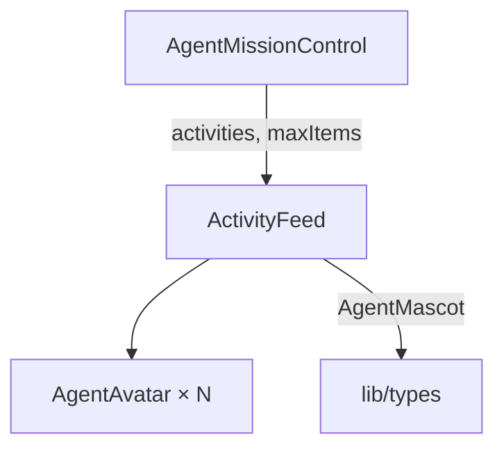

# `ActivityFeed.tsx` — 活动动态列表组件

> 源文件路径: `ui/src/components/ActivityFeed.tsx`

## 功能概述

`ActivityFeed` 展示多 Agent 并行模式下的最近活动动态列表。每条活动项包含 Agent 头像、名称（使用吉祥物专属颜色）、关联的功能 ID、相对时间和思考内容摘要。支持限制显示数量和可选的标题头。

## 依赖关系

### 导入依赖

| 模块 | 说明 |
|------|------|
| `lucide-react` | `Activity` 图标 |
| `./AgentAvatar` | Agent 头像组件 |
| `../lib/types` | `AgentMascot` 类型 |
| `@/components/ui/card` | `Card`, `CardContent` |

### 被依赖

| 模块 | 引用内容 |
|------|----------|
| `AgentMissionControl.tsx` | 在任务控制中心面板底部展示最近活动 |

## 关键组件/函数

### `ActivityFeed`

- **Props**: `activities`（活动列表）、`maxItems`（最大显示数量，默认5）、`showHeader`（是否显示标题，默认 `true`）
- **渲染逻辑**: 截取前 `maxItems` 条活动，空列表时返回 `null`
- **布局**: 每条活动为一张小卡片，左侧 Agent 头像（sm 尺寸），右侧名称+功能ID+时间+思考内容

### `formatTimestamp(timestamp)`

- 相对时间格式化函数：<5秒 "just now"，<1分钟 "Ns ago"，<1小时 "Nm ago"，其他显示时分

### `getMascotColor(name)`

- 返回 20 种吉祥物各自的专属颜色（如 Spark=#3B82F6, Fizz=#F97316）

## 架构图

## 注意事项

- 活动项 key 由 `featureId + timestamp + thought前20字符` 组合生成，确保唯一性
- 思考内容使用 `truncate` 单行截断，完整内容通过 `title` 属性悬停显示
- 未知吉祥物名称的颜色回退到 `#6B7280`（灰色）
