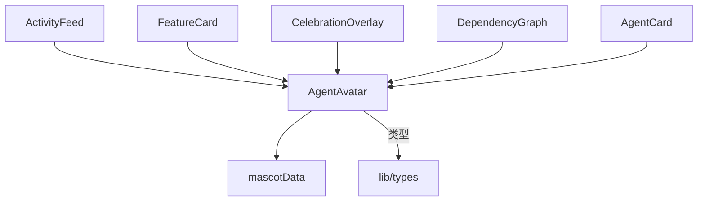

# `AgentAvatar.tsx` — Agent 头像组件

> 源文件路径: `ui/src/components/AgentAvatar.tsx`

## 功能概述

`AgentAvatar` 是 Agent 吉祥物头像的通用展示组件。每个 Agent 有独特的名称、配色方案和 SVG 形象。头像会根据 Agent 当前状态（空闲、思考、工作、测试、成功、错误等）展示对应的动画效果和光晕。支持三种尺寸和可选的名称标签显示。

## 依赖关系

### 导入依赖

| 模块 | 说明 |
|------|------|
| `../lib/types` | `AgentMascot`, `AgentState` 类型 |
| `./mascotData` | `AVATAR_COLORS`, `UNKNOWN_COLORS`, `MASCOT_SVGS`, `UnknownMascotSVG` — 吉祥物配色和 SVG 数据 |

### 被依赖

| 模块 | 引用内容 |
|------|----------|
| `ActivityFeed.tsx` | 活动动态中的 Agent 头像 |
| `FeatureCard.tsx` | 功能卡片中正在工作的 Agent 头像 |
| `CelebrationOverlay.tsx` | 庆祝动画中的 Agent 头像 |
| `DependencyGraph.tsx` | 依赖图节点中的 Agent 头像 |
| `AgentCard.tsx` | Agent 卡片中的头像 |

## 关键组件/函数

### `AgentAvatar`

- **Props**: `name`（吉祥物名称或 `'Unknown'`）、`state`（Agent 状态）、`size`（`'sm'`/`'md'`/`'lg'`）、`showName`（是否显示名称标签）
- **尺寸映射**: sm=32px, md=48px, lg=64px
- **Unknown 处理**: 未知 Agent 使用专用配色和 SVG

### 辅助函数

- `getStateAnimation(state)` — 状态到动画类的映射（bounce、thinking、working、testing、celebrate、shake）
- `getStateGlow(state)` — 状态到发光阴影效果的映射
- `getStateDescription(state)` — 无障碍状态描述文本

## 架构图

## 注意事项

- 所有 SVG 形象和配色数据集中在 `mascotData.tsx` 中管理
- 组件设有完整的 ARIA 属性（`role="status"`, `aria-label`, `aria-live="polite"`）确保无障碍访问
- 支持 20 种命名吉祥物（Spark、Fizz、Octo 等）和一种 Unknown 备用形象
- 名称标签颜色使用该吉祥物的主色调（`colors.primary`）
