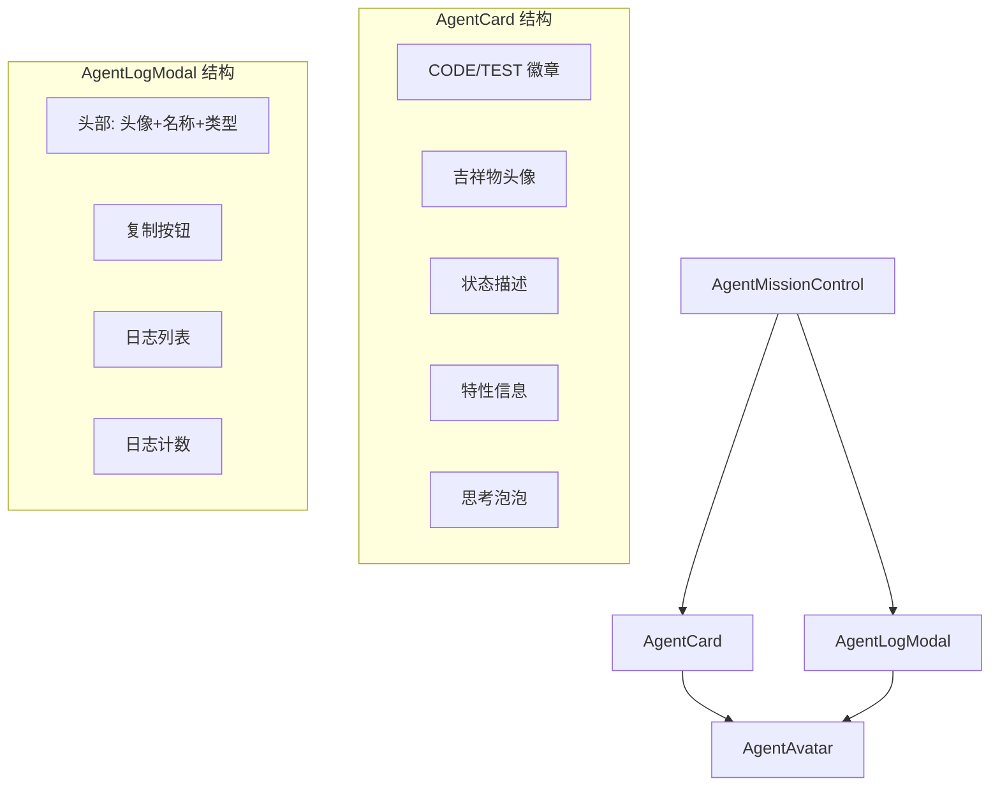

# `AgentCard.tsx` -- Agent 状态卡片与日志查看模态框

> 源文件路径: `ui/src/components/AgentCard.tsx`

## 功能概述

`AgentCard.tsx` 包含两个导出组件：`AgentCard`（Agent 状态卡片）和 `AgentLogModal`（Agent 日志查看模态框），它们共同用于 Agent Mission Control 面板中展示各个 Agent 的实时状态和运行日志。

`AgentCard` 是一个紧凑的卡片组件（180-220px 宽度），展示单个 Agent 的吉祥物头像、名称、状态描述、正在处理的特性信息（支持批次模式显示多个特性 ID）、以及 Agent 的"思考泡泡"（thought 字段的最后两行截断显示）。Agent 类型通过右上角的 CODE/TEST 徽章区分。

`AgentLogModal` 是全屏日志查看模态框，使用 React Portal 渲染到 body 级别，展示 Agent 的完整日志流，支持一键复制日志内容到剪贴板。

## 依赖关系

### 导入依赖

| 模块 | 说明 |
|------|------|
| `lucide-react` | MessageCircle, ScrollText, X, Copy, Check, Code, FlaskConical 图标 |
| `react` | `useState` -- React Hook |
| `react-dom` | `createPortal` -- 模态框门户渲染 |
| `./AgentAvatar` | Agent 吉祥物头像组件 |
| `../lib/types` | `ActiveAgent`, `AgentLogEntry`, `AgentType` 类型 |
| `@/components/ui/card` | Card, CardContent 组件 |
| `@/components/ui/button` | Button 组件 |
| `@/components/ui/badge` | Badge 组件 |

### 被依赖

| 模块 | 引用内容 |
|------|----------|
| `ui/src/components/AgentMissionControl.tsx` | 导入 `AgentCard` 和 `AgentLogModal` |

## 关键组件/函数

### `AgentCard`

**Props:**
- `agent: ActiveAgent` -- Agent 状态数据
- `onShowLogs?: (agentIndex: number) => void` -- 显示日志回调

**渲染内容:**
1. 类型徽章（CODE 蓝色 / TEST 紫色）-- 右上角
2. 头像 + 名称 + 状态描述 + 日志按钮
3. 特性信息（单特性显示 ID+名称，批次显示所有 ID）
4. 思考泡泡（`agent.thought` 的截断显示）

**活跃状态动画:**
当 Agent 处于 thinking/working/testing 状态时，卡片添加 `animate-pulse` 类。

### `AgentLogModal`

**Props:**
- `agent: ActiveAgent` -- Agent 数据
- `logs: AgentLogEntry[]` -- 日志条目列表
- `onClose: () => void` -- 关闭回调

**功能:**
- 使用 `createPortal` 渲染到 `document.body`，z-index 9999
- 点击背景遮罩关闭
- 复制按钮将所有日志格式化为 `[timestamp] line` 并复制到剪贴板
- 日志条目根据类型着色：`error` 红色、`state_change` 主色调、默认前景色
- 底部显示日志总条数

### 辅助函数

- **`getStateText(state)`** -- 状态到友好描述的映射（Standing by/Pondering/Coding away 等）
- **`getStateColor(state)`** -- 状态到颜色类名的映射
- **`getAgentTypeBadge(agentType)`** -- Agent 类型到徽章配置的映射（标签/颜色/图标）

## 架构图

## 注意事项

- 卡片宽度范围 `min-w-[180px] max-w-[220px]`，适配 Mission Control 的水平滚动布局
- 批次模式下显示所有 `featureIds`，并高亮当前活跃的 `featureId`
- 思考泡泡使用 `line-clamp-2` 限制最多两行显示
- 日志模态框使用 `navigator.clipboard.writeText()` 实现复制功能
- 复制成功后 2 秒内按钮文字从"Copy"变为"Copied!"
- 日志时间戳使用 `toLocaleTimeString()` 本地化显示
- Agent 状态到描述的映射使用趣味性表达（如 "Nailed it!", "Trying plan B..."）
