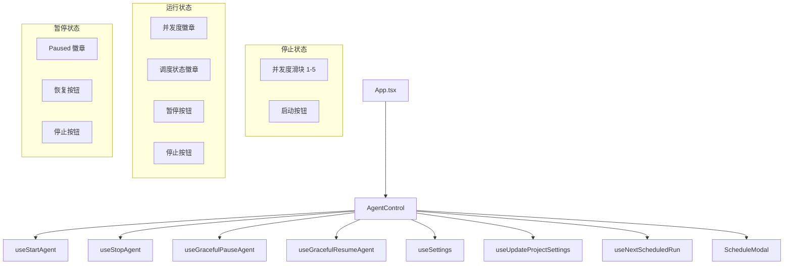

# `AgentControl.tsx` -- Agent 启动/停止/暂停控制栏

> 源文件路径: `ui/src/components/AgentControl.tsx`

## 功能概述

`AgentControl` 是 Agent 生命周期控制组件，提供启动、停止、优雅暂停和恢复等操作按钮，以及并发度调节、调度状态显示和调度管理入口。它是项目页面顶栏中 Agent 操作的核心控件。

组件根据 Agent 当前状态（stopped/running/paused/pausing/crashed/loading）动态渲染不同的按钮组合：
- **已停止**: 显示并发度滑块 + 启动按钮
- **运行中**: 显示并发度徽章 + 暂停按钮 + 停止按钮
- **暂停中**: 显示"Pausing..."动画徽章
- **已暂停**: 显示"Paused"徽章 + 恢复按钮 + 停止按钮
- **加载中**: 显示旋转加载图标

并发度设置通过防抖（500ms）自动保存到项目配置中。调度状态信息通过 `useNextScheduledRun` hook 获取，显示下次运行时间或当前运行的结束时间。

## 依赖关系

### 导入依赖

| 模块 | 说明 |
|------|------|
| `react` | `useState`, `useEffect`, `useRef`, `useCallback` -- React Hooks |
| `lucide-react` | Play, Square, Loader2, GitBranch, Clock, Pause, PlayCircle 图标 |
| `../hooks/useProjects` | Agent 控制 hooks（start/stop/pause/resume）、设置和项目设置 hooks |
| `../hooks/useSchedules` | `useNextScheduledRun` -- 下次调度运行信息 |
| `../lib/timeUtils` | `formatNextRun`, `formatEndTime` -- 时间格式化 |
| `./ScheduleModal` | 调度管理模态框组件 |
| `../lib/types` | `AgentStatus` 类型 |
| `@/components/ui/button` | Button 组件 |
| `@/components/ui/badge` | Badge 组件 |

### 被依赖

| 模块 | 引用内容 |
|------|----------|
| `ui/src/App.tsx` | 导入 `AgentControl`，在项目页面顶栏中使用 |

## 关键组件/函数

### `AgentControl`

**Props:**
- `projectName: string` -- 项目名称
- `status: AgentStatus` -- 当前 Agent 状态
- `defaultConcurrency?: number` -- 默认并发度（默认 3）

**状态管理:**
- `concurrency` -- 当前并发度值，与 `defaultConcurrency` 同步
- `showScheduleModal` -- 调度模态框开关

**并发度管理:**
- `handleConcurrencyChange(newConcurrency)` -- 更新本地状态 + 500ms 防抖保存
- 保存通过 `updateProjectSettings.mutate({ default_concurrency })` 实现
- 组件卸载时清理未执行的保存定时器

**Agent 控制操作:**
- `handleStart()` -- 启动 Agent，传入 yoloMode、parallelMode、maxConcurrency、testingAgentRatio
- `handleStop()` -- 立即停止 Agent
- `gracefulPause.mutate()` -- 优雅暂停（完成当前工作后暂停）
- `gracefulResume.mutate()` -- 恢复运行

**调度状态显示:**
- 正在运行的调度：显示 "Running until {endTime}"
- 下次调度：显示 "Next: {nextStart}"

**YOLO 模式联动:**
- 从全局设置 `useSettings()` 读取 `yolo_mode`
- YOLO 模式启用时，启动按钮使用 `variant="secondary"` 视觉区分

**按钮禁用逻辑:**
- 任何 mutation 的 `isPending` 状态都会禁用所有操作按钮
- `isLoading` 合并了 start/stop/pause/resume 四个 mutation 的 pending 状态

## 架构图

## 注意事项

- 并发度保存使用 500ms 防抖，避免滑块拖动期间频繁请求
- `isRunning` 包含 running、paused、pausing、paused_graceful 四种状态
- `isStopped` 包含 stopped 和 crashed 两种状态
- 并发度范围 1-5，大于 1 时自动启用并行模式
- 启动时 `testingAgentRatio` 从全局设置读取
- 时钟按钮始终可见，无论 Agent 是否运行
- `useEffect` 监听 `defaultConcurrency` 变化以同步状态（项目切换时）
- 调度结束时间使用 `formatEndTime()` 格式化，下次运行使用 `formatNextRun()` 格式化
