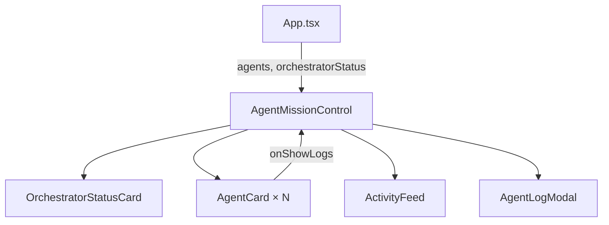

# `AgentMissionControl.tsx` — 任务控制中心面板

> 源文件路径: `ui/src/components/AgentMissionControl.tsx`

## 功能概述

`AgentMissionControl` 是并行模式下的任务控制中心，展示当前所有活跃 Agent 的状态卡片、编排器状态，以及最近的活动动态。面板可折叠/展开，活动动态区域也可独立折叠（状态持久化到 `localStorage`）。当没有编排器状态也没有活跃 Agent 时，组件不渲染任何内容。

## 依赖关系

### 导入依赖

| 模块 | 说明 |
|------|------|
| `lucide-react` | `Rocket`, `ChevronDown`, `ChevronUp`, `Activity` 图标 |
| `react` | `useState` |
| `./AgentCard` | `AgentCard`, `AgentLogModal` Agent 卡片和日志弹窗 |
| `./ActivityFeed` | 活动动态列表 |
| `./OrchestratorStatusCard` | 编排器状态卡片 |
| `../lib/types` | `ActiveAgent`, `AgentLogEntry`, `OrchestratorStatus` 类型 |
| `@/components/ui/card` | `Card`, `CardContent` |
| `@/components/ui/badge` | `Badge` |
| `@/components/ui/button` | `Button` |

### 被依赖

| 模块 | 引用内容 |
|------|----------|
| `App.tsx` | 在主界面中展示任务控制中心 |

## 关键组件/函数

### `AgentMissionControl`

- **Props**: `agents`（活跃 Agent 列表）、`orchestratorStatus`（编排器状态）、`recentActivity`（最近活动）、`isExpanded`（初始展开状态）、`getAgentLogs`（获取指定 Agent 日志的函数）
- **状态管理**:
  - `isExpanded` — 面板整体展开/折叠
  - `activityCollapsed` — 活动动态区域折叠状态（持久化）
  - `selectedAgentForLogs` — 选中查看日志的 Agent（触发 `AgentLogModal`）
- **布局结构**:
  - 顶部可点击标题栏，显示 Agent 数量或编排器状态
  - 内容区：编排器状态卡片 + Agent 卡片水平滚动行 + 可折叠活动动态

## 架构图

## 注意事项

- Agent 卡片使用水平滚动布局（`overflow-x-auto`），适应多个 Agent 并排展示
- 面板整体使用 `max-h` + `transition` 实现平滑展开/折叠动画
- 活动动态折叠状态通过 `localStorage` key `autoforge-activity-collapsed` 持久化
- 当 `orchestratorStatus` 和 `agents` 都为空时返回 `null`，不占用页面空间
