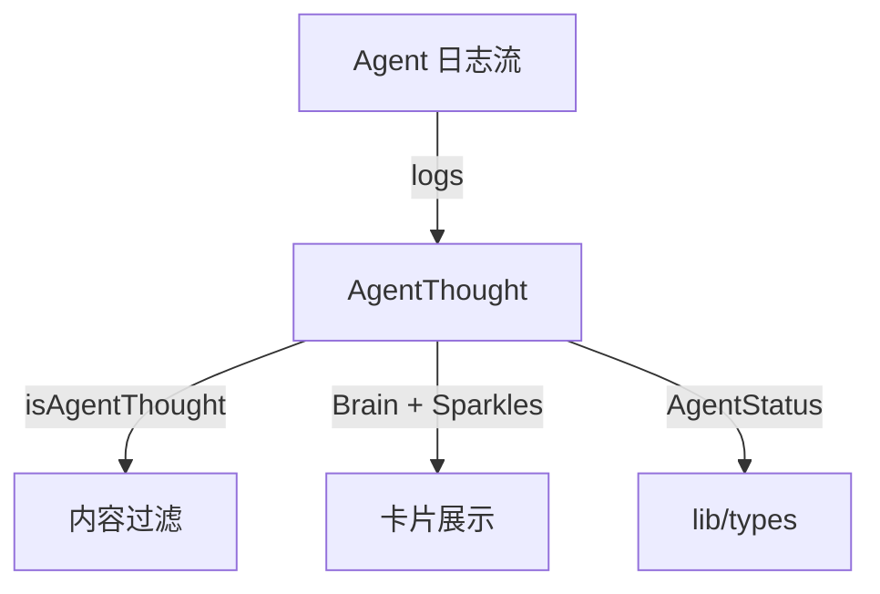

# `AgentThought.tsx` — Agent 思考气泡组件

> 源文件路径: `ui/src/components/AgentThought.tsx`

## 功能概述

`AgentThought` 是一个独立的 Agent 思考内容展示组件，从日志流中提取最新的"思考"文本（叙述性内容），以带有大脑图标和闪光动画的卡片形式展示。组件会根据 Agent 的运行状态自动显示/隐藏，并在文本切换时使用淡入淡出过渡动画。

注意：该组件目前未被任何其他文件引用，其功能已被内联到 `ProgressDashboard` 组件中。

## 依赖关系

### 导入依赖

| 模块 | 说明 |
|------|------|
| `react` | `useMemo`, `useState`, `useEffect` |
| `lucide-react` | `Brain`, `Sparkles` 图标 |
| `../lib/types` | `AgentStatus` 类型 |
| `@/components/ui/card` | `Card` |

### 被依赖

| 模块 | 引用内容 |
|------|----------|
| （无） | 当前未被其他组件直接引用 |

## 关键组件/函数

### `AgentThought`

- **Props**: `logs`（日志数组）、`agentStatus`（Agent 状态）
- **状态管理**:
  - `displayedThought` — 当前显示的思考文本
  - `textVisible` — 文本淡入淡出控制
  - `isVisible` — 组件整体可见性（延迟隐藏支持退出动画）
- **显示条件**:
  - Agent 状态为 `running` 或 `pausing` 时显示
  - `paused` 状态下，仅在最后一条日志 30 秒内显示
  - 无思考内容时不显示

### `isAgentThought(line)` / `getLatestThought(logs)`

- 日志行分类函数，过滤工具调用（`[Tool:`）、JSON 输出、路径、短文本等非叙述性内容
- 从日志末尾向前搜索最新的思考文本

## 架构图

## 注意事项

- 30 秒空闲超时（`IDLE_TIMEOUT`）后自动隐藏，防止显示过时信息
- 隐藏时使用 300ms 延迟以允许退出动画完成
- 文本末尾的冒号自动去除（`replace(/:$/, '')`）
- 运行中状态下卡片底部有脉冲指示条
- 与 `ProgressDashboard` 中的 `isAgentThought` 逻辑重复，属于遗留代码
