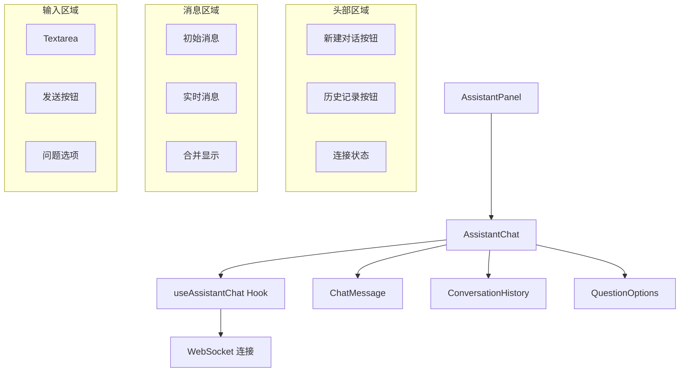

# `AssistantChat.tsx` -- 项目 AI 助手聊天组件

> 源文件路径: `ui/src/components/AssistantChat.tsx`

## 功能概述

`AssistantChat` 是项目 AI 助手的主要聊天界面组件，为用户提供针对项目代码库的问答功能。用户可以询问关于代码结构、实现细节、最佳实践等问题，助手基于项目上下文提供回答。

该组件实现了完整的对话管理功能：
- **多对话支持**: 通过 `conversationId` 支持在多个对话之间切换
- **对话历史**: 集成 `ConversationHistory` 组件查看和选择历史对话
- **消息合并**: 使用 `useMemo` 将初始消息（恢复的历史消息）与实时消息去重合并
- **结构化问答**: 支持助手发送结构化问题，通过 `QuestionOptions` 组件展示选项
- **新建对话**: 清空当前消息并创建新的对话会话
- **对话创建通知**: 当新对话创建时，通过 `onConversationCreated` 通知父组件

组件使用 WebSocket 实现实时通信，连接状态在头部显示。输入区域使用可自适应高度的 Textarea，支持 Enter 发送和 Shift+Enter 换行。

## 依赖关系

### 导入依赖

| 模块 | 说明 |
|------|------|
| `react` | `useState`, `useRef`, `useEffect`, `useCallback`, `useMemo` -- React Hooks |
| `lucide-react` | Send, Loader2, Wifi, WifiOff, Plus, History 图标 |
| `../hooks/useAssistantChat` | `useAssistantChat` -- 助手聊天 WebSocket hook |
| `./ChatMessage` | 聊天消息渲染组件 |
| `./ConversationHistory` | 对话历史列表组件 |
| `./QuestionOptions` | 结构化问题选项组件 |
| `../lib/types` | `ChatMessage` 类型 |
| `../lib/keyboard` | `isSubmitEnter` -- 提交快捷键检测 |
| `@/components/ui/button` | Button 组件 |
| `@/components/ui/textarea` | Textarea 组件 |

### 被依赖

| 模块 | 引用内容 |
|------|----------|
| `ui/src/components/AssistantPanel.tsx` | 导入 `AssistantChat`，在助手面板中使用 |

## 关键组件/函数

### `AssistantChat`

**Props:**
- `projectName: string` -- 项目名称
- `conversationId?: number | null` -- 当前对话 ID
- `initialMessages?: ChatMessage[]` -- 恢复的历史消息
- `isLoadingConversation?: boolean` -- 是否正在加载对话数据
- `onNewChat?: () => void` -- 新建对话回调
- `onSelectConversation?: (id: number) => void` -- 选择历史对话回调
- `onConversationCreated?: (id: number) => void` -- 新对话创建通知回调

**状态管理:**
- `inputValue` -- 用户输入文本
- `showHistory` -- 历史对话面板开关
- `hasStartedRef` / `lastConversationIdRef` -- 避免重复初始化和重复连接
- `previousActiveConversationIdRef` -- 追踪对话 ID 变化以触发创建通知

**消息合并逻辑:**
```typescript
const displayMessages = useMemo(() => {
  // 1. 未同步时显示 initialMessages
  // 2. 无初始消息时显示实时 messages
  // 3. 两者都有时，通过 Map 去重合并（实时消息优先）
}, [initialMessages, messages, conversationId, isLoadingConversation])
```

**对话切换流程:**
1. 检测 `conversationId` 变化
2. 对比 `lastConversationIdRef` 确认是否真正切换
3. 清空当前消息（`clearMessages`）
4. 调用 `start(conversationId)` 建立新连接

**结构化问答:**
- `currentQuestions` 不为空时显示 `QuestionOptions`
- 问答模式下禁用文本输入框，底部显示"Select an option above"提示

## 架构图



## 注意事项

- 错误处理通过 `useCallback` 包装避免无限重渲染
- 对话创建通知使用 `previousActiveConversationIdRef` 精确追踪从 null 到有值的转变
- `isLoadingConversation` 为 true 时跳过 `start()` 调用，等待对话数据加载完成
- 消息合并使用 Map 数据结构去重，以消息 ID 为键，实时消息覆盖初始消息
- Textarea 最小高度 44px，最大高度 120px
- 结构化问答模式下禁用文本输入和发送按钮
- 连接状态使用三色指示：绿色（已连接）、蓝色旋转（连接中）、红色（断开）
