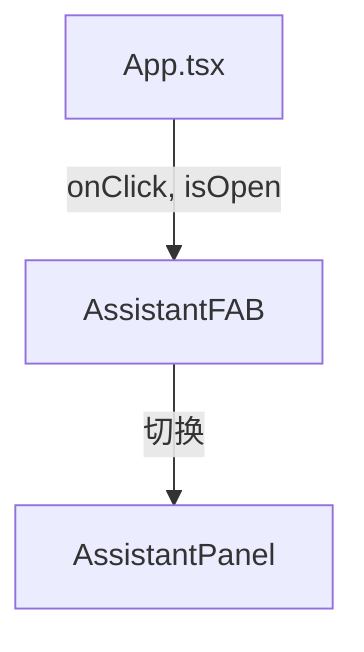

# `AssistantFAB.tsx` — AI 助手浮动操作按钮

> 源文件路径: `ui/src/components/AssistantFAB.tsx`

## 功能概述

`AssistantFAB`（Floating Action Button）是固定在页面右下角的圆形浮动按钮，用于快速切换 AI 助手面板的开关状态。打开时显示关闭图标（X），关闭时显示消息图标（MessageCircle）。支持快捷键 `A` 的提示标签。

## 依赖关系

### 导入依赖

| 模块 | 说明 |
|------|------|
| `lucide-react` | `MessageCircle`, `X` 图标 |
| `@/components/ui/button` | `Button` |

### 被依赖

| 模块 | 引用内容 |
|------|----------|
| `App.tsx` | 固定在主界面右下角的助手面板开关按钮 |

## 关键组件/函数

### `AssistantFAB`

- **Props**: `onClick`（点击回调）、`isOpen`（当前助手面板是否打开）
- **样式**: `fixed bottom-6 right-6 z-50 w-14 h-14 rounded-full` 圆形按钮
- **交互动画**: 悬停上移（`hover:-translate-y-0.5`），按下下沉（`active:translate-y-0.5`）
- **无障碍**: 设有 `aria-label` 和 `title` 属性，包含快捷键提示（Press A）

## 架构图

## 注意事项

- 按钮固定在视口右下角（`bottom-6 right-6`），z-index 为 50 确保在其他内容之上
- 图标根据 `isOpen` 状态切换：关闭状态显示 `MessageCircle`，打开状态显示 `X`
- 阴影效果：默认 `shadow-lg`，悬停 `shadow-xl`，增强浮动感
