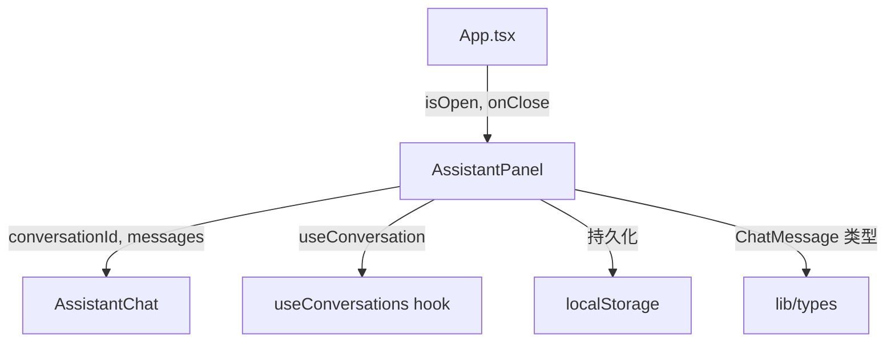

# `AssistantPanel.tsx` — 项目助手侧边面板容器

> 源文件路径: `ui/src/components/AssistantPanel.tsx`

## 功能概述

`AssistantPanel` 是项目 AI 助手的滑入式侧边面板容器组件。它从屏幕右侧滑入，提供与 `AssistantChat` 组件的交互界面。该组件负责管理对话状态（通过 `localStorage` 持久化会话 ID）、面板宽度的拖拽调整，以及会话的新建、选择和自动恢复等生命周期。

当用户切换项目时，组件会自动重置为该项目上次的会话 ID；当存储的会话在后端已不存在（404 错误）时，会自动清除过期的会话引用。

## 依赖关系

### 导入依赖

| 模块 | 说明 |
|------|------|
| `react` | `useState`, `useEffect`, `useCallback`, `useRef` 状态与副作用管理 |
| `lucide-react` | `X`, `Bot` 图标 |
| `./AssistantChat` | 助手聊天核心组件 |
| `../hooks/useConversations` | `useConversation` — 获取单个会话详情的 React Query hook |
| `../lib/types` | `ChatMessage` 类型定义 |
| `@/components/ui/button` | `Button` 基础按钮组件 |

### 被依赖

| 模块 | 引用内容 |
|------|----------|
| `App.tsx` | 作为主应用中的助手面板，通过 `isOpen`/`onClose` 控制显隐 |

## 关键组件/函数

### `AssistantPanel`

- **Props**: `projectName`（项目名称）、`isOpen`（面板是否打开）、`onClose`（关闭回调）
- **状态管理**:
  - `conversationId` — 当前会话 ID，初始值从 `localStorage` 恢复
  - `panelWidth` — 面板宽度，支持拖拽调整且持久化到 `localStorage`
- **交互逻辑**:
  - 左侧边缘拖拽手柄实现面板宽度调整（最小 300px，最大 90vw）
  - 点击遮罩层关闭面板
  - 会话 ID 变更自动同步到 `localStorage`
  - 会话不存在时（404）自动清除引用

### `getStoredConversationId` / `setStoredConversationId`

- 工具函数，负责从 `localStorage` 读写会话 ID，键名格式为 `assistant-conversation-{projectName}`

## 架构图

## 注意事项

- 面板宽度通过 `col-resize` 光标和 `mousemove`/`mouseup` 事件实现拖拽，需要在拖拽期间禁用文本选择（`user-select: none`）
- `isOpen` 为 `false` 时，内部的 `AssistantChat` 不会渲染，避免不必要的 WebSocket 连接
- 会话恢复仅在后端返回 404 时清除，网络临时错误不会触发清除逻辑
