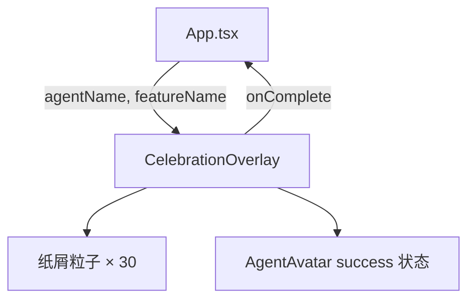

# `CelebrationOverlay.tsx` — 功能完成庆祝覆盖层

> 源文件路径: `ui/src/components/CelebrationOverlay.tsx`

## 功能概述

`CelebrationOverlay` 是功能特性完成时的全屏庆祝动画组件。它展示彩色纸屑粒子雨、Agent 头像庆祝动画、完成消息和功能名称。覆盖层在 3 秒后自动消失，也可以通过点击或按 Escape 键提前关闭。

## 依赖关系

### 导入依赖

| 模块 | 说明 |
|------|------|
| `react` | `useCallback`, `useEffect`, `useState` |
| `lucide-react` | `Sparkles`, `PartyPopper` 图标 |
| `./AgentAvatar` | Agent 头像组件 |
| `../lib/types` | `AgentMascot` 类型 |
| `@/components/ui/card` | `Card`, `CardContent` |

### 被依赖

| 模块 | 引用内容 |
|------|----------|
| `App.tsx` | 在功能完成时触发庆祝动画 |

## 关键组件/函数

### `CelebrationOverlay`

- **Props**: `agentName`（Agent 吉祥物名称）、`featureName`（完成的功能名称）、`onComplete`（动画结束回调）
- **状态管理**: `isVisible` — 控制淡出动画
- **交互逻辑**:
  - 3 秒自动关闭定时器
  - Escape 键监听提前关闭
  - 点击卡片关闭
  - 关闭时 300ms 淡出后调用 `onComplete`

### `generateConfetti(count)`

- 生成指定数量的纸屑粒子数据，每个粒子包含：
  - `x` — 水平位置（0-100%）
  - `delay` — 动画延迟（0-0.5s）
  - `duration` — 下落时长（1-2s）
  - `color` — 从5种鲜艳颜色中随机选取
  - `rotation` — 初始旋转角度

## 架构图

## 注意事项

- 覆盖层使用 `pointer-events-none`，但内部卡片设为 `pointer-events-auto`，确保只有卡片可点击
- 纸屑使用 `animate-confetti` CSS 动画，需在全局样式中定义
- 卡片使用 `animate-bounce-in` 弹入动画，绿色背景（`bg-green-500`）
- Agent 头像以 `success` 状态显示庆祝动画
