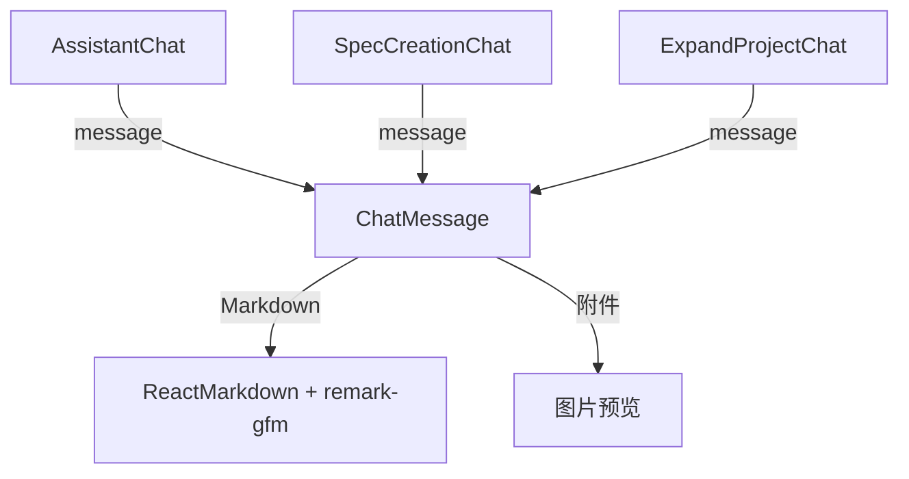

# `ChatMessage.tsx` — 聊天消息气泡组件

> 源文件路径: `ui/src/components/ChatMessage.tsx`

## 功能概述

`ChatMessage` 是一个通用的聊天消息展示组件，支持用户、助手和系统三种角色的消息样式。使用 `react-markdown` 渲染 Markdown 内容（支持 GFM 语法），支持图片附件展示和流式输入指示器。组件使用 `React.memo` 优化性能，避免不必要的重渲染。

## 依赖关系

### 导入依赖

| 模块 | 说明 |
|------|------|
| `react` | `memo` 性能优化包装器 |
| `lucide-react` | `Bot`, `User`, `Info` 角色图标 |
| `react-markdown` | Markdown 渲染引擎 |
| `remark-gfm` | GitHub Flavored Markdown 插件 |
| `../lib/types` | `ChatMessage` 类型（重命名为 `ChatMessageType`） |
| `@/components/ui/card` | `Card` |

### 被依赖

| 模块 | 引用内容 |
|------|----------|
| `ExpandProjectChat.tsx` | 渲染扩展项目聊天中的消息 |
| `SpecCreationChat.tsx` | 渲染 Spec 创建聊天中的消息 |
| `AssistantChat.tsx` | 渲染助手聊天中的消息（别名 `ChatMessageComponent`） |

## 关键组件/函数

### `ChatMessage`（memo 包装）

- **Props**: `message`（`ChatMessageType` 对象，包含 `role`、`content`、`attachments`、`timestamp`、`isStreaming`）
- **角色样式**:
  - `user` — 右对齐，主色调背景，User 图标在右侧
  - `assistant` — 左对齐，灰色背景，Bot 图标在左侧
  - `system` — 居中对齐，绿色背景，Info 图标，单行紧凑布局
- **功能特性**:
  - Markdown 渲染，链接自动在新标签页打开
  - 图片附件网格展示，点击可放大查看
  - 流式输入时消息卡片脉冲动画 + 光标闪烁指示器
  - 时间戳（时:分格式）显示在气泡下方

## 架构图

## 注意事项

- `remarkPlugins` 和 `markdownComponents` 定义在组件外部作为稳定引用，避免因重渲染导致 Markdown 解析重复执行
- 用户消息使用 `chat-prose-user` CSS 类，助手消息使用 `chat-prose` 类，样式在 `globals.css` 中定义
- 导入时 `ChatMessage` 类型重命名为 `ChatMessageType` 避免与组件同名冲突
