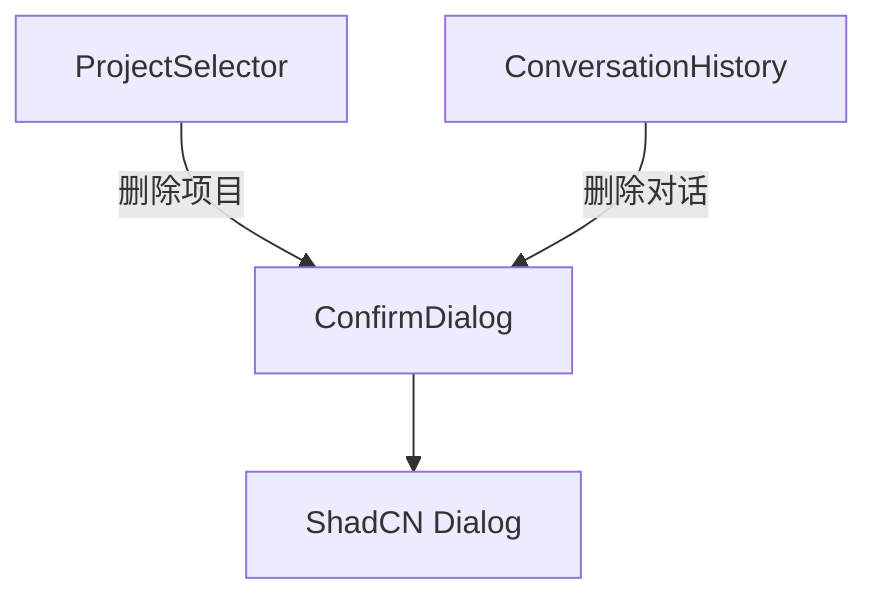

# `ConfirmDialog.tsx` — 通用确认对话框组件

> 源文件路径: `ui/src/components/ConfirmDialog.tsx`

## 功能概述

`ConfirmDialog` 是一个可复用的确认对话框组件，用于确认删除、重置等破坏性操作。支持 `danger`（红色）和 `warning`（主色调）两种视觉变体，以及加载状态显示。基于 ShadCN Dialog 组件封装，提供一致的确认交互体验。

## 依赖关系

### 导入依赖

| 模块 | 说明 |
|------|------|
| `react` | `ReactNode` 类型（message 支持 JSX 内容） |
| `lucide-react` | `AlertTriangle` 警告图标 |
| `@/components/ui/dialog` | `Dialog`, `DialogContent`, `DialogDescription`, `DialogFooter`, `DialogHeader`, `DialogTitle` |
| `@/components/ui/button` | `Button` |

### 被依赖

| 模块 | 引用内容 |
|------|----------|
| `ProjectSelector.tsx` | 删除项目的确认对话框 |
| `ConversationHistory.tsx` | 删除对话记录的确认对话框 |

## 关键组件/函数

### `ConfirmDialog`

- **Props**:
  - `isOpen` — 是否打开
  - `title` — 标题文本
  - `message` — 描述内容（支持 `ReactNode`，可传入 JSX）
  - `confirmLabel` / `cancelLabel` — 按钮文本（默认 "Confirm" / "Cancel"）
  - `variant` — 视觉变体（`'danger'` 或 `'warning'`）
  - `isLoading` — 加载中状态
  - `onConfirm` / `onCancel` — 确认/取消回调
- **行为**: 加载中时两个按钮均禁用，确认按钮文本变为 "Deleting..."

## 架构图

## 注意事项

- `message` 接受 `ReactNode` 类型，允许传入复杂内容（如带错误提示的 JSX 结构）
- `danger` 变体：图标背景为红色，确认按钮为 `destructive` 样式
- `warning` 变体：图标背景为主色调，确认按钮为默认样式
- 对话框关闭时触发 `onCancel` 回调（通过 `onOpenChange`）
