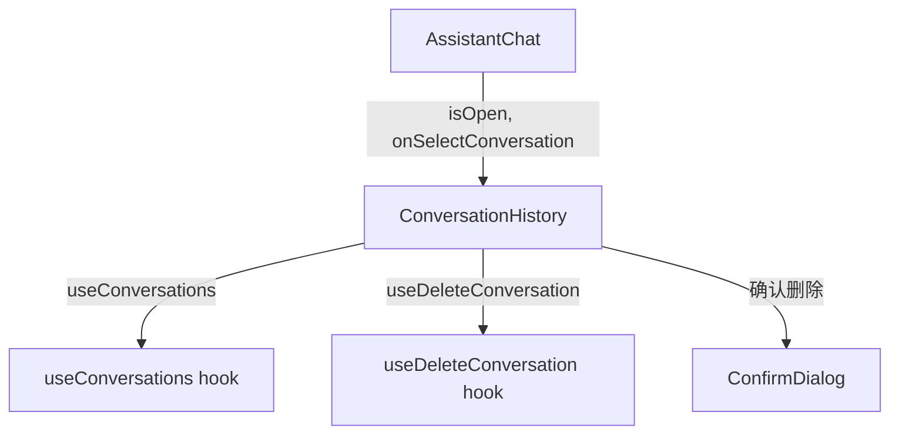

# `ConversationHistory.tsx` — 对话历史下拉列表组件

> 源文件路径: `ui/src/components/ConversationHistory.tsx`

## 功能概述

`ConversationHistory` 是助手面板中的对话历史管理组件，以下拉列表形式展示过去的所有对话记录。用户可以选择一个历史对话来恢复聊天，也可以删除不再需要的旧对话。组件内置了删除确认对话框和错误处理逻辑。

## 依赖关系

### 导入依赖

| 模块 | 说明 |
|------|------|
| `react` | `useState`, `useEffect` |
| `lucide-react` | `MessageSquare`, `Trash2`, `Loader2`, `AlertCircle` 图标 |
| `../hooks/useConversations` | `useConversations`（获取列表）、`useDeleteConversation`（删除） |
| `./ConfirmDialog` | 删除确认对话框 |
| `../lib/types` | `AssistantConversation` 类型 |
| `@/components/ui/button` | `Button` |
| `@/components/ui/card` | `Card`, `CardContent`, `CardHeader` |

### 被依赖

| 模块 | 引用内容 |
|------|----------|
| `AssistantChat.tsx` | 在助手聊天组件中作为历史记录下拉菜单使用 |

## 关键组件/函数

### `ConversationHistory`

- **Props**: `projectName`、`currentConversationId`、`isOpen`、`onClose`、`onSelectConversation`
- **状态管理**:
  - `conversationToDelete` — 待删除的对话对象（触发确认对话框）
  - `deleteError` — 删除失败的错误信息
- **交互逻辑**:
  - 当前对话高亮显示且不可重复选择
  - 悬停显示删除按钮，点击弹出 `ConfirmDialog` 确认
  - 按 `Escape` 键或点击遮罩层关闭下拉列表
  - 下拉列表最大高度 300px，超出时滚动

### `formatRelativeTime`

- 将 ISO 日期字符串转换为相对时间（"just now"、"5m ago"、"yesterday" 等）

## 架构图

## 注意事项

- 组件关闭时自动清除删除错误状态
- 删除失败时保持确认对话框打开并显示错误信息，方便用户重试
- 对话列表每项显示标题、消息数量和最后更新的相对时间
