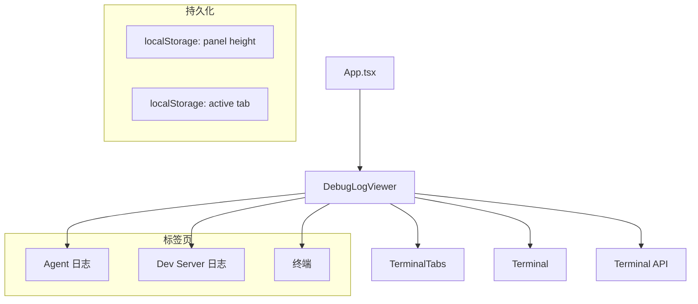

# `DebugLogViewer.tsx` -- 底部可折叠调试面板（日志、开发服务器、终端）

> 源文件路径: `ui/src/components/DebugLogViewer.tsx`

## 功能概述

`DebugLogViewer` 是固定在页面底部的可折叠调试面板，类似于浏览器 DevTools 的布局风格。它提供三个标签页：Agent 日志、Dev Server 日志和交互式终端，帮助用户实时监控和调试项目运行状态。

该组件实现了多项高级交互特性：可拖拽调整面板高度（支持 localStorage 持久化）、日志自动滚动与暂停检测、日志级别着色（error/warn/debug/info）、多终端标签管理，以及终端会话的创建、重命名和关闭。终端内容通过离屏 transform 而非 display:none 来保留 xterm.js 缓冲区。

面板高度的调整范围为 150px 到 600px，默认 288px。当前选中的标签页和面板高度均通过 localStorage 持久化，确保用户偏好在刷新后保留。

## 依赖关系

### 导入依赖

| 模块 | 说明 |
|------|------|
| `react` | `useEffect`, `useRef`, `useState`, `useCallback` -- React Hooks |
| `lucide-react` | 图标组件（ChevronUp, ChevronDown, Trash2, Terminal, GripHorizontal, Cpu, Server） |
| `./Terminal` | 交互式终端组件 |
| `./TerminalTabs` | 终端标签管理组件 |
| `@/lib/api` | `listTerminals`, `createTerminal`, `renameTerminal`, `deleteTerminal` -- 终端管理 API |
| `@/lib/types` | `TerminalInfo` 类型 |
| `@/components/ui/button` | Button 组件 |
| `@/components/ui/badge` | Badge 组件 |

### 被依赖

| 模块 | 引用内容 |
|------|----------|
| `ui/src/App.tsx` | 导入 `DebugLogViewer` 和 `TabType` 类型 |

## 关键组件/函数

### `DebugLogViewer`

**Props:**
- `logs: Array<{ line: string; timestamp: string }>` -- Agent 日志数据
- `devLogs: Array<{ line: string; timestamp: string }>` -- Dev Server 日志数据
- `isOpen: boolean` -- 面板是否展开
- `onToggle: () => void` -- 折叠/展开切换
- `onClear: () => void` -- 清除 Agent 日志
- `onClearDevLogs: () => void` -- 清除 Dev Server 日志
- `onHeightChange?: (height: number) => void` -- 面板高度变化通知
- `projectName: string` -- 当前项目名
- `activeTab?: TabType` -- 受控标签页状态
- `onTabChange?: (tab: TabType) => void` -- 标签切换回调

**状态管理:**
- 支持受控/非受控标签页模式（`controlledActiveTab` 优先）
- `panelHeight` 从 localStorage 恢复，拖拽结束时保存
- `autoScroll` / `devAutoScroll` 分别追踪两个日志标签的自动滚动状态
- `terminals` / `activeTerminalId` 管理终端列表和当前活动终端

**核心功能:**
- **拖拽调整高度**: 通过全局 mousemove/mouseup 事件监听实现平滑拖拽
- **日志级别检测**: `getLogLevel()` 通过关键词匹配（error/warn/debug）识别日志级别
- **自动滚动控制**: 用户上滚时暂停，滚到底部时恢复（50px 阈值）
- **终端管理**: CRUD 操作通过 API 调用，所有终端叠加渲染保留缓冲区

### 导出类型 `TabType`

```typescript
type TabType = 'agent' | 'devserver' | 'terminal'
```

## 架构图



## 注意事项

- 面板高度范围限制为 `MIN_HEIGHT=150` 到 `MAX_HEIGHT=600`，默认 `DEFAULT_HEIGHT=288`
- 拖拽期间设置 `cursor: ns-resize` 和 `userSelect: none` 防止文字选择干扰
- 终端使用 `transform: translateX(-200%)` 而非 `display: none`，确保 xterm.js 正确处理 IntersectionObserver 并保留缓冲区
- 关闭最后一个终端时会阻止操作（`terminals.length <= 1`）
- 日志时间戳格式化为 24 小时制 HH:MM:SS
