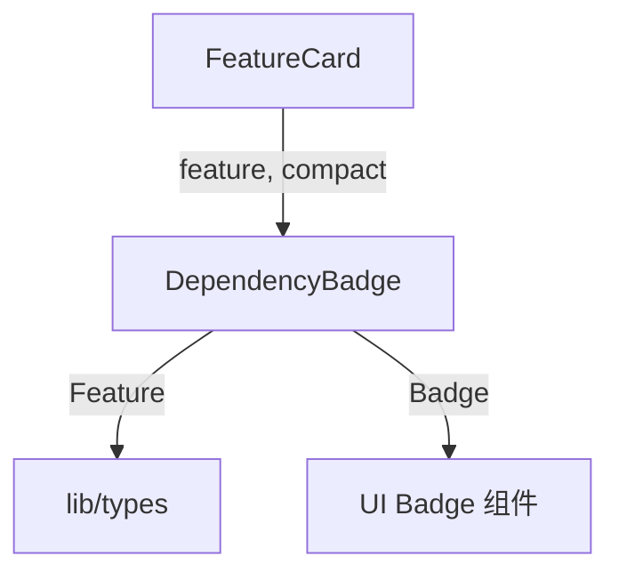

# `DependencyBadge.tsx` — 依赖状态徽章组件

> 源文件路径: `ui/src/components/DependencyBadge.tsx`

## 功能概述

`DependencyBadge` 用于展示功能特性的依赖完成状态。提供两种显示模式：紧凑模式（`compact`）用于卡片内嵌入，完整模式用于详情页展示。当功能被阻塞时显示红色警告和阻塞数量，依赖全部满足时显示绿色已完成状态。文件还导出一个更简洁的 `DependencyIndicator` 内联圆形图标组件。

## 依赖关系

### 导入依赖

| 模块 | 说明 |
|------|------|
| `lucide-react` | `AlertTriangle`, `GitBranch`, `Check` 图标 |
| `../lib/types` | `Feature` 类型 |
| `@/components/ui/badge` | `Badge` |

### 被依赖

| 模块 | 引用内容 |
|------|----------|
| `FeatureCard.tsx` | 在功能卡片头部展示紧凑模式的依赖徽章 |

## 关键组件/函数

### `DependencyBadge`

- **Props**: `feature`、`allFeatures`（用于本地计算满足数量）、`compact`（紧凑模式）
- **显示逻辑**:
  - 无依赖时返回 `null`
  - 紧凑模式：红色/灰色小徽章，仅显示数字
  - 完整模式：显示详细文本描述（"Blocked by N dependencies" 或 "All N dependencies satisfied"）
- **阻塞判断**: 优先使用 API 计算的 `feature.blocked` 和 `blocking_dependencies`，回退到本地计算

### `DependencyIndicator`

- 轻量级内联组件，仅显示一个 20x20 圆形图标
- 阻塞时显示红色三角警告，否则显示灰色分支图标

## 架构图

## 注意事项

- `satisfiedCount` 优先通过 `blocking_dependencies` 反向计算，仅在 API 未返回该字段时才遍历 `allFeatures` 本地计算
- 紧凑模式下通过 `title` 属性提供完整描述信息的悬停提示
- 徽章文本自动处理单复数（`dependency` vs `dependencies`）
