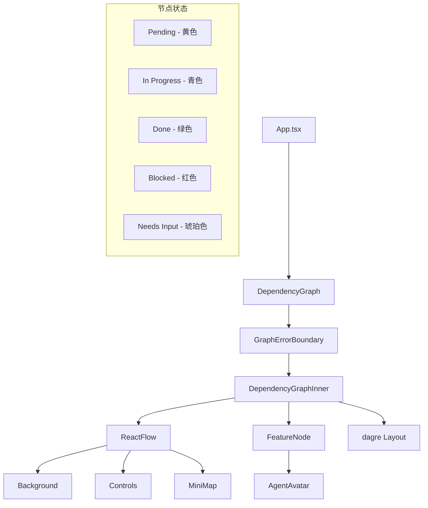

# `DependencyGraph.tsx` -- 交互式特性依赖关系图（React Flow + dagre）

> 源文件路径: `ui/src/components/DependencyGraph.tsx`

## 功能概述

`DependencyGraph` 是一个基于 React Flow 和 dagre 布局库的交互式特性依赖关系可视化组件。它将项目中所有特性及其依赖关系渲染为有向图，支持节点的平移、缩放、点击交互，并通过颜色和图标直观展示每个特性的状态（pending/in_progress/done/blocked/needs_human_input）。

该组件具备多项高级特性：
- **自动布局**: 使用 dagre 算法进行水平或垂直方向的层次布局
- **Agent 关联显示**: 活跃的 Agent 以吉祥物头像 badge 形式附着在其正在处理的节点上
- **错误边界**: 内置 `GraphErrorBoundary` 类组件，在 React Flow 渲染崩溃时提供优雅的恢复按钮
- **性能优化**: 通过 ref 追踪回调函数、JSON hash 比较避免不必要的布局重计算
- **缩略地图**: 内置 MiniMap 和 Controls 控件

图支持两种布局方向切换（水平 LR / 垂直 TB），每个节点可点击查看详情。

## 依赖关系

### 导入依赖

| 模块 | 说明 |
|------|------|
| `react` | `Component`, `useCallback`, `useEffect`, `useMemo`, `useRef`, `useState` |
| `@xyflow/react` | ReactFlow, Background, Controls, MiniMap, Handle, 各种类型 |
| `dagre` | 有向图自动布局库 |
| `lucide-react` | CheckCircle2, Circle, Loader2, AlertTriangle, RefreshCw, UserCircle |
| `../lib/types` | DependencyGraph, GraphNode, ActiveAgent, AgentMascot, AgentState 类型 |
| `./AgentAvatar` | Agent 吉祥物头像组件 |
| `@/components/ui/button` | Button 组件 |
| `@/components/ui/card` | Card, CardContent 组件 |
| `@xyflow/react/dist/style.css` | React Flow 样式表 |

### 被依赖

| 模块 | 引用内容 |
|------|----------|
| `ui/src/App.tsx` | 导入 `DependencyGraph`，在图视图模式下渲染 |

## 关键组件/函数

### `DependencyGraph`（导出组件）

外层包装组件，提供错误边界保护和重置机制。

**Props:**
- `graphData: DependencyGraphData` -- 图数据（nodes + edges）
- `onNodeClick?: (nodeId: number) => void` -- 节点点击回调
- `activeAgents?: ActiveAgent[]` -- 当前活跃的 Agent 列表

### `DependencyGraphInner`（内部组件）

实际的图渲染组件。

**核心逻辑:**
- `agentByFeatureId` -- 构建 featureId -> agent 的 Map，支持批次模式下多 feature 关联
- `initialElements` -- 将图数据转换为 React Flow 的 nodes/edges 格式
- `getLayoutedElements()` -- 使用 dagre 算法计算节点位置
- 通过 `prevGraphDataRef` 比较 JSON hash 避免不必要的重新布局

### `FeatureNode`（自定义节点组件）

**渲染内容:**
- 状态颜色背景（5 种状态对应不同配色）
- 状态图标（CheckCircle/Loader/AlertTriangle/UserCircle/Circle）
- 优先级编号 `#priority`
- 特性名称和分类
- Agent 吉祥物头像（绝对定位在右上角）
- 左右两侧的 Handle（连接点）

### `GraphErrorBoundary`（错误边界类组件）

- `getDerivedStateFromError()` -- 捕获渲染错误
- `componentDidCatch()` -- 日志记录
- `handleReset()` -- 通过 key 变更强制重新挂载

### `getLayoutedElements()`

- 参数: nodes, edges, direction ('TB' | 'LR')
- 使用 dagre.graphlib.Graph 进行布局计算
- 节点间距 50px，层级间距 100px，边距 50px

## 架构图

## 注意事项

- 节点宽度 220px，高度 80px，这些常量用于 dagre 布局计算
- `onNodeClick` 通过 ref 传递以避免触发 useMemo 重计算
- Agent 关联通过 `featureIds`（批次）和 `featureId`（单个）两种方式匹配
- 图更新使用 JSON.stringify 进行 hash 比较，包含节点状态和 Agent 分配信息
- MiniMap 颜色与节点状态同步（green-500/cyan-500/red-500/yellow-500/amber-500）
- 错误边界重置通过 React key 变更触发子树完全重新挂载
- 空图状态显示"No features to display"提示
- smoothstep 边类型搭配 ArrowClosed 箭头标记
