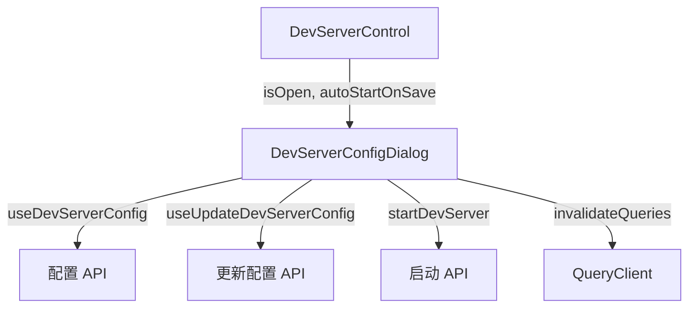

# `DevServerConfigDialog.tsx` — 开发服务器配置对话框

> 源文件路径: `ui/src/components/DevServerConfigDialog.tsx`

## 功能概述

`DevServerConfigDialog` 是开发服务器命令的配置对话框。当项目没有检测到开发命令，或用户需要自定义命令时使用。支持查看自动检测的项目类型和命令、设置自定义命令、清除自定义命令恢复自动检测，以及保存后可选自动启动服务器。

## 依赖关系

### 导入依赖

| 模块 | 说明 |
|------|------|
| `react` | `useState`, `useEffect` |
| `lucide-react` | `Loader2`, `RotateCcw`, `Terminal` 图标 |
| `@tanstack/react-query` | `useQueryClient` 缓存管理 |
| `@/components/ui/dialog` | `Dialog`, `DialogContent`, `DialogDescription`, `DialogFooter`, `DialogHeader`, `DialogTitle` |
| `@/components/ui/button` | `Button` |
| `@/components/ui/input` | `Input` |
| `@/components/ui/label` | `Label` |
| `@/hooks/useProjects` | `useDevServerConfig`（获取配置）、`useUpdateDevServerConfig`（更新配置） |
| `@/lib/api` | `startDevServer` API 函数 |

### 被依赖

| 模块 | 引用内容 |
|------|----------|
| `DevServerControl.tsx` | 作为配置对话框嵌入在开发服务器控制组件中 |

## 关键组件/函数

### `DevServerConfigDialog`

- **Props**: `projectName`、`isOpen`、`onClose`、`autoStartOnSave`（保存后是否自动启动，默认 `false`）
- **状态管理**:
  - `command` — 当前输入的命令文本
  - `error` — 操作错误信息
  - `isSaving` — 保存中状态
- **交互逻辑**:
  - 对话框打开时从后端加载当前配置并同步到输入框
  - 支持 Enter 键快速保存
  - "Clear custom command" 按钮恢复自动检测的命令
  - `autoStartOnSave` 为 true 时，保存后立即调用 `startDevServer` 启动

## 架构图

## 注意事项

- 仅在 `isOpen` 为 true 时才请求配置数据（条件查询 `isOpen ? projectName : null`）
- 允许的命令运行器白名单：npm, npx, pnpm, yarn, python, uvicorn, flask, poetry, cargo, go
- 清除自定义命令后，输入框恢复为检测到的默认命令（`detected_command`）
