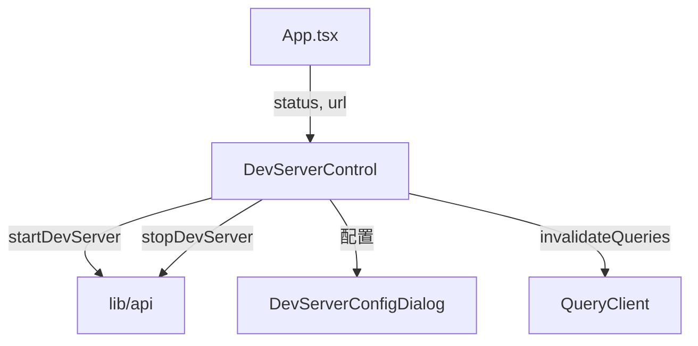

# `DevServerControl.tsx` — 开发服务器控制组件

> 源文件路径: `ui/src/components/DevServerControl.tsx`

## 功能概述

`DevServerControl` 提供项目开发服务器的启动/停止控制界面。当服务器运行时显示可点击的 URL 链接；当服务器崩溃时显示警告图标和重启按钮。组件还集成了 `DevServerConfigDialog`，允许用户配置自定义的开发命令，当检测到"无可用开发命令"错误时会自动弹出配置对话框。

## 依赖关系

### 导入依赖

| 模块 | 说明 |
|------|------|
| `react` | `useState` |
| `lucide-react` | `Globe`, `Square`, `Loader2`, `ExternalLink`, `AlertTriangle`, `Settings2` 图标 |
| `@tanstack/react-query` | `useMutation`, `useQueryClient` 用于 mutation 和缓存失效 |
| `../lib/types` | `DevServerStatus` 类型定义 |
| `../lib/api` | `startDevServer`, `stopDevServer` API 函数 |
| `@/components/ui/button` | `Button` |
| `./DevServerConfigDialog` | 开发服务器配置对话框 |

### 被依赖

| 模块 | 引用内容 |
|------|----------|
| `App.tsx` | 在主应用顶栏中展示开发服务器控制按钮 |

## 关键组件/函数

### `DevServerControl`

- **Props**: `projectName`、`status`（当前服务器状态）、`url`（服务器 URL）
- **内部 hooks**: `useStartDevServer` / `useStopDevServer` — 封装 mutation 逻辑并在成功后失效查询缓存
- **状态管理**:
  - `showConfigDialog` — 是否显示配置对话框
  - `autoStartOnSave` — 保存配置后是否自动启动服务器
- **交互逻辑**:
  - 停止状态：显示启动按钮 + 配置按钮
  - 运行状态：显示停止按钮 + URL 链接
  - 崩溃状态：使用红色 destructive 样式的重启按钮
  - 启动失败且原因为"无开发命令"时，自动弹出配置对话框

## 架构图

## 注意事项

- 组件同时导出了 `DevServerStatus` 类型供消费者使用（`export type { DevServerStatus }`）
- 启动/停止操作前会先 `reset()` 另一方的错误状态，避免残留的错误信息
- "No dev command available" 错误不在行内显示，而是由配置对话框处理
