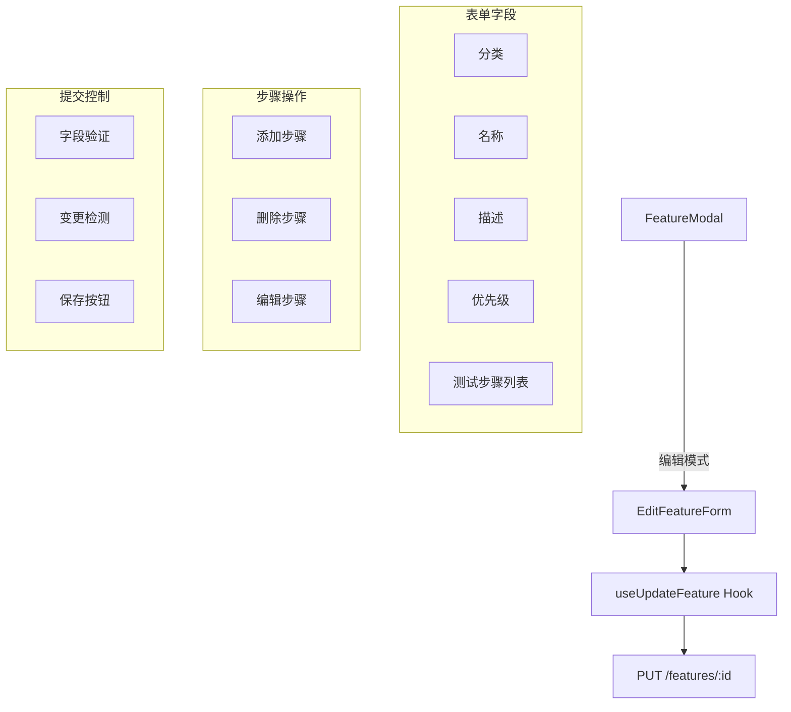

# `EditFeatureForm.tsx` -- 特性编辑表单组件

> 源文件路径: `ui/src/components/EditFeatureForm.tsx`

## 功能概述

`EditFeatureForm` 是一个完整的特性编辑表单，以模态框形式展示，允许用户修改特性的分类、名称、描述、优先级和测试步骤。它从 `FeatureModal` 的编辑模式切入，提供了表单验证、变更检测和异步保存功能。

表单的测试步骤编辑支持动态增删：用户可以添加新步骤、删除已有步骤，步骤自动编号显示。每个步骤使用唯一的 `id`（基于 `useId` 和计数器生成）来确保 React key 的稳定性。

组件实现了智能的保存按钮状态：仅当表单有效（必填字段非空）且存在实际变更时才可点击保存。变更检测通过对比当前值与原始特性数据实现，包括步骤列表的 JSON 序列化比较。

## 依赖关系

### 导入依赖

| 模块 | 说明 |
|------|------|
| `react` | `useState`, `useId` -- React Hooks |
| `lucide-react` | X, Save, Plus, Trash2, Loader2, AlertCircle 图标 |
| `../hooks/useProjects` | `useUpdateFeature` -- 更新特性的 mutation hook |
| `../lib/types` | `Feature` 类型 |
| `@/components/ui/dialog` | Dialog 系列组件 |
| `@/components/ui/button` | Button 组件 |
| `@/components/ui/input` | Input 组件 |
| `@/components/ui/textarea` | Textarea 组件 |
| `@/components/ui/label` | Label 组件 |
| `@/components/ui/alert` | Alert, AlertDescription 组件 |

### 被依赖

| 模块 | 引用内容 |
|------|----------|
| `ui/src/components/FeatureModal.tsx` | 导入 `EditFeatureForm`，在编辑模式下渲染 |

## 关键组件/函数

### `EditFeatureForm`

**Props:**
- `feature: Feature` -- 待编辑的特性数据
- `projectName: string` -- 项目名称
- `onClose: () => void` -- 关闭编辑表单回调
- `onSaved: () => void` -- 保存成功回调（通常关闭 FeatureModal）

**表单状态:**
- `category` -- 分类名称
- `name` -- 特性名称
- `description` -- 描述文本
- `priority` -- 优先级（字符串形式，提交时转换为整数）
- `steps: Step[]` -- 测试步骤数组，每项包含 `{ id: string, value: string }`
- `error` -- 错误信息
- `stepCounter` -- 步骤 ID 计数器

**步骤管理:**
- `handleAddStep()` -- 添加空步骤，递增计数器
- `handleRemoveStep(id)` -- 按 ID 移除步骤
- `handleStepChange(id, value)` -- 更新指定步骤的值

**验证与变更检测:**
```typescript
const isValid = category.trim() && name.trim() && description.trim()
const hasChanges =
  category.trim() !== feature.category ||
  name.trim() !== feature.name ||
  description.trim() !== feature.description ||
  parseInt(priority, 10) !== feature.priority ||
  JSON.stringify(currentSteps) !== JSON.stringify(feature.steps)
```

**提交流程:**
1. 过滤空步骤（`trim()` 后非空）
2. 调用 `updateFeature.mutateAsync()` 发送更新请求
3. 成功时调用 `onSaved()`
4. 失败时显示错误信息

## 架构图



## 注意事项

- 步骤 ID 使用 `useId()` + 计数器组合生成，确保跨渲染周期的唯一性
- 初始步骤列表：如果特性无步骤，默认创建一个空步骤
- 优先级使用 `<Input type="number">`，提交时通过 `parseInt` 转换
- Textarea 最小高度 100px，启用垂直方向 resize
- 步骤列表至少保留一个步骤（`steps.length > 1` 时才显示删除按钮）
- 保存按钮同时检查 `isValid`、`hasChanges` 和 `isPending` 三个条件
- 表单使用 `<form>` 标签和 `onSubmit`，支持原生表单提交行为
- 模态框最大宽度 `sm:max-w-2xl`
