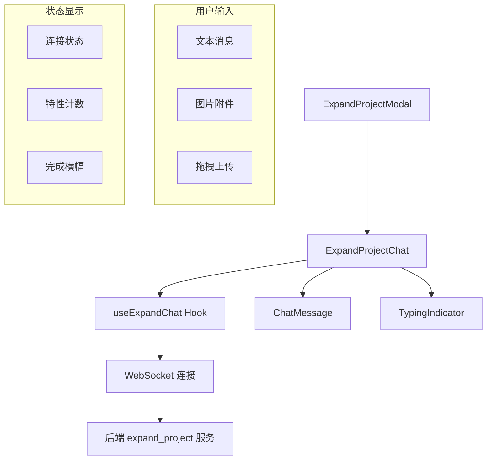

# `ExpandProjectChat.tsx` -- 项目扩展聊天界面（自然语言添加新特性）

> 源文件路径: `ui/src/components/ExpandProjectChat.tsx`

## 功能概述

`ExpandProjectChat` 是用于向现有项目添加新特性的聊天界面组件。用户通过自然语言描述想要添加的功能，Claude AI 会分析现有项目结构并创建新的特性条目。组件实时显示已创建的特性数量，并在完成时展示总结。

该组件与 `SpecCreationChat` 共享类似的 UI 模式（消息列表、输入区域、连接状态），但功能定位不同：`SpecCreationChat` 用于新项目的规格创建，而 `ExpandProjectChat` 用于已有项目的功能扩展。它支持图片附件上传（JPEG/PNG，最大 5MB）和拖拽操作，通过 WebSocket 实现实时通信。

完成后，组件在底部显示绿色完成栏，告知用户新增了多少个特性，并提供关闭按钮。

## 依赖关系

### 导入依赖

| 模块 | 说明 |
|------|------|
| `react` | `useCallback`, `useEffect`, `useRef`, `useState` -- React Hooks |
| `lucide-react` | Send, X, CheckCircle2, AlertCircle, Wifi, WifiOff, RotateCcw, Paperclip, Plus |
| `../hooks/useExpandChat` | `useExpandChat` -- 项目扩展聊天 WebSocket hook |
| `./ChatMessage` | 聊天消息渲染组件 |
| `./TypingIndicator` | 打字指示器组件 |
| `../lib/types` | `ImageAttachment` 类型 |
| `../lib/keyboard` | `isSubmitEnter` -- 提交快捷键检测 |
| `@/components/ui/button` | Button 组件 |
| `@/components/ui/input` | Input 组件 |
| `@/components/ui/card` | Card, CardContent 组件 |
| `@/components/ui/alert` | Alert, AlertDescription 组件 |

### 被依赖

| 模块 | 引用内容 |
|------|----------|
| `ui/src/components/ExpandProjectModal.tsx` | 导入 `ExpandProjectChat`，作为模态框的内容区域 |

## 关键组件/函数

### `ExpandProjectChat`

**Props:**
- `projectName: string` -- 项目名称
- `onComplete: (featuresAdded: number) => void` -- 完成回调，传递新增特性数量
- `onCancel: () => void` -- 取消回调

**状态管理:**
- `input` -- 用户输入文本
- `error` -- 错误信息
- `pendingAttachments: ImageAttachment[]` -- 待发送图片附件
- 通过 `useExpandChat` hook 获取 `messages`, `isLoading`, `isComplete`, `connectionStatus`, `featuresCreated`

**核心交互:**
- `handleSendMessage()` -- 发送文本消息或带附件消息
- `handleFileSelect()` -- 图片文件验证和 Base64 转换
- `handleRemoveAttachment()` -- 移除待发送附件
- `handleDrop()` / `handleDragOver()` -- 拖拽上传支持
- `ConnectionIndicator` -- WebSocket 连接状态指示器（connected/connecting/error/disconnected）

**特性计数显示:**
- 头部区域实时显示已创建特性数量（`{featuresCreated} added`）
- 完成栏显示最终计数（`Added N new feature(s)!`）

## 架构图

## 注意事项

- 错误回调通过 `useCallback` 包装以保持 hook 依赖稳定，避免无限重渲染
- 图片附件与 `SpecCreationChat` 共享相同的验证逻辑（5MB 限制，仅 JPEG/PNG）
- FileReader 添加了 `onerror` 处理，比 SpecCreationChat 多了文件读取错误处理
- 组件挂载时自动 `start()`，卸载时自动 `disconnect()` WebSocket 连接
- 与 SpecCreationChat 不同，此组件使用 Input 而非 Textarea（单行输入）
- 完成横幅使用绿色背景白色文字，提供 Close 按钮触发 `onComplete` 回调
