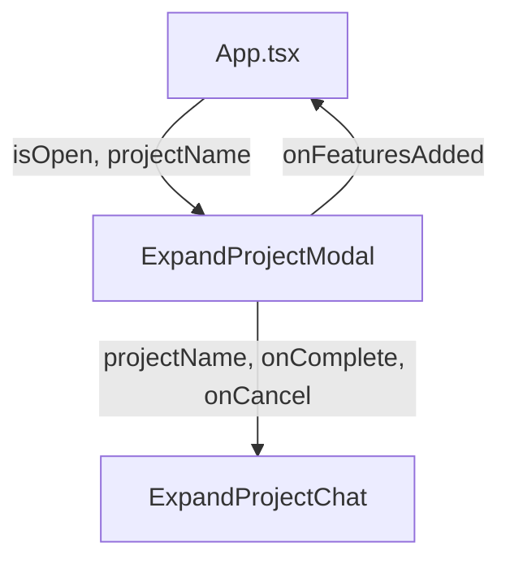

# `ExpandProjectModal.tsx` — 项目扩展模态框

> 源文件路径: `ui/src/components/ExpandProjectModal.tsx`

## 功能概述

`ExpandProjectModal` 是"AI 扩展项目"功能的全屏模态容器。它包装了 `ExpandProjectChat` 组件，提供全屏覆盖层和生命周期管理。用户可以通过自然语言描述向现有项目添加多个新功能特性，完成后自动刷新功能列表。

## 依赖关系

### 导入依赖

| 模块 | 说明 |
|------|------|
| `./ExpandProjectChat` | 扩展项目聊天组件 |

### 被依赖

| 模块 | 引用内容 |
|------|----------|
| `App.tsx` | 通过快捷键 `E` 或按钮触发展示 |

## 关键组件/函数

### `ExpandProjectModal`

- **Props**: `isOpen`、`projectName`、`onClose`、`onFeaturesAdded`（刷新功能列表回调）
- **渲染逻辑**: `isOpen` 为 `false` 时返回 `null`（不渲染 DOM）
- **完成处理**: `handleComplete` 检查 `featuresAdded > 0` 后调用 `onFeaturesAdded`，然后关闭

## 架构图

## 注意事项

- 全屏模态使用 `fixed inset-0 z-50 bg-background`，完全覆盖当前界面
- 与 `NewProjectModal` 的 Spec 创建流程不同，此组件用于向已有项目追加功能
- 关闭时会检查是否有新增功能，有则触发刷新回调
