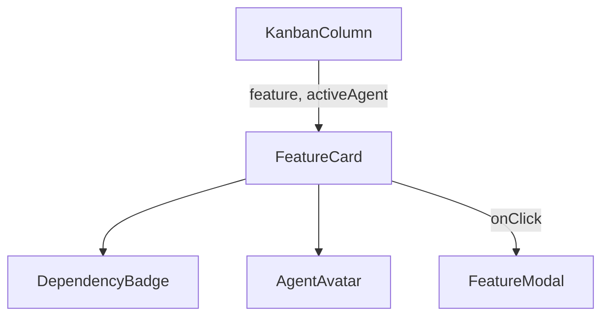

# `FeatureCard.tsx` — 功能特性卡片组件

> 源文件路径: `ui/src/components/FeatureCard.tsx`

## 功能概述

`FeatureCard` 是看板（Kanban）视图中的单个功能特性卡片，展示功能的类别、名称、描述、依赖状态和完成状态。当有 Agent 正在处理该功能时，卡片内会显示 Agent 头像、名称和当前思考内容。卡片可点击以打开详情模态框。

## 依赖关系

### 导入依赖

| 模块 | 说明 |
|------|------|
| `lucide-react` | `CheckCircle2`, `Circle`, `Loader2`, `MessageCircle`, `UserCircle` 图标 |
| `../lib/types` | `Feature`, `ActiveAgent` 类型 |
| `./DependencyBadge` | 依赖状态徽章 |
| `./AgentAvatar` | Agent 头像 |
| `@/components/ui/card` | `Card`, `CardContent` |
| `@/components/ui/badge` | `Badge` |

### 被依赖

| 模块 | 引用内容 |
|------|----------|
| `KanbanColumn.tsx` | 在看板列中渲染功能卡片 |

## 关键组件/函数

### `FeatureCard`

- **Props**: `feature`、`onClick`、`isInProgress`、`allFeatures`（用于依赖计算）、`activeAgent`
- **状态展示**:
  - 头部：类别彩色徽章 + 依赖状态 + 优先级编号
  - 名称和描述（各最多2行截断）
  - Agent 工作指示区（头像 + 名称 + 思考气泡）
  - 底部状态：Processing / Complete / Needs Your Input / Blocked / Pending
- **视觉效果**:
  - 进行中：脉冲动画
  - 完成：主色调边框
  - 需要输入：琥珀色边框
  - 被阻塞：红色边框 + 透明度降低
  - 有活跃 Agent：主色调光环（`ring-2`）

### `getCategoryColor(category)`

- 根据类别名称哈希生成一致的颜色，从7种预设颜色中选择

## 架构图

## 注意事项

- 类别颜色通过简单哈希算法保证同一类别始终对应同一颜色
- `isBlocked` 判断同时考虑 `feature.blocked` 和 `feature.blocking_dependencies` 字段
- 当有 `activeAgent` 时，思考内容使用 10px 超小字体和 `truncate` 截断
