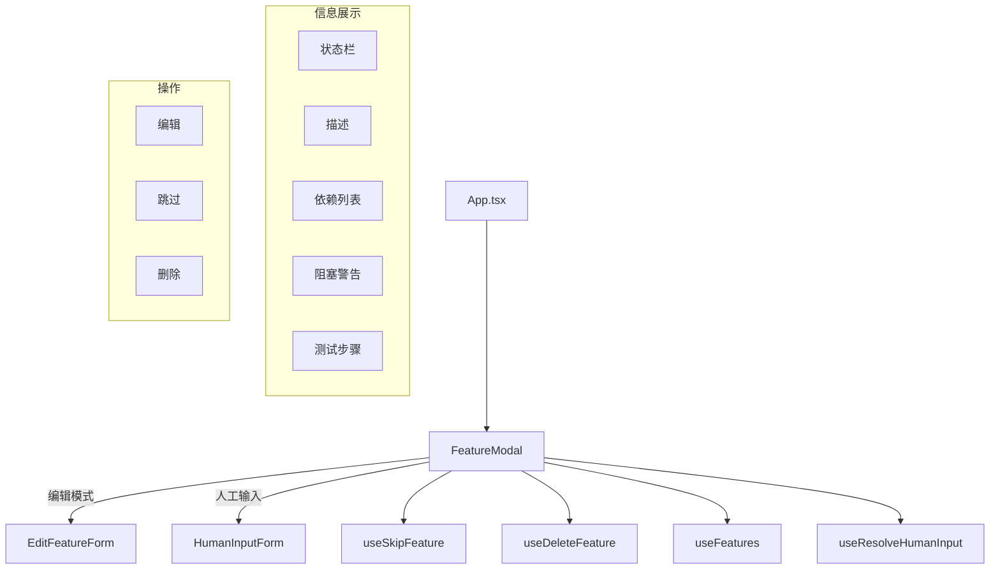

# `FeatureModal.tsx` -- 特性详情查看与操作模态框

> 源文件路径: `ui/src/components/FeatureModal.tsx`

## 功能概述

`FeatureModal` 是特性（Feature）的详情查看和操作模态框，在用户点击看板卡片或依赖图节点时弹出。它提供了特性的完整信息展示，包括分类、名称、状态、描述、依赖关系、阻塞依赖、测试步骤，以及需要人工输入时的表单。

该组件支持以下操作：
- **编辑**: 切换到 `EditFeatureForm` 编辑模式
- **跳过**: 将特性移到队列末尾
- **删除**: 带二次确认的删除操作
- **人工输入**: 当特性处于 `needs_human_input` 状态时，展示 `HumanInputForm`
- **依赖查看**: 展示所有依赖特性及其完成状态，高亮显示阻塞依赖

分类标签使用基于字符串 hash 的一致性颜色分配，确保同一分类始终显示相同颜色。

## 依赖关系

### 导入依赖

| 模块 | 说明 |
|------|------|
| `react` | `useState` -- React Hook |
| `lucide-react` | 多个图标（X, CheckCircle2, Circle, SkipForward, Trash2, Loader2 等） |
| `../hooks/useProjects` | `useSkipFeature`, `useDeleteFeature`, `useFeatures`, `useResolveHumanInput` |
| `./EditFeatureForm` | 特性编辑表单组件 |
| `./HumanInputForm` | 人工输入表单组件 |
| `../lib/types` | `Feature` 类型 |
| `@/components/ui/dialog` | Dialog 系列组件 |
| `@/components/ui/button` | Button 组件 |
| `@/components/ui/badge` | Badge 组件 |
| `@/components/ui/alert` | Alert, AlertDescription 组件 |
| `@/components/ui/separator` | Separator 组件 |

### 被依赖

| 模块 | 引用内容 |
|------|----------|
| `ui/src/App.tsx` | 导入 `FeatureModal`，在选中特性时渲染 |

## 关键组件/函数

### `FeatureModal`

**Props:**
- `feature: Feature` -- 特性数据对象
- `projectName: string` -- 项目名称
- `onClose: () => void` -- 关闭回调

**状态管理:**
- `error` -- 操作错误信息
- `showDeleteConfirm` -- 删除确认状态
- `showEdit` -- 编辑模式开关

**核心逻辑:**
- **依赖解析**: 通过 `useFeatures` 获取全部特性，构建 ID -> Feature 映射表
- **阻塞依赖**: 从 `feature.blocking_dependencies` 解析出未完成的依赖
- `handleSkip()` -- 调用 `skipFeature.mutateAsync` 跳过特性
- `handleDelete()` -- 调用 `deleteFeature.mutateAsync` 删除特性
- 编辑模式下直接返回 `<EditFeatureForm>`，替换整个模态框内容

### `getCategoryColor(category: string): string`

辅助函数，根据分类名称的字符 hash 值分配一致的颜色类名。使用 7 种预定义颜色（pink/cyan/green/yellow/orange/purple/blue）循环分配。

**信息展示区域:**
1. **状态栏**: COMPLETE（绿色）/ NEEDS YOUR INPUT（琥珀色）/ PENDING（灰色）+ 优先级
2. **人工输入表单**: 当 `needs_human_input` 为 true 时显示 `HumanInputForm`
3. **已提交人工输入**: 绿色提示框显示历史提交记录
4. **描述**: 特性详细描述
5. **阻塞依赖警告**: 橙色警告框列出未完成的依赖
6. **依赖列表**: 所有依赖特性及其完成状态
7. **测试步骤**: 有序列表展示

**操作区域（仅未完成特性）:**
- 默认视图: 编辑 / 跳过 / 删除按钮
- 删除确认视图: "Yes, Delete" / "Cancel" 按钮

## 架构图

## 注意事项

- 编辑模式通过条件返回直接替换整个组件渲染，而非在模态框内切换视图
- 删除操作使用两步确认：点击垃圾桶图标显示确认按钮，再点击确认执行删除
- 依赖映射通过合并所有状态数组（pending + in_progress + done + needs_human_input）构建
- `getCategoryColor` 使用简单的字符串 hash 算法，确保颜色分配的确定性
- 模态框内容区域最大高度 60vh，支持滚动
- 所有 mutation 操作成功后自动调用 `onClose()` 关闭模态框
