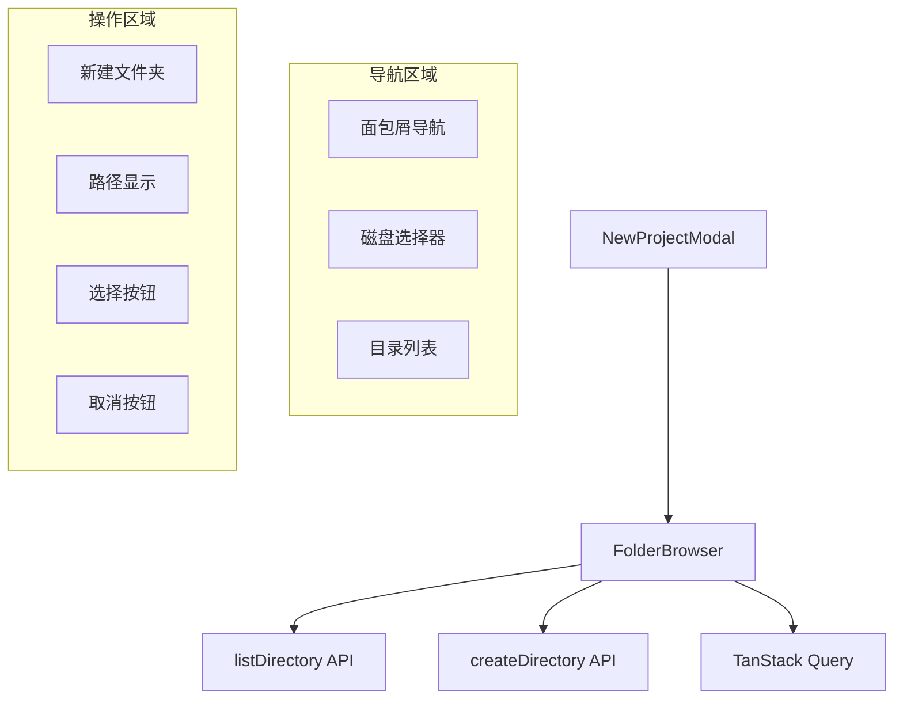

# `FolderBrowser.tsx` -- 服务端文件系统浏览器组件

> 源文件路径: `ui/src/components/FolderBrowser.tsx`

## 功能概述

`FolderBrowser` 是一个服务端文件系统浏览器组件，用于在创建新项目时选择项目目录。它通过后端 API 列出服务器上的目录结构，支持跨平台操作（Windows 磁盘驱动器选择、macOS/Linux 路径导航）。

组件提供了完整的文件系统导航功能：
- **面包屑导航**: 显示当前路径层级，支持点击跳转到任意层级
- **Windows 磁盘选择**: 检测到 drives 数据时显示磁盘驱动器选择栏
- **目录列表**: 仅显示文件夹（过滤文件），支持单击选中和导航
- **新建文件夹**: 内联创建新文件夹并自动导航到新目录
- **路径显示**: 底部始终显示当前选中的完整路径

该组件使用 TanStack Query 管理目录列表的数据获取和缓存。

## 依赖关系

### 导入依赖

| 模块 | 说明 |
|------|------|
| `react` | `useState`, `useEffect` -- React Hooks |
| `@tanstack/react-query` | `useQuery` -- 数据获取和缓存 |
| `lucide-react` | Folder, FolderOpen, ChevronRight, HardDrive, Loader2, AlertCircle, FolderPlus, ArrowLeft |
| `../lib/api` | `listDirectory`, `createDirectory` -- 文件系统 API |
| `../lib/keyboard` | `isSubmitEnter` -- 提交快捷键检测 |
| `../lib/types` | `DirectoryEntry`, `DriveInfo` 类型 |
| `@/components/ui/button` | Button 组件 |
| `@/components/ui/input` | Input 组件 |
| `@/components/ui/card` | Card, CardContent 组件 |

### 被依赖

| 模块 | 引用内容 |
|------|----------|
| `ui/src/components/NewProjectModal.tsx` | 导入 `FolderBrowser`，在文件夹选择步骤中使用 |

## 关键组件/函数

### `FolderBrowser`

**Props:**
- `onSelect: (path: string) => void` -- 文件夹选择确认回调
- `onCancel: () => void` -- 取消回调
- `initialPath?: string` -- 初始路径（可选）

**状态管理:**
- `currentPath` -- 当前浏览的路径
- `selectedPath` -- 选中的路径
- `isCreatingFolder` -- 是否正在创建新文件夹
- `newFolderName` -- 新文件夹名称
- `createError` -- 创建文件夹的错误信息

**数据获取:**
```typescript
useQuery({
  queryKey: ['filesystem', 'list', currentPath],
  queryFn: () => api.listDirectory(currentPath),
})
```

**核心功能:**
- `handleNavigate(path)` -- 导航到指定路径，重置创建状态
- `handleNavigateUp()` -- 使用 `parent_path` 导航到上级目录
- `handleDriveSelect(drive)` -- Windows 磁盘选择（格式 `{letter}:/`）
- `handleEntryClick(entry)` -- 点击目录条目进行导航
- `handleCreateFolder()` -- 验证文件夹名称并创建，成功后自动导航

### `getBreadcrumbs(path: string)`

面包屑解析函数，支持两种路径格式：
- Windows: `C:/Users/foo` -> `[{name: "C:", path: "C:/"}, {name: "Users", path: "C:/Users"}, ...]`
- Unix: `/home/foo` -> `[{name: "/", path: "/"}, {name: "home", path: "/home"}, ...]`

**文件夹名称验证:**
- 正则 `/^[a-zA-Z0-9_\-. ]+$/` -- 允许字母、数字、下划线、连字符、点和空格

## 架构图



## 注意事项

- 目录列表仅显示 `is_directory === true` 的条目，文件被过滤掉
- 面包屑解析兼容 Windows 和 Unix 路径格式
- 新建文件夹使用 `currentPath + "/" + name` 拼接路径
- 目录条目显示 `has_children` 箭头指示器，提示是否有子目录
- 选中的目录使用 `FolderOpen` 图标和主色调高亮
- 创建文件夹输入框支持 Enter 提交和 Escape 取消快捷键
- 组件最大高度 70vh，目录列表区域可滚动
- `selectedPath` 会随着 `currentPath` 的 API 返回自动更新
