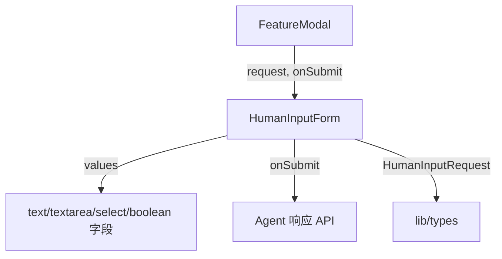

# `HumanInputForm.tsx` — 人工输入表单组件

> 源文件路径: `ui/src/components/HumanInputForm.tsx`

## 功能概述

`HumanInputForm` 用于在 Agent 需要人工输入时展示动态表单。根据后端传来的 `HumanInputRequest` 定义，自动渲染不同类型的表单字段（文本输入、文本区域、单选列表、布尔开关），支持必填验证和提交状态管理。表单以琥珀色警告卡片样式呈现，突出"Agent 需要您的帮助"的紧急感。

## 依赖关系

### 导入依赖

| 模块 | 说明 |
|------|------|
| `react` | `useState` |
| `lucide-react` | `Loader2`, `UserCircle`, `Send` 图标 |
| `../lib/types` | `HumanInputRequest` 类型定义 |
| `@/components/ui/button` | `Button` |
| `@/components/ui/input` | `Input` |
| `@/components/ui/textarea` | `Textarea` |
| `@/components/ui/label` | `Label` |
| `@/components/ui/alert` | `Alert`, `AlertDescription` |
| `@/components/ui/switch` | `Switch` |

### 被依赖

| 模块 | 引用内容 |
|------|----------|
| `FeatureModal.tsx` | 在功能详情模态框中展示人工输入请求表单 |

## 关键组件/函数

### `HumanInputForm`

- **Props**: `request`（输入请求定义）、`onSubmit`（提交回调，接收字段值映射）、`isLoading`
- **状态管理**:
  - `values` — 各字段当前值（根据字段类型初始化为 `''` 或 `false`）
  - `validationError` — 验证错误信息
- **支持的字段类型**:
  - `text` — 单行文本输入
  - `textarea` — 多行文本区域
  - `select` — 单选列表（radio button 样式）
  - `boolean` — 开关切换
- **验证逻辑**: 提交前检查所有 `required` 字段是否已填写

## 架构图

## 注意事项

- 表单使用 `Alert` 组件的琥珀色主题（`border-amber-500`），视觉上与普通卡片区分
- `select` 类型字段渲染为单选卡片列表（非原生 `<select>`），选中项有高亮边框
- 必填字段标签后显示红色星号（`*`）
- 提交按钮占满宽度，加载中显示旋转动画
