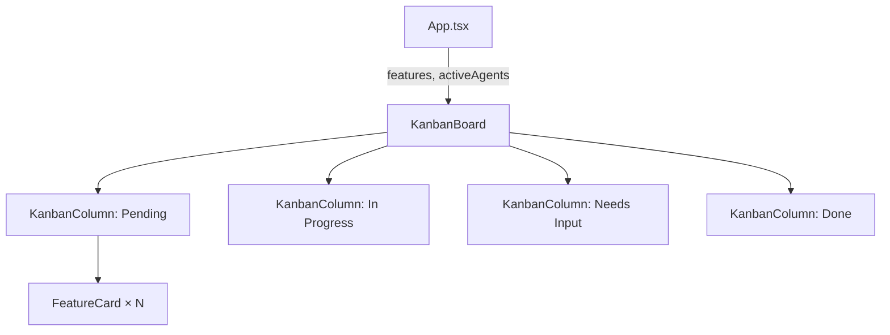

# `KanbanBoard.tsx` — 看板面板组件

> 源文件路径: `ui/src/components/KanbanBoard.tsx`

## 功能概述

`KanbanBoard` 是功能看板的顶层容器组件，将功能列表按状态分配到不同的 `KanbanColumn` 中（Pending、In Progress、Needs Input、Done）。当存在需要人工输入的功能时，自动增加第四列。数据加载中时显示骨架屏占位。

## 依赖关系

### 导入依赖

| 模块 | 说明 |
|------|------|
| `./KanbanColumn` | 看板列组件 |
| `../lib/types` | `Feature`, `FeatureListResponse`, `ActiveAgent` 类型 |
| `@/components/ui/card` | `Card`, `CardContent` |

### 被依赖

| 模块 | 引用内容 |
|------|----------|
| `App.tsx` | 在主界面中作为看板视图的核心展示组件 |

## 关键组件/函数

### `KanbanBoard`

- **Props**: `features`（功能列表响应）、`onFeatureClick`、`onAddFeature`、`onExpandProject`、`activeAgents`、`onCreateSpec`、`hasSpec`
- **布局逻辑**:
  - 默认三列网格（Pending、In Progress、Done）
  - 当 `needs_human_input` 列表非空时自动切换为四列
  - 数据为 `undefined` 时渲染3列骨架屏
- **数据合并**: 将所有状态的功能合并为 `allFeatures` 数组，传递给各列用于依赖状态计算
- **按钮逻辑**:
  - 添加按钮和扩展按钮仅在 Pending 列显示
  - "Create Spec" 按钮仅在无 Spec 且无功能时显示

## 架构图

## 注意事项

- `needs_human_input` 列使用可选链（`features.needs_human_input?.length || 0`），兼容旧版 API 未返回该字段的情况
- 骨架屏使用 `animate-pulse` 动画的灰色块，模拟标题和卡片区域
- `hasSpec` 控制是否在空列表时显示 Spec 创建引导
- 响应式布局：小屏单列，中屏以上三/四列网格
