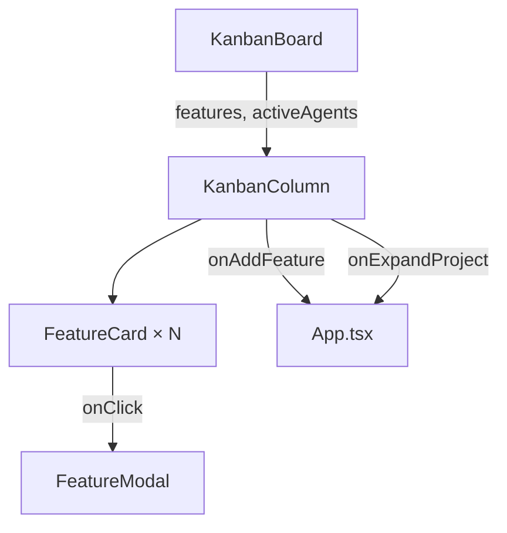

# `KanbanColumn.tsx` — 看板列组件

> 源文件路径: `ui/src/components/KanbanColumn.tsx`

## 功能概述

`KanbanColumn` 是看板视图中的单列容器，代表一种功能状态（Pending、In Progress、Needs Input、Done）。每列有一个带计数徽章的标题头、可选的添加/扩展按钮，以及一个固定高度可滚动的功能卡片列表。当列为空且尚无 Spec 时，可以显示"Create Spec with AI"引导按钮。

## 依赖关系

### 导入依赖

| 模块 | 说明 |
|------|------|
| `./FeatureCard` | 功能特性卡片组件 |
| `lucide-react` | `Plus`, `Sparkles`, `Wand2` 图标 |
| `../lib/types` | `Feature`, `ActiveAgent` 类型 |
| `@/components/ui/card` | `Card`, `CardContent`, `CardHeader`, `CardTitle` |
| `@/components/ui/button` | `Button` |
| `@/components/ui/badge` | `Badge` |

### 被依赖

| 模块 | 引用内容 |
|------|----------|
| `KanbanBoard.tsx` | 看板面板中的列组件 |

## 关键组件/函数

### `KanbanColumn`

- **Props**: `title`、`count`、`features`、`allFeatures`、`activeAgents`、`color`（颜色主题）、`onFeatureClick`、`onAddFeature`、`onExpandProject`、`showExpandButton`、`onCreateSpec`、`showCreateSpec`
- **Agent 映射**: 内部构建 `agentByFeatureId` Map，将批量特性 ID（`featureIds`）映射到同一个 Agent
- **视觉样式**: 四种颜色主题对应顶部边框色
  - `pending` — 静音灰色
  - `progress` — 主色调
  - `done` — 主色调
  - `human_input` — 琥珀色
- **卡片动画**: 每张卡片有 50ms 递增的入场延迟（`animationDelay`）

## 架构图

## 注意事项

- 卡片列表固定 600px 高度，使用 `overflow-y-auto` 滚动
- `agentByFeatureId` 映射支持批量模式：一个 Agent 可能同时处理多个特性
- 空列根据 `showCreateSpec` 标志决定显示"No features"文本还是"Create Spec with AI"按钮
- 卡片使用 `animate-slide-in` 动画实现级联入场效果
