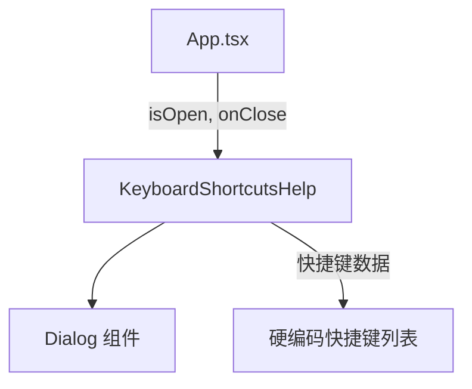

# `KeyboardShortcutsHelp.tsx` — 键盘快捷键帮助对话框

> 源文件路径: `ui/src/components/KeyboardShortcutsHelp.tsx`

## 功能概述

`KeyboardShortcutsHelp` 是键盘快捷键帮助页面的模态对话框。按 `?` 键触发打开，展示所有可用的快捷键列表及其功能描述。部分快捷键标注了使用上下文（如"with project"），帮助用户了解在何种状态下可用。

## 依赖关系

### 导入依赖

| 模块 | 说明 |
|------|------|
| `react` | `useEffect`, `useCallback` |
| `lucide-react` | `Keyboard` 图标 |
| `@/components/ui/dialog` | `Dialog`, `DialogContent`, `DialogHeader`, `DialogTitle` |
| `@/components/ui/badge` | `Badge` |

### 被依赖

| 模块 | 引用内容 |
|------|----------|
| `App.tsx` | 在主应用中通过 `?` 快捷键触发显示 |

## 关键组件/函数

### `KeyboardShortcutsHelp`

- **Props**: `isOpen`、`onClose`
- **快捷键列表**（硬编码）:
  - `?` — 显示快捷键帮助
  - `D` — 切换调试面板
  - `T` — 切换终端标签
  - `N` — 添加新功能（需选中项目）
  - `E` — AI 扩展项目（需有 Spec 和功能）
  - `A` — 切换 AI 助手（需选中项目）
  - `G` — 切换看板/图形视图（需选中项目）
  - `,` — 打开设置
  - `Esc` — 关闭弹窗/面板
- **键盘监听**: 打开时按 `Escape` 或 `?` 均可关闭

## 架构图

## 注意事项

- 快捷键以 `<kbd>` 元素展示，等宽字体 + 灰色背景模拟键帽样式
- 带上下文条件的快捷键右侧显示灰色小徽章
- 底部提示文本："Press ? or Esc to close"
