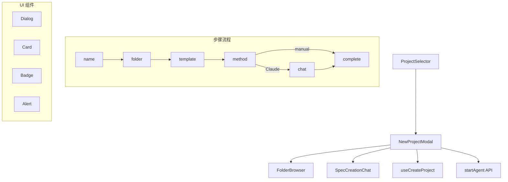

# `NewProjectModal.tsx` -- 多步骤新项目创建向导模态框

> 源文件路径: `ui/src/components/NewProjectModal.tsx`

## 功能概述

`NewProjectModal` 是一个多步骤模态向导组件，引导用户完成新项目的完整创建流程。它提供了从项目命名、文件夹选择、模板选择到规格定义方法选择的分步引导，是 AutoForge UI 中项目创建的核心入口。

该组件支持两种项目模板选择（空白项目和 Agentic Starter），以及两种规格定义方式（通过 Claude AI 交互式创建或手动编辑）。选择 Claude 方式时，会全屏展示 `SpecCreationChat` 聊天界面；选择手动方式时，直接创建项目并关闭模态框。

组件还集成了脚手架模板的实时 SSE 流式输出、初始化 Agent 的自动启动与重试机制，以及项目创建完成后的自动跳转功能。

## 依赖关系

### 导入依赖

| 模块 | 说明 |
|------|------|
| `react` | `useRef`, `useState` -- React 基础 Hooks |
| `react-dom` | `createPortal` -- 将聊天视图渲染到 body 层 |
| `lucide-react` | 多个图标组件（Bot, FileEdit, ArrowRight 等） |
| `../hooks/useProjects` | `useCreateProject` -- 创建项目的 mutation hook |
| `./SpecCreationChat` | 规格创建聊天组件 |
| `./FolderBrowser` | 文件夹浏览选择组件 |
| `../lib/api` | `startAgent` -- 启动 Agent 的 API 调用 |
| `@/components/ui/dialog` | Dialog 系列 UI 组件 |
| `@/components/ui/button` | Button 组件 |
| `@/components/ui/input` | Input 组件 |
| `@/components/ui/label` | Label 组件 |
| `@/components/ui/alert` | Alert, AlertDescription 组件 |
| `@/components/ui/badge` | Badge 组件 |
| `@/components/ui/card` | Card, CardContent 组件 |

### 被依赖

| 模块 | 引用内容 |
|------|----------|
| `ui/src/components/ProjectSelector.tsx` | 导入 `NewProjectModal` 组件，在项目选择器中使用 |

## 关键组件/函数

### `NewProjectModal`

**Props:**
- `isOpen: boolean` -- 控制模态框显示
- `onClose: () => void` -- 关闭回调
- `onProjectCreated: (projectName: string) => void` -- 项目创建成功回调
- `onStepChange?: (step: Step) => void` -- 步骤变更通知

**状态管理:**
- `step: Step` -- 当前步骤（name -> folder -> template -> method -> chat -> complete）
- `projectName: string` -- 项目名称
- `projectPath: string | null` -- 选择的项目路径
- `initializerStatus: InitializerStatus` -- 初始化 Agent 状态
- `scaffoldStatus: ScaffoldStatus` -- 脚手架执行状态
- `scaffoldOutput: string[]` -- 脚手架输出日志（最多保留 100 行）

**核心流程:**
1. `handleNameSubmit` -- 验证项目名称格式（字母数字、连字符、下划线）
2. `handleFolderSelect` -- 文件夹选择完成后前进到模板步骤
3. `handleTemplateSelect` -- 空白项目直接跳到方法选择；Agentic Starter 通过 SSE 流式执行脚手架
4. `handleMethodSelect` -- Claude 方式创建项目后显示聊天；手动方式直接创建完成
5. `handleSpecComplete` -- 自动启动初始化 Agent，支持 YOLO 模式
6. `handleRetryInitializer` -- Agent 启动失败时的重试机制

**特殊渲染:**
- 聊天步骤使用 `createPortal` 渲染到 `document.body`，实现全屏覆盖
- 文件夹步骤使用更大的模态框（`sm:max-w-3xl`）

## 架构图

## 注意事项

- 项目名称验证使用正则 `^[a-zA-Z0-9_-]+$`，只允许字母、数字、连字符和下划线
- Agentic Starter 模板通过 `/api/scaffold/run` 的 SSE 流接收实时输出，最多缓存 100 行
- 聊天步骤使用 React Portal 渲染到 body 级别，绕过模态框的 DOM 层级限制
- 脚手架成功后延迟 1200ms 自动跳到方法选择步骤
- 项目创建完成后延迟 1500ms 自动跳转到项目页面
- Agent 启动默认并发度为 3，与 `AgentControl.tsx` 保持一致
